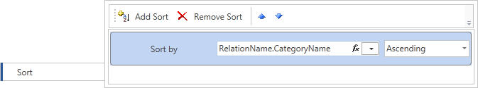
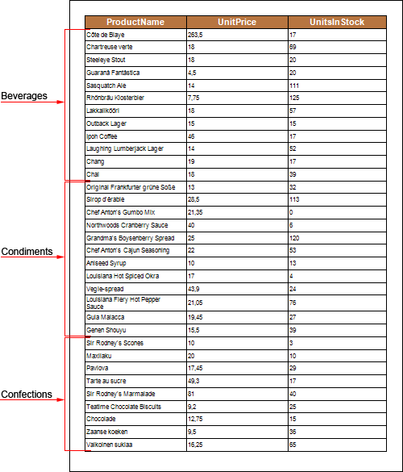

## Sorting

When sorting data it can be used not only columns in the specified data source but the columns in the source, which can be accessed vie the relation. Let's review data sorting using a relation (in the example we use data source Products). If you want to sort by category name, i.e. entries in the data column CategoryName of the data source Categories, then, with established relation between data sources Categories and Products, to add sorting to the expression: Products.RelationName.CategoryName. You should also select sorting direction. In this example we set the Ascending sorting direction. The picture below shows a window of data sorting via the relation between data sources:

Now, when rendering a report, the report generator will sort data from the data source Products by names of the categories in alphabetical order from A to Z. The picture below shows a page of the rendered report:

