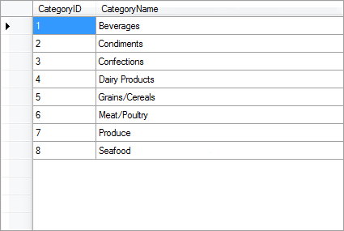
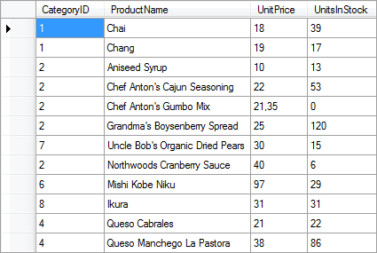
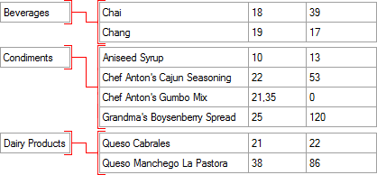

## Relation

Relation is created between data sources and defines how should data from these sources be bind. When creating a relation, keys which play a role of data columns, are indicated. As a result, a relation is a connection between data sources on the basis of one or more key data columns. The Relation provides the ability to filter, sort, display data when accessing the same data source via a relation from another data source. Let's review the following example. The picture below shows two data sources - Categories and Products (partially):

The relation is organized by the key data columns. Key data columns are present in the data sources, among which a relation is organized, and contain the keys. For example, in Categories and Products data sources the key columns are CategoryID. It should be noted that in this example, the names of key columns are the same, but this is not a prerequisite. The key data column in the data source Categories is called CategoryID, and the data source Products - CategoryNumber. Organizing the relation between data sources Categories and Products by the key columns CategoryID, where the data source Categories is the master data source, and Products is a detail data source. The relation between data sources will have the form as shown in the picture below (partially):

As can be seen, after the organization of a relation, to each entry from the data source Categories will be matched to entries from the data source Products. In this example, entry Beverages is matched to entries Chai and Chang; entry Condiments is matched to Aniseed Syrup, Chef Anton's Cajun Seasoning, Chef Anton's Gumbo Mix, Grandma's Boysenberry Spread; entry Dairy Products is matched to Queso Carbales and Queso Manchego La Pastora.
