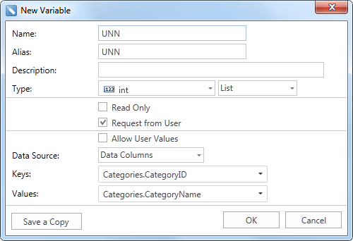
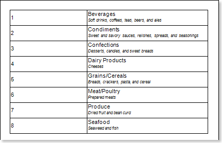
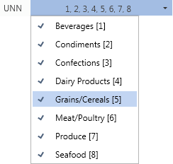
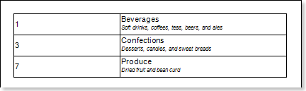

## List

The **List** variable provides the ability to place a list of values of any available data type. In contrast to the **Value** variable, in this case, when report rendering, the variable contains a list of values. The picture below shows the **New Variable** dialog with the selected **List** type:

After clicking OK, a variable named **UNN** and the stored list of values ​​from 0 to 8 will be created. Consider using a variable created in the report. Suppose there is a report that contains numbers, names and descriptions of categories. The picture below shows a report page:

If you want to show some of the categories then use already created variable in the report. To do this, add a filter in the **DataBand** with the expression **UNN.Contains(Categories.CategoryID)**, where **UNN** is the variable name. When rendering a report, by default, all categories are displayed. All values ​​in the list of stored values ​​of the variable are selected. Also,values, for example **Grains/Cereals** and keys, for example [**5**] ​​are displayed in the variable list . The picture below shows a list of variable values​​:

Because the **Allow User Values** parameter is not enabled, in this example, the user can only select values, ​​stored in the variable, but cannot use their own values. Suppose the values such as **Beverages [1]**, **Confections [3]**, **Produce [7]** will be selected. Then, after clicking the **Submit** button, the generator will build a report, considering the filtering conditions and display entries **1**,**3**,**7**. Below is a report using a variable is shown:

