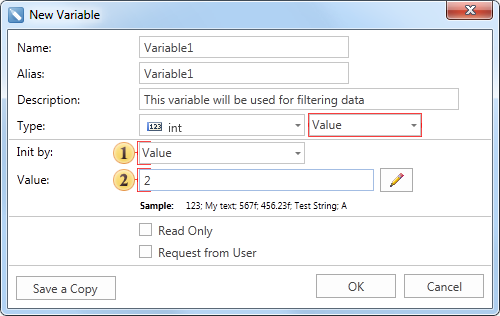
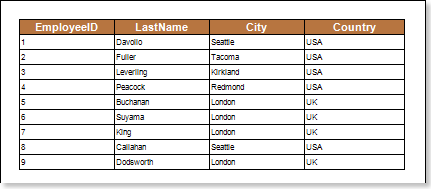
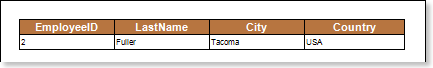

## New Variable

The variable of the first type provides the ability to place a simple value of any available data type or expression. Consider the example of creating such a variable. Call the New Variable... command. The dialog box in which to define the parameters of the variable will be opened. The Value variable is set by default. The picture below shows the New Variable dialog:

 The **Init by** field has a menu with the drop-down list. Depending on the selected item in this menu the type of the value in a variable is defined: Value or Expression, i.e. the method of initializing a variable as a value or expression is selected. In this example, the variable is initialized as a Value.

 This field specifies the value to be stored in a variable. Please note that this field may be missing. If, for example, the Expression is selected in the Init by field, then this field is absent, and the Expression field present instead. In this case, in the Expression field you should specify an expression that will be stored in a variable. In this example, the variable is equal to 2.

After pressing the OK button the variable named Variable1 will be created. Consider the example of using variable of the type Value in the report. Suppose there is a report that contains information about employees (see the picture above).

Add a filter with the expression Employees.EmployeeID == UNN in the DataBand. Now, when rendering a report, the information about employees whose EmployeeID is equal to the value stored in a variable will be output. In this example, EmployeeID = 2. The picture below shows a report with the condition of filtering:

