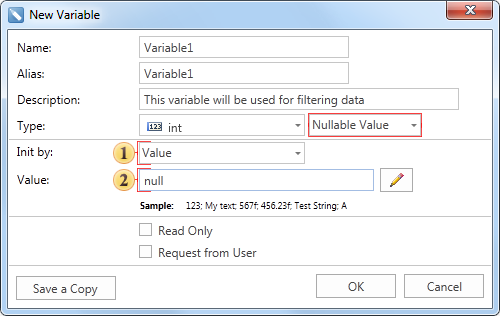

## Nullable Value

The Nullable Value variable provides the ability to place simple values​ and values ​​equal to null. If it is necessary to return a null value in the report, then when using a variable of another type, the report compilation error occurs. The picture below shows the New Variable dialog of the Nullable Value:

 The **Init by** field has a menu with the drop-down list. Depending on the selected item in this menu the type of the value in a variable is defined: Value or Expression, i.e. the method of initializing a variable as a value or expression is selected. In this example, the variable is initialized as a Value.

 This field specifies the value to be stored in a variable. Please note that this field may be missing. If, for example, the Expression is selected in the Init by field, then this field is absent, and the Expression field present instead. In this case, in the Expression field you should specify an expression that will be stored in a variable. In this example, the variable is equal to 2.
