## Dependent Variables

When you create a report with parameters, you can use the dependent variables. In this case, one variable will be independent, and the rest ones will depend on it or will represent a hierarchy. Each subsequent variable is dependent on the previous one. To become dependent, the variable must have the check box Dependent Value is enabled (it is located on the panel Request From User when you choose a data source Data Column). After you enable the check box two fields will be displayed: the Variable and Dependent Column. In the first field, select the variable that will be the main one from which this variable will depend. In the second field select the data column, which will be in relation with the main variable.

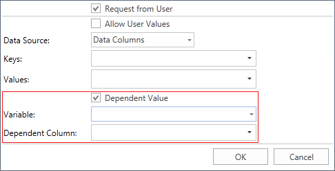

This possibility (relations between variables) is useful when using parameters in reports, for example, in Master-Detail reports. Suppose we have a list of categories, each category includes several products, and each product has detailed description. In this case, using the report parameters, the variable by a product and by product information will contain a huge list of values ​​(completely full list of products and descriptions), and, if it is necessary to select a particular product or information on it, this will take much time. If the relations between variables is missing, then the list of category values ​​will contain 8 categories of products - 77 records, and detailed data to several hundreds. It will be almost impossible to find a product or information on it. The images below show examples of lists of values ​​without the relations between the variables:

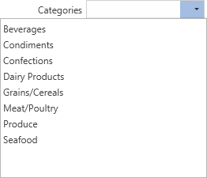

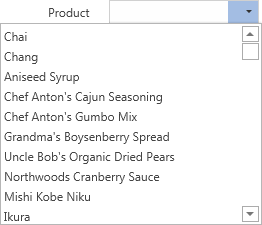

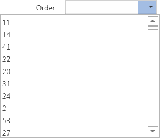

The dependent variables provides an opportunity to reduce the list of variables. In other words, you can establish a connection among variables. This will lead to filtering the list of values ​​depending on the value of the main variable. For example, depending on the selected category, a list of values ​​of a variable by product is created, and, depending on the selected product, a list of detailed information is created. For example, the category Condiments will be selected, then the list of products will be filtered and will look like this:

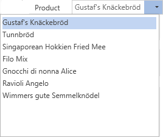

Now select the product Genen Shouyu, and then the list of detailed information will be like this:

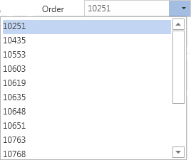

Consider creating and using variables in the report. Create two variables, one of which will contain a list of categories, a second is list of products. And the list of products will depend on the selected category. For example, on the base of data sources from our Demo application.

* Create variables Category and Product, of the type Value with initialization of data integer. In the main variable (Category), choose the keys Categories.CategoryID, and the values ​​Categories.CategoryName.

* Notice: The key is a unique identifier of a record (row) in the data source. In this case, CategoryID will be a column that contains keys, and ProductID - for products. The connection is organized by keys between the data sources. It is important to understand that different product keys may be related to the same category key.

* In the dependent variable define keys Products.ProductID, and the values ​​Products.ProductName. Select the check box Dependent Value, select Category as the main variable and data column Products.CategoryID as the dependent column. We go to the tab Preview, as shown in the picture below. It shows two parameters. In the first list the category is selected, and the second list (products) is created depending on the selected category:

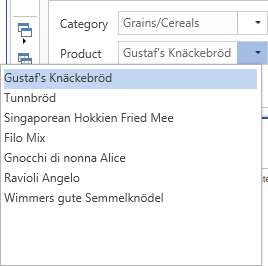

As can be seen from the picture above, the second variable (a list of values) ​​displays not complete list of stored values, but only those values ​​that belong to the selected category.

* Add a third variable in the data dictionary. The variable will be named All, of the type Value with initialization data bool.

* Now use the dependent variable in the report. Suppose we have a Master-Detail Report, where each category has a few products. Add filters with expressions on Data bands in the report template to choose a certain product or products of a certain category:

 The first filter is on the data band Master. (this is the band with which a list of categories is created in the report). It is necessary to filter categories, depending on the selected report parameter, so the expression looks like Category == Categories.CategoryID.

 Next, add a second filter on the data band Detail (this is the band with which a list of products is created in the report). The filter will have the expression Product == Products.ProductID.

* Switch to the tab Preview. In the report parameters select a category, then a product, apply settings to filter report data:

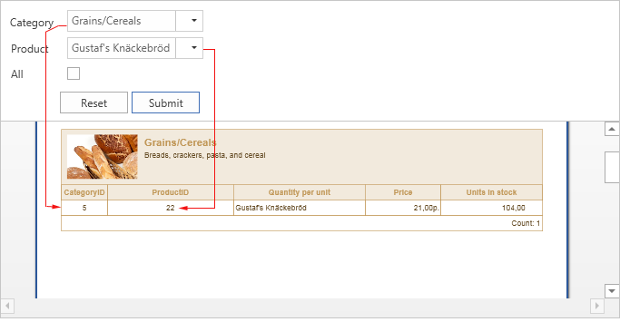

As can be seen from the picture above, the category Grains/Cereals was chosen (note, the key of the category is 5) and the product Gustaf's Knackebrod (product key = 22). In other words, all categories with the key 5 and all the products with  the key 22 are displayed.

* To display a complete list of products related to the category, it is necessary to use the third variable, All. Therefore, you should change the filter expression on the Data band with which to create a list of products (Product == Products.ProductID || All). In this case, depending on the value of the third variable (enabled/disabled) filtering will be done. If the check box is disabled, the filter will occur by the product keys (the report shows the product which key matches). If the check box is enabled all the products of the selected category will be shown:

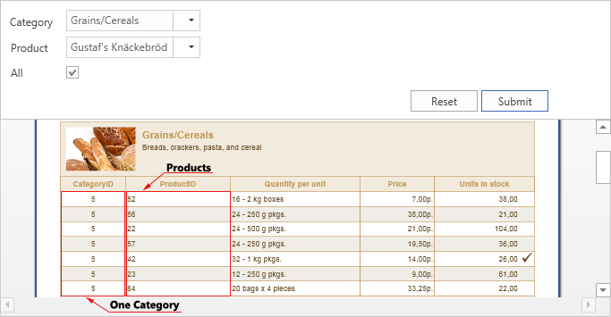

As can be seen from the picture above, one category (key = 5) is displayed, and all products related to it, with different keys.

The example that was reviewed above is a single-level dependency. Now consider a more complex example of a two-level dependency. Leave the category, products related to them, and add detailed data by each product. To do this, create the variable Order of the Value type with initialization of data integer. Next, enable the check box Request From User, select the data source as the data column.

 The column with keys OrderDetails.OrderID, with values​ OrderDetails.UnitPrice.

 Next, set relations with the products. Select Product as a main variable. The dependent column is OrderDetails.ProductID.

 Now, in the report template, add the Data band with detailed information on the products. In this example, select Order Details as the data source for the Data band. The Master component will be the Data band with the products. Also indicate the relationship between the data sources.

 Add a filter with the expression Order == Order_Details.OrderID in the Data band, which contains detailed information on products.

 Go to the tab Preview.

In the report, select a category, and the list of products is filtered. Select the product, and then the list of detailed data for the selected product is filtered. Select a detailed value, click the button Apply:

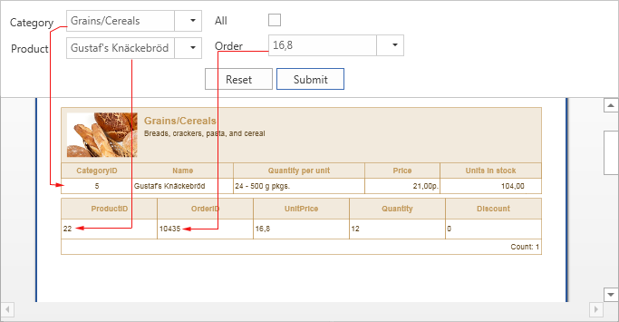

If you need to display all the detailed information on the selected product, you should change the filter expression in the Data band with detailed data by products. The expression will be with Variable3 and will look Order == Order_Details.OrderID || All. Now, you can simply specify a category, select a product and get all the detailed information on it:

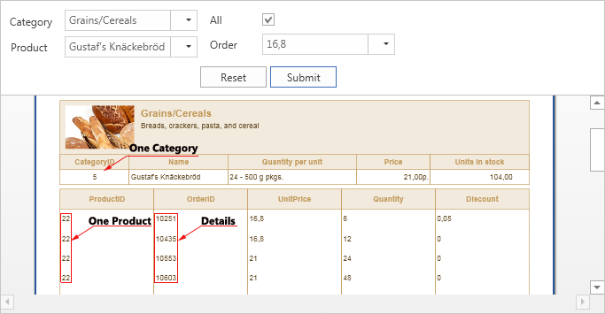

As can be seen from the picture above one category, one product and all the details by the product were printed. It is also worth noting that the number of nesting levels is not limited.
