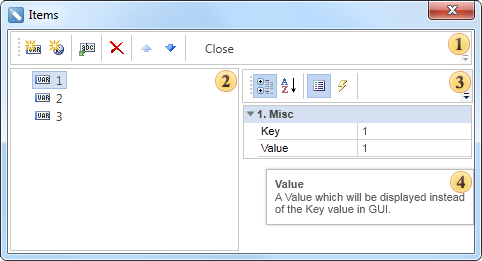
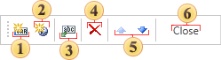

## Items Dialog

In the Items dialog you can create, delete, edit items (values, ​​expressions). This window is invoked when clicking the Editor in the Variables dialog. The picture below shows the Items dialog:

 Control Panel. This panel contains buttons to control items.

 In the Toolbox displays a list of created items (values, expressions). Keep in mind that the order of items in the list affects sequence of items in the Items field on the Request from User panel.

 The properties panel. In this panel the properties of the selected item are displayed. The item has two properties: Key and Value.

 The panel displays the description of the selected property.

Control Panel

As mentioned above, on this panel (see the picture above) the buttons to control items are placed.

 The New Value button. Used to create a new type of the value;

 The New Expression button. Creates a new type of an expression;

 The Select Columns button. Calls a dialog where you can specify data columns as keys and values;

 The Remove button. Removes the selected item.

 The Navigation buttons. Used to move selected item up or down in the toolbox.

 The Close button. Closes the Items dialog saving changes.
