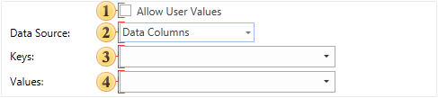
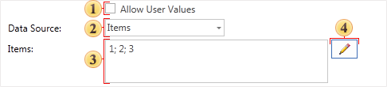

## Panel Request From User

The **Request from user** panel contains parameters controls. These parameters determine the possible involvement of the user when using the variable in the report. Some options may present or absent, depending on the value of the **Data Source** field. The picture below shows the **Request from user** panel, if in the **Data Source** field the **Data Columns** value is selected:

 The **Allow User Values** parameter. Provides an opportunity to set the dialogue mode, i.e. using this variable in a report the user may input values.

 The **Data Source** field. Contains a drop-down list of values. Depending on the selected value: **Items** or **Data Columns**, on this panel will be fields either **Items**, or **Keys** and **Values**.

 The **Keys** field. using the 

, the data column is selected. The entries of the column will be keys.

 The **Values** field. using the 

, the data column is selected. The entries of the column will be values.

If the **Data Source** is set to **Items**, then on the **Request from user** panel other options will be located. The picture below shows the **Request from user** panel:

 The **Allow User Values** parameter. Used to set the dialogue mode, i.e. using this variable in a report the user may input values.

 The **Data Source** contains a drop-down list of values. Depending on the selected value: **Items** or **Data Columns**, on this panel will be fields either **Items**, or **Keys** and **Values**.

 The **Items** field. Displays a list of created variable items. If the items are not created, then this field will be blank. It should be noted that the order of items in the list depends on their priority on the list panel in the **Items** dialog, the higher the item is the left its position is in the list, and vice versa.

 The **Editor** button. Calls the **Items** dialog, where you can create new items, remove existing or edit them.
