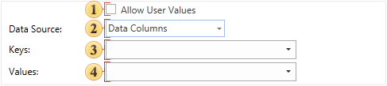
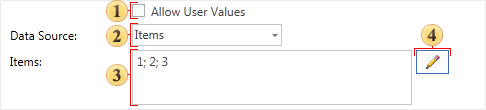

## Panel Request From User

The **Request from user** panel contains parameters that determine the options available for user interaction when a variable is used in a report. Some parameters may be present or absent depending on the value selected in the **Data Source** field. The image below shows the **Request from user** panel, if in the **Data Source** field the **Data Columns** value is selected:

 The **Allow User Values** parameter provides the option to set the dialog mode, i.e. when this variable is used in a report, the user may be prompted to enter a value.

 The **Data Source** field contains a drop-down list of values. Depending on the selected value: **Items** or **Data Columns**, the panel will display either the **Items** field or the **Keys** and **Values** fields.

 The **Keys** field. Using the 

, the data column is selected. The entries of the column will be keys.

 The **Values** field. Using the 

, the data column is selected. The entries of the column will be values.

If **Items** is selected in the **Data Source** field, other parameters will be displayed in the **Request from user** panel. The image below shows the **Request from user** panel:

 The **Allow User Values** parameter provides the option to set the dialog mode, i.e. when this variable is used in a report, the user may be prompted to enter a value.

 The **Data Source** field contains a drop-down list of values. Depending on the selected value: **Items** or **Data Columns**, the panel will display either the **Items** field or the **Keys** and **Values** fields.

 The **Items** field displays a list of the variable's created items. If no items have been created, this field will be empty. Note that the order of the items in this list depends on their order in the **Items** window: the higher an item is in the list, the further to the left it will be in this list, and vice versa.

 The **Editor** button opens the **Items** window, where you can create new items, delete existing ones, or edit them.
