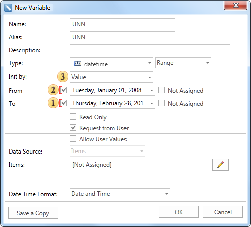
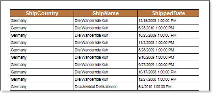
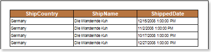

## Range

If using a variable of this type in the report, you can work with ranges of values. In this case, the variable will store a range of values​​. The picture below shows the New Variable dialog of the **Range** type:

 The **Init by** field has a menu with the drop-down list. Depending on the selected item in this menu the type of the value in a variable is defined: Value or Expression, i.e. the method of initializing a variable as a value or expression is selected. In this example, the variable is initialized as a Value.

 The **From** field. Specifies the starting value of the range. The value in this field is included into the values range. In our case the date **01/01/2008; 00:00:01** is specified.

 The **To** field. Specifies the ending value of the range. The value in this field is included into the values range. In our case the date **12/31/2008; 23:59:59** is specified.

After clicking **OK**, the variable will be created. Here is an example of this type of the variable in the report. Suppose there is a report that contains information about orders: country, name and date of delivery. The picture below shows a report page:

If you want to display information about orders, which were processed in 2008, then use the variable created in the report. To do this, add a filter in the DataBand with the expression **Orders.ShippedDate** &gt; **Variable1.FromDate** & & **Orders.ShippedDate** &lt; **Variable1.ToDate**. When rendering a report, you will see only the information about orders that were processed in 2008. Below is a report with orders in 2008:

It is worth noting that when referring to the start/end range value, if the **DateTime** data type is used, then to avoid additional changes, you can address to the **VariableName.FromDate** (or **VariableName.FromTime** if the **TimeSpan** data type is used) and **VariableName.ToDate** (or **VariableName.ToTime** if the **TimeSpan** data type is used).
