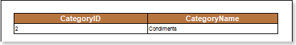
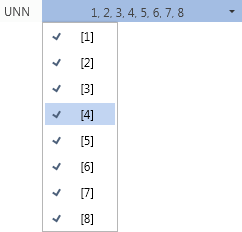
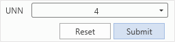
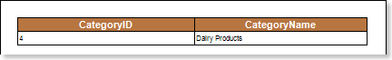
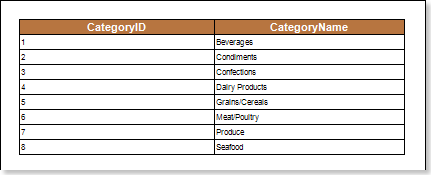
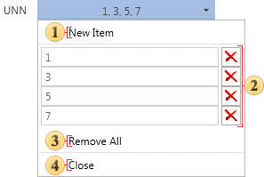
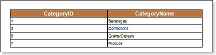

## Three Modes of Variable Functioning

Depending on the selected parameters the variable in the report can be operated in the following modes: autonomous, user (with selecting values)​​, user (with inputting values). Let us consider these modes in more detail.

**Autonomous**

This mode will be applied if the **Request from User** parameter is disabled, i.e. using a variable in the report, no action will require from the user. Create a variable that will store the value 2 of the integer type with the name **UNN**. Use this variable in the report. The picture below shows an example of the rendered report:

Add a filter in the **DataBand**, where specify the expression **Categories.CategoryID == UNN** as the filtering condition. Now when rendering a report, the report generator will consider the filtering condition and display only those entries which values ​​in the column **CategoryID** be equal to the values, ​stored in the variable. In this case, it is the entry Condiments. The picture below shows an example of a report using a variable to filter data:

In this case, when rendering a report, no action will require from the user.

**User (with selecting values)**

This mode of operation of the variable will be used if the **Request from User parameter** is enabled and the **Allow Users Values** is disabled. If using this variable in the report, there may need some actions from the user for selecting values ​​from a variable list. Create the variable **UNN**, which will store a list of items from 1 to 8. Use this variable in the report. The picture below shows an example of the rendered report:

Add a filter in the **DataBand**, where the expression **Categories.CategoryID == UNN** is a filtering condition. Now, when report rendering, the value from the list will be selected in the viewer window. The picture below shows a list of variable values​​:

After selecting the value, click the **Submit** button to apply the selected value or the **Reset** button to reset the initial value in the list. The picture below shows the variable panel in the report:

When clicking the Submit button, the report generator will filter data and display these data, which **CategoryID** is equal to the selected value. The picture below shows an example of a report with the selected value **4**:

The Reset button resets the current value and sets the first top value from the variable list.

User (with inputting values)

This mode of the variable will be applied if the Request from User and ​Allow Users Values is enabled. When using this mode, selecting or entering values ​​in the variable field will require from the user. Create a variable type of List with the name UNN, and specify the column CategoryID as keys and values. The picture below shows an example the rendered report:

Add a filter in the **DataBand**, where as the filter condition, specify the expression **UNN.Contains(Categories.CategoryID)**. Now, when rendering a report, it is necessary to edit the list of values ​​of the variable (remove unwanted items, or change the key in the item field, or create a new item) in the viewer window. The picture below shows an edited list of the variable:

 The **New Item** button. Creates a new item with the field in which to specify a key;

 The **Remove** buttons. Remove the item to which they belong. Each item in the list has such a button.

 The **Remove All** button. Removes all items from the list;

 The **Close** button. Closes this menu saving items and input keys.

After that, click the Submit button. Now the report generator will filter data and display the data which the CategoryID is equal to keys specified in the fields in the list of the variable values. The picture below shows the filtered report:

The Reset button, in this case, resets the current list of values ​​to the original one.
