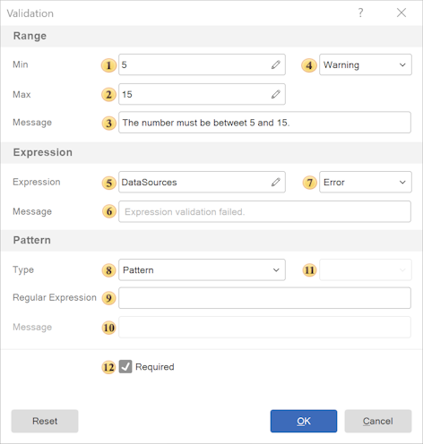

## Variable Validation

**Variable Validation** - is the process of checking that a variable value matches the expected format, type, and constraints.

For example:

* The variable value must be in the range from 1 to 100;
* A string must not be empty;
* An email must match a specific format.

Let us consider the variable validation settings:

**Range**

Allows defining a range of valid values. The parameters of this group are listed below.
 In the **Min** field, the minimum allowed value is specified;

 In the **Max** field, the maximum allowed value is specified;

 **Message** - provides the ability to specify a notification that will be displayed on the parameters panel when the entered value is outside the defined range;

 **Validation Type** - defines the type of value validation:

* **Warning** - in this case, a message will be displayed on the parameters panel, but the parameter value will still be applied and the report will be generated;

* **Error** - in this case, a message will be displayed on the parameters panel, and the parameter value will not be applied and the report will not be generated.

**Expression**

Allows defining a validation criterion using an expression. The parameters of this group are listed below.

 In the **Expression** field, you can specify a condition, for example: variable_1 != 5;

 **Message** - provides the ability to specify a notification that will be displayed on the parameters panel when the entered value does not meet the criteria of the defined expression;

 **Validation Type** - defines the type of value validation:

* **Warning** - in this case, a message will be displayed on the parameters panel, but the parameter value will still be applied and the report will be generated;

* **Error** - in this case, a message will be displayed on the parameters panel, and the parameter value will not be applied and the report will not be generated.

**Pattern**

Allows you to validate the result of the evaluated expression. The parameters of this group are described below.

 **Type**. The following options are available:

* **No** - pattern validation is disabled;
* **Pattern** - custom regular expression;
* **Email** - email validation;
* **Phone** - phone number;
* **URL** - web address;
* **Alpha Numeric** - letters and digits;
* **Alpha** - letters only;
* **Numeric** - digits only;
* **SSN** - Social Security Number (USA);
* **TIN** - Tax Identification Number;
* **IP Address** - IP address;
* **IBAN** - International Bank Account Number;
* **ISBN** - International Standard Book Number.

 **Regular Expression** -  in this field, a custom regular expression is specified, which is used to validate the entered value. The value is considered valid if it matches the specified pattern. A regular expression allows defining complex validation rules, for example:

* validation of an e-mail format;
* validation of a phone number;
* validation of a string according to a specified pattern.

If the entered value does not match the regular expression, a validation message will be displayed.

 **Message** - provides the ability to specify a notification that will be displayed on the parameters panel when the entered value does not meet the criteria of the defined pattern;
 **Validation Type** - defines the type of value validation:

* **Warning** - in this case, a message will be displayed on the parameters panel, but the parameter value will still be applied and the report will be generated;

* **Error** - in this case, a message will be displayed on the parameters panel, and the parameter value will not be applied and the report will not be generated.

 **Required** - makes the field mandatory, an empty value will be treated as an error.

> **Information**
>
> Validation is performed sequentially: Range → Expression → Pattern → Required.
>
> If the value does not meet one of the criteria, validation stops and an error message is displayed for that criterion.
>
> Validation can be performed using a single criterion (for example, Range) or multiple criteria simultaneously (for example, Range and Expression).
