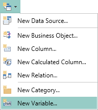
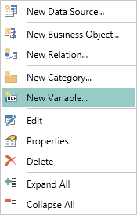
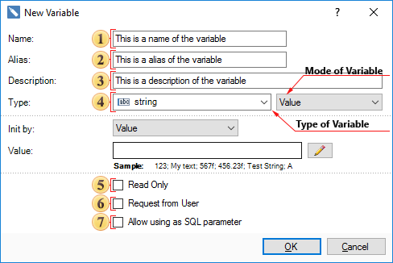
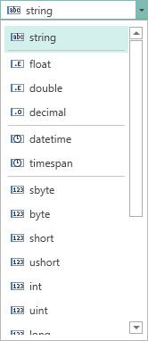
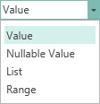

## Variables

In Stimulsoft Reports you can use Variables in the report. The Variable is the opportunity to place and use of any value when rendering reports. The values can be of different types: string, date, time, number, array, collection, range, etc. All variables are stored in the data dictionary. Before using a variable in the report, it is necessary to add it to the data dictionary. To add a variable you can select the New variable... in the New Item of the data dictionary. The picture below shows the New Item menu:

Also, you can create a new variable by selecting New Variable... in the context menu of the Dictionary:

After selecting this item, the New Variable dialog will be called. In this dialog you can set the parameters of the variable. The picture below shows the New Variable dialog:

 The Name field specifies the name of the variable used in the report.

 The alias, name of the variable that is displayed to the user, you can specify it in the Alias field.

 In the Description field, you can specify a description of the variable.

 In the Type field you can change the type of data that will be placed in a variable, and the type of the variable. This field is represented by two fields with drop-down lists. The first list is a list of all available data types divided into categories:

As can be seen from the picture, the integer is selected. The second list contains a list of variables. Depending on the type of a variable, some additional fields of parameters can be displayed. The list of types of variable fields is presented in the second list of the Type field (see. picture above). The picture below shows a list of types of a variable:

As can be seen from the picture, the variable can be of the following types - Value, Nullable Value, List, Range. Next, consider all types of a variable and the Request from User option in detail.

 The Read Only parameter sets the read-only mode. In this case the value stored in a variable is returned and the user cannot change it. If the value is initialized as an expression then, at the time of treatment to our variable, the expression will be calculated each time.

 The Request from User parameter establishes a mode under which the returned value can be changed by the user. It should be noted that, if the Request from User is set to true, an additional panel will be displayed. This panel has variable settings that determine the possibility of interaction with the user. In addition, the New Variable dialog can be modified.

 The Allow using as SQL parameter gives an opportunity to use a variable as a parameter in the query when selecting data.

> **Information**
>
> Information: When editing a variable, the Save a Copy button will be displayed in the window. When you click on this button, a copy of the edited variable with the Copy postfix in the variable name, will be created.
