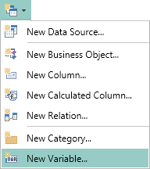
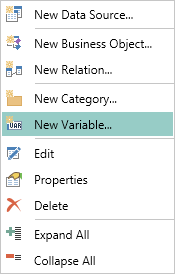
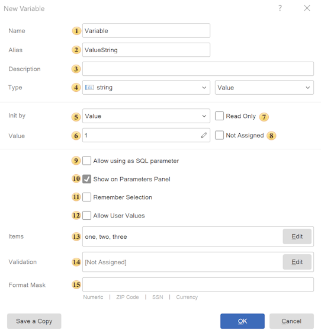
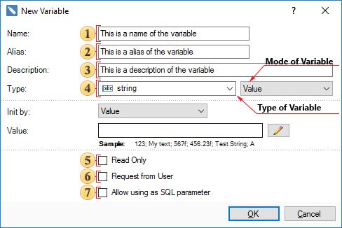
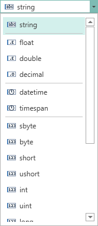

## Variables

In Stimulsoft Reports you can use Variables in the report. The Variable is the opportunity to place and use of any value when rendering reports. The values can be of different types: string, date, time, number, array, collection, range, etc. All variables are stored in the data dictionary. Before using a variable in the report, it is necessary to add it to the data dictionary. To add a variable you can select the New variable... in the New Item of the data dictionary. The picture below shows the New Item menu:

Also, you can create a new variable by selecting New Variable... in the context menu of the Dictionary:

After selecting this item, the New Variable dialog will be called. In this dialog you can set the parameters of the variable. The picture below shows the New Variable dialog:

 In the **Name** field, the variable name used in the report is specified.

 The **Alias** field specifies the variable name displayed to the user.

 In the **Description** field, you can provide additional information about the variable.

 In the **Type** field, you can change the data type stored in the variable and the variable type. This field consists of two dropdown lists. The first list contains all available data types grouped into categories:

As can be seen from the picture, the integer is selected. The second list contains a list of variables. Depending on the type of a variable, some additional fields of parameters can be displayed. The list of types of variable fields is presented in the second list of the Type field (see. picture above). The picture below shows a list of types of a variable:

As can be seen from the picture, the variable can be of the following types - Value, Nullable Value, List, Range. Next, consider all types of a variable and the Request from User option in detail.

 In the **Init by** field, the method of variable initialization is specified.
 In the **Value** field, the variable value is specified.

 The **Read Only** option enables read-only mode. In this case, the value stored in the variable is returned, and the user cannot modify it. If the value is initialized by an expression, the expression will be recalculated each time the variable is accessed.

 The **Not Assigned** property allows indicating that the variable has no value.

 The **Allow using as SQL** parameter option allows using the variable as a parameter in a data query.

 The **Show on Parameters Panel** property allows displaying the variable on the parameters panel.

 The **Remember Selection** property allows saving the value selected by the user.

 The **Allow User Values** property allows users to enter custom values for the variable.

 In the **Items** field, the list of variable values is specified.

 In the **Validation** field, you can configure validation rules for the variable value.

 In the **Format Mask** field, you can define the display format of the variable value.

> **Information**
>
> When editing a variable, the **Save a Copy** button is available in the window. When this button is clicked, a copy of the edited variable is created with the postfix **Copy** added to the variable name.
