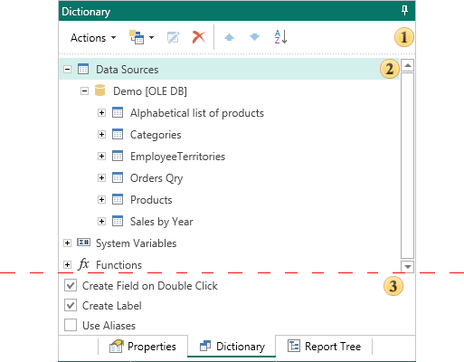

## Data Dictionary

Each report contains the data dictionary. The data dictionary contains information about the data used to create reports. This information includes connections to databases, data sources, and their relations, variables, and business objects. Also, the report data dictionary may not have any information about the data, but the report will be rendered. The report data dictionary is displayed in the Dictionary panel. The picture below shows the Dictionary panel:

 The Data Dictionary panel. It contains the necessary controls in the dictionary.

 The Information panel. Displays information about the data as a tree.

 The Settings panel. Used to enable/disable some options to work with the data dictionary.
