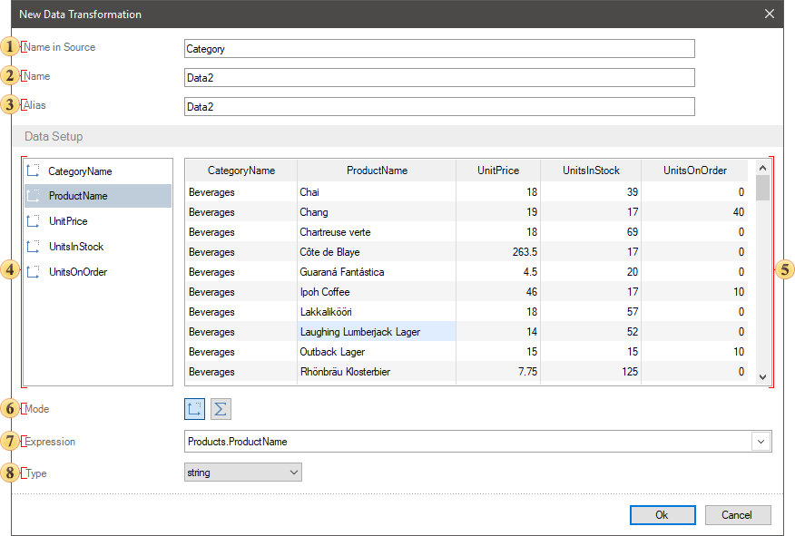
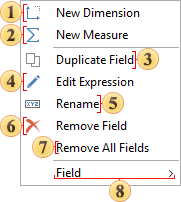
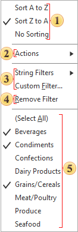

## Structure

When creating a new data transformation, settings and its elements are defined in the window of this tool. Below you can see the description of the New Data Transformation window structure.

 The name of transformation, which will be used in original data (for example in the DataSet) is specified in the Name in Source field.

 The name of transformation used in a report is specified in the Name field.

 In the Alias field, you can specify the name of transformation, which will be used if the Use Alias parameter is enabled in the data dictionary.

 The list of a new transformation. Data columns added from different sources and created the New Measure and the New Dimension are displayed on this panel. You can add data columns in data transformation using the following ways:

* Dragging a data source or a data column from the dictionary into the list of elements or the preview. If a data source is dragged into, all data columns from this source will be added to the list of data transformation fields.
* Using the New Dimension or the New Measure commands from the context menu (below) in the list of fields.

 The preview of a new data transformation. The values from data columns and fields are displayed on this panel, i.e a new data table.

 The **Mode** parameter allows you to define the mode of a selected field:

  * Measure. By default, this field type is applied for all numeric types of data. In addition, this type of data field is used if you need to group values of the current data field by the values of another data field.

* Dimension. This field type is applied not for numeric data types by default. When grouping data the values of this data field will be the condition of grouping for values of other data fields.

 Using this parameter the expression that resulted in getting a value for a selected field is defined. For example, a link to a data column in a table or data columns production, a data column with a function, etc.

 The Type parameter allows you to define the type of data for the values of a selected field. For example, string, integer, decimal, byte[], object.

> **Information**
>
> You can delete fields from a new data transformation using the following way:
>
> Hover the cursor over a field and click the delete button to the right of its name;
>  Hover the cursor over a field, click the right button of the input cursor, and select the Remove Field command in the context menu;
>  Select a field and click the delete button.
>
> Also, you can delete all fields from data transformation. To do it, you should call the context menu and select the Remove All Fields command.

Field context menu

There are controls of the current field in the context menu. To call the context field menu you should:
* Hover the cursor over the field you need on the list panel;
* Click the right button of the input cursor.
After that, the context menu will be called:

 Field creation command – the New Dimension.

 Field creation command – the New Measure.

 Duplicate (a copy) creation command of a selected field.

 The command, which calls the expression editor with an expression of a selected field.

 The command, which calls the mode of editing the name of a selected field. Also, you can rename an element using the following ways:

* Double click the left button of the input cursor on a field in a list.
* Select a field in a list and click the F2 button.

 Selected field deleting command.

 The Remove all fields command.

 When hovering the cursor over the Field command, the menu with the set of data sources and columns in them will be opened. In this list, you can select a link to a data column for the current field.

> **Information**
>
> If there are no data sources in the data dictionary, the Field command will not be displayed.

Field menu in the preview

To call the field menu in the preview, you should click on a header on this panel. This menu contains control commands of the values of the current field.

 Sorting values commands:

  * Sorting in ascending order. Depending on value type, sorting commands can be different. For row values the from A to Z, for numerical the from Smallest to Largest, etc.

* Sorting in descending order. Depending on value type, sorting commands can be different. For row values the from Z to A, for numeric from the Largest to Smallest, etc.
* No sorting. In this case, the order of values in the current field will be as well as in the data description.

 Depending on the values of the current field the Actions menu can contain the following commands:

* [Skip and limit rows;](Skip_and_Limit_Rows.md);
* [Running total](Running_Total.md);
* [Show percentage](Show_Percentage.md);
* [Replace value](Replace_Value.md).
* The Remove Actions command. This command is active, if some action is applied to an element. When selecting this command, all actions for the current field will be deleted.

 Commands of adding [data filtering](Filtration.md) in the current field:

  * The type filter, in this case the String Filters contains logical operations for the condition of the current field filtering. Depending on the value type of this field, logical operations can be different.

  * The Custom filter allows you to set several filters with various logical operations.

 The command, which deletes all filters for the current field.

 Values of the current field. One of data filtering tools. By default, all values and the Select All item are displayed as well as other values they are checked a box. However, you can check a box next to the values you need. As a result, only the values checked a box and rows related with them will be displayed in a new table. When selecting the Remove Filter command all values will be checked a box, it means they will be displayed.
