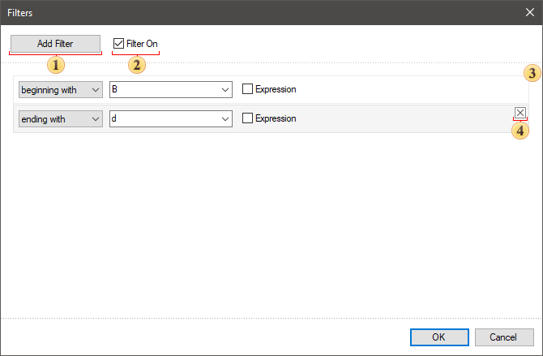
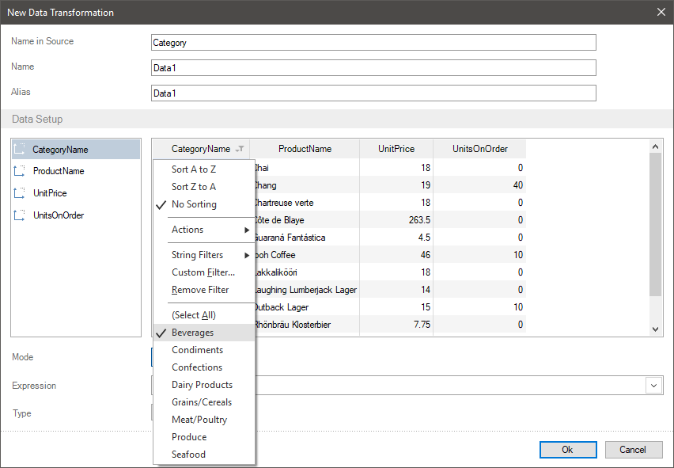
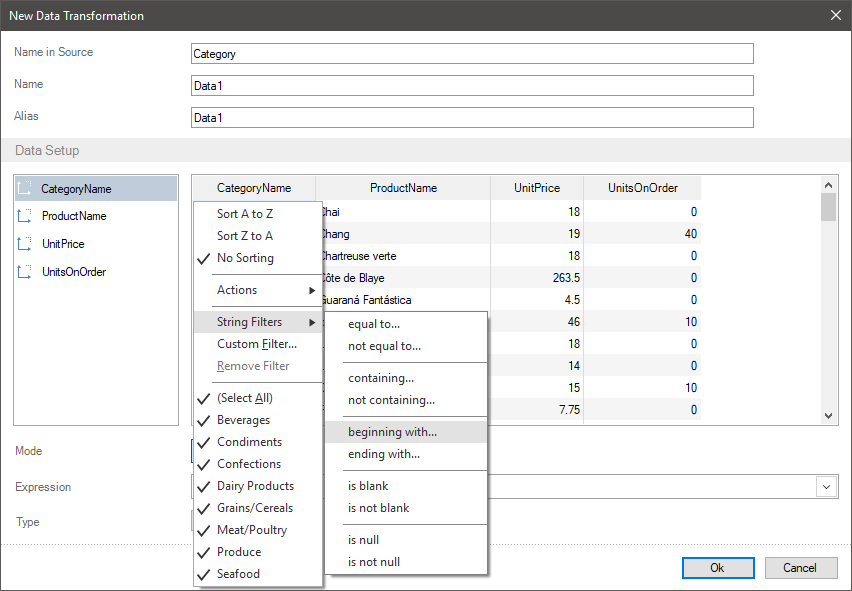
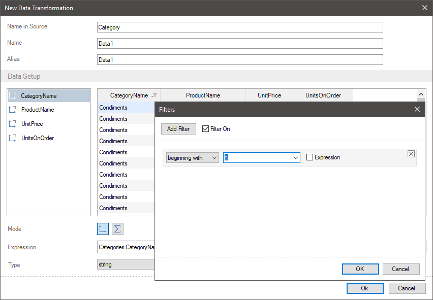
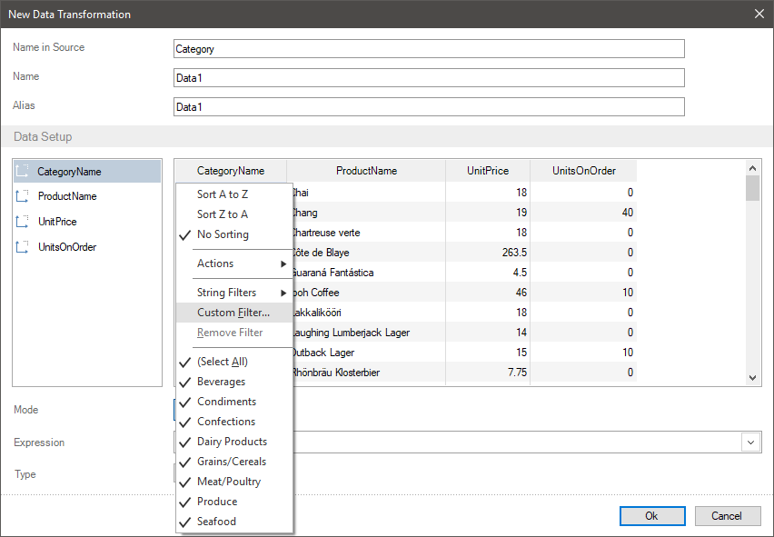
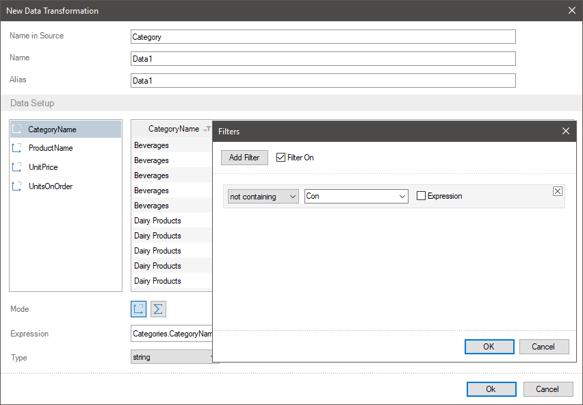
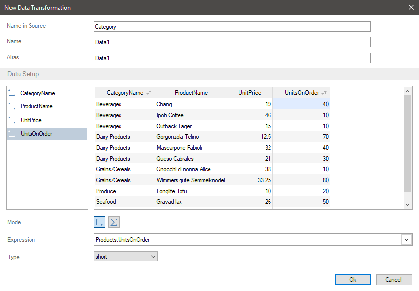

## Filtering Data

Filtering data is data selection by some condition. For example, the statistics of visits for the last twenty four hours or sales volume by a definite category, etc.
You can filter data using various tools in the report designer. However, you can often face with such situations, when you have to transfer filtered data to a report components.
In this case, you can create the **New Data Transformation**, where you should filter data. After that, based on this table you can create a report.
You can filter data in the data transformation using the following ways:
* Click on the data field header in the preview. Check boxes next to the values which need to be skipped, it means uncheck boxes next to the values you don`t need.
* Click on the data field header in the preview. In the drop down menu you should go to the Filter of data type (name depends on a data field type, i.e. the Number Filter is for numeric fields, the String Filter is for row fields, etc.) and define a logical operation in the submenu. After that, the editor will be opened, where you should specify a value for a logical operation. When this filter triggers, i.e a definite logical condition is carried out, the values will be filtered in the current field.
* You should click on the data field header in the preview. Select the Custom filter command in the drop down menu. After that, the filter editor will be called where you should add filters, define a logical operation and a value. When this filter triggers, i.e a definite logical condition is carried out, the values will be filtered in the current field.
You should understand, that data are filtered with rows, i.e if a logical operation triggers for a definite value of one field, the values from other fields of this row will be displayed. Besides, you can specify the Expression as filter value. In this case, the result of expression calculation will be a value for a logical condition in a filter.

> **Information**
>
> Pay attention to the fact that filtering can be multi-level both for one field and in relation to the entire table:
>
> * You can specify several filters for one field. In this case, the values will be displayed, if even one of the filters is carried out.
>
>
> * Besides, the filtering can be carried out by the values of one field and by the values of another field. For example, firstly, one category is selected and then two products with max sales are defined in this category.
>
>
> * Also, when filtering data, read this article [Skip and limit rows](Skip_and_Limit_Rows.md).

When applying the type filter or custom filter to a field, the filter editor menu will be opened. Below you can see the **Filters** menu structure:

 Button for adding a new filter.

 The **Filter On** box is used to enable or disable filters.

 List of added filters.

 Button for deleting a selected filter.

> **Information**
>
> Moving the selected filter into up / down carried out by dragging. The higher a filter, the earlier it is processed.

Let`s consider the examples of data filtering when creating a new data transformation. Imagine, a new table contains fields with the names of product categories, the products with price for each product and the number of orders for each product.

**Filtering by values selection**

**Step 1**: In the preview, you should click on a field header and check a box next to the values, which need to be displayed. In this case, the filtering is carried out by the set of categories, only data for the Beverages category will be displayed.

You should understand that after filtering categories, you can filter by the values of another field.
**Filtering using the type filter**

Depending on data type of the current field, the filters of data type and their logical operations can be different. For example, there are different operations for string values, numeric values, and dates.
**Step 1**: You should click on a field header in the preview, in the menu of the filter of data type (for example the String Filters), select a logical operation. In this case, you should select the **beginning with** operation for category name.

**Step 2**: To perform a logical condition of filter you should specify a value in the **Filters** menu and click the **Ok** button. Also, if needed, you can change a logical operation and add other filters. In this case, specify **C** letter. Now all categories which start with this letter will be displayed.

**Custom Filters**

**Step 1**: You should click on the field header in the preview and select the **Custom Filter** command. In this case, you should click on the field header with the set of categories.

**Step 2**: You should click on the **Add Filter** in the **Filters** menu, define a type of a logical operation and a value for a logical condition, and click Ok. In this case, you should select the **not containing** operation, specify the **Con** as a value of a logical condition. Now, all categories, which don`t contain the **Con** will be displayed.

Apart from filtering by categories, let`s filter by product prices. For example, you need that from a filtered list of categories only the products where orders were written will be displayed. To do that you should:
**Step 1**: Click on a field header with the number of orders in the preview;
**Step 2**: Select the **greater than** operation in the **Number** filter menu;
**Step 3**: Specify the 0 as a value of a logical operation and click Ok in the **Filters** menu. This way, products, the number of orders, which more than null will be displayed.

> **Information**
>
> You can delete filters using the following ways:
> * To delete all field filters, you should click on its header in the preview and select the **Remove Filters** command in the opened menu.
> * To delete a specific filter, you should call the editor of filters, i.e. you should click on a field header and select the **Custom filters** command in the preview. Select the filter you need and click the **Remove Filter** button in the editor.
