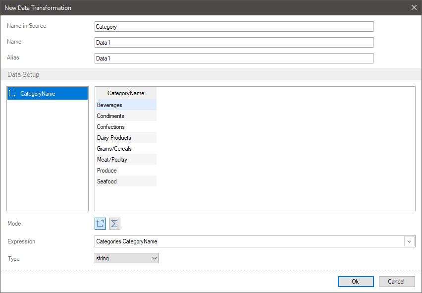
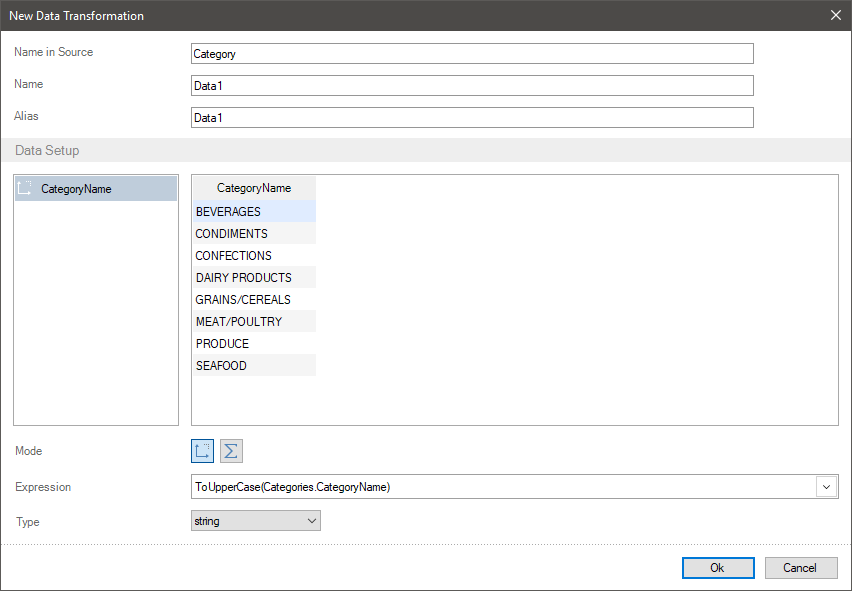
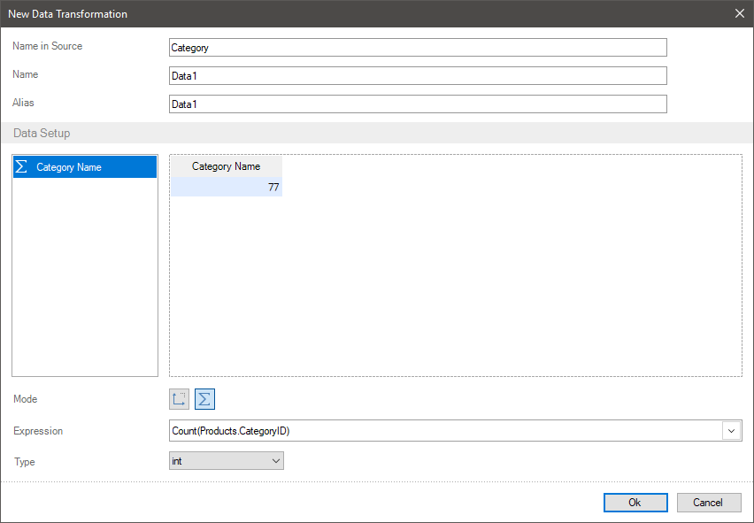
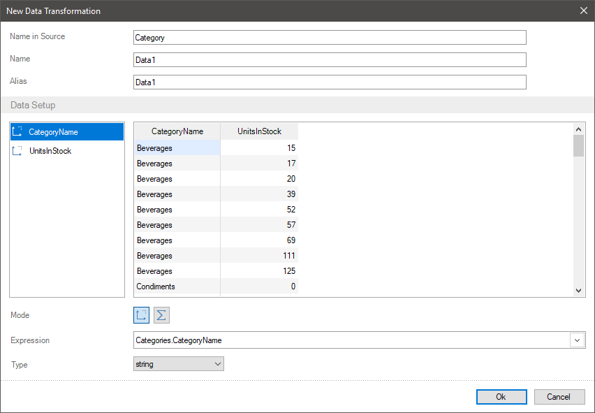
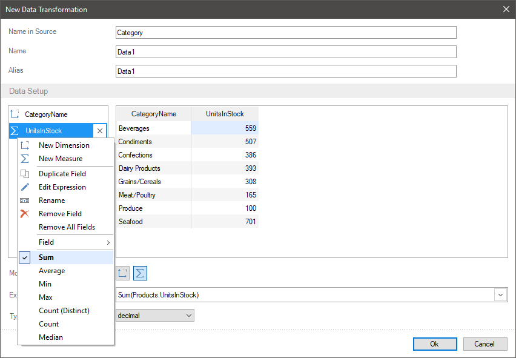

## Using functions

Frequently, when creating a report, you should apply some functions to data. You can do it using different ways, including the report designer tools. However, if you need to transfer data with an applied function to a report component, a possible solution is creation a new data transformation.
When creating a new data transformation you can use functions to the values of fields.
To use functions to an element you should:

* Switch the element mode from the Dimension mode to the Measure, if you need to apply calculation functions;
* Select a function from the drop down list of parameters in the Expression field or call the expression editor and select an appropriate function in the data dictionary;

* Select a function from the context menu in the element list;
* Also, you can manually add a function to an element expression.

> **Information**
>
> Pay attention to the fact, that a list of available functions can be different depending on a data type in a selected function. For example, you can apply the functions of sum, selection of max, min values, average calculation for numeric types. However, these operations can`t be applied to the values of a string type.

Let`s consider the examples of using functions to the fields with various data types.

Applying functions to dimension
All functions except the functions of total calculation can be applied to the dimension. For example, the function of transferring all values of the current field to the upper register or the function of inserting text inside current values can be applied.

Step 1: Add a field to the data transformation. For example, a data column with a list of categories.

Step 2: Type function name manually to an expression of the current field or call the expression editor and drag the function from the data dictionary. For example, add the function of transferring all values to the upper register - ToUpperCase(). And the ToUpperCase(Categories.CategoryName) field expression for the list of categories.

Applying functions of total calculation to non-numeric values

You can apply functions for total calculation only to the fields with the Measure mode. For the fields with non-numeric values only the following functions of total calculation are available:
* The Count() function for calculation the number of values in the current field;

* The DistinctCount() function for calculation the number of unique values in the current field;
* The First() function for displaying the first value from the current field;

* The Last() function for displaying the last value from the current field.

Let`s consider the applying functions of total calculation to non-numeric data in the data transformation. Imagine, a table contains 77 products from 8 categories.

Step 1: Add a field to the data transformation. You should add a data field with a list of categories for this example.
Step 2: Change the mode from the Dimension to the Measure for this field.
Step 3: You should select the total calculation function from the context menu of the current element or the drop down menu of the Expression parameter.
* Firstly, you should select the Count() function. As a result, you will get the total number of values in the field with a list of categories – 77, because there is more one product per a category, the values of categories are repeated.

* If you select the DistinctCount() function, the number of unique notes will be calculated – 8, so as repeated values will not be taken into account.

Applying functions to numeric values
You can apply functions for total calculation only to the fields with the Measure mode. Different total calculation functions are available for the fields with numeric values: sum, average and median value calculation, display of max and min, etc.
Let`s consider the applying these functions to a filed in the data transformation. For example, a table contains 77 products from 8 categories. You should calculate the number of product in stock by each category. To do it you should:

Step 1: Add a data field to a new data transformation. In this example, you should add a data field with the names of categories and a data field with units in a stock.

Step 2: Change the mode from the Dimension to the Measure for the field where you should apply the total calculation function. In this example, you should do it for the field with units in stock.
Step 3: You should select the total calculation function from the context menu of the current field or the drop down menu of the Expression parameter.

All units in stock by each category will be summed. You can see a full list of total calculation in the data dictionary, in the Totals category. To add a function from the data dictionary, you should call the expression editor for a selected field and drag the function into the field of expression editor.
