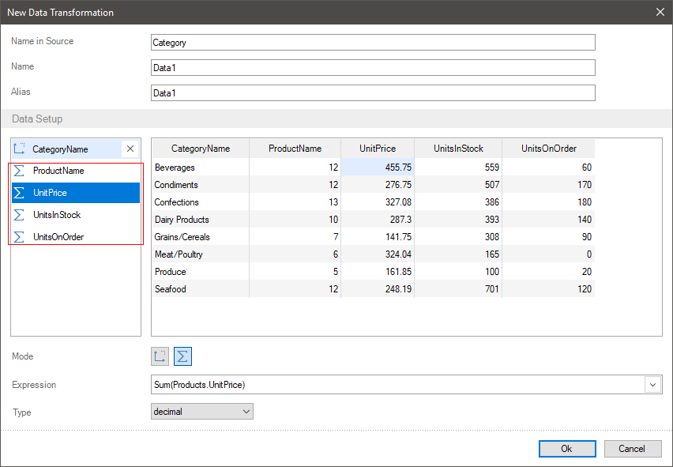
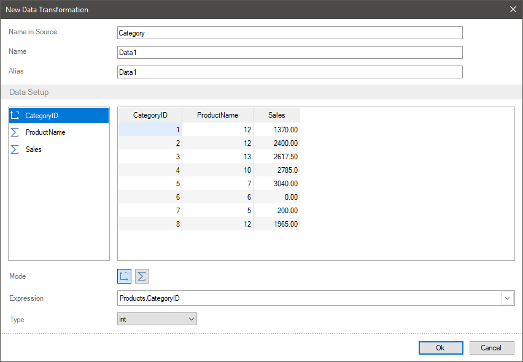
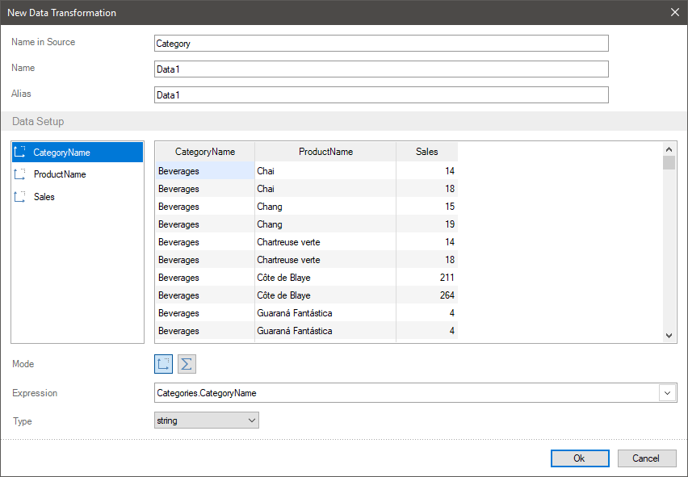
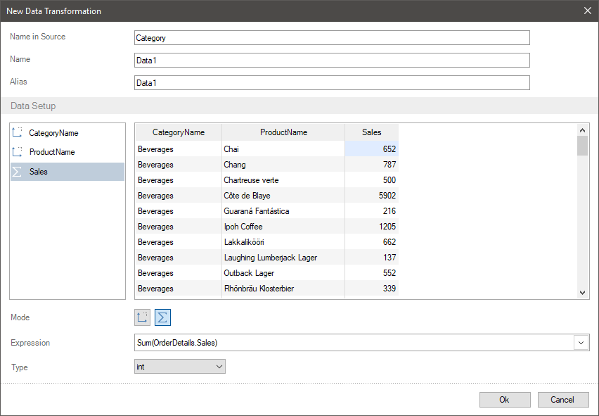
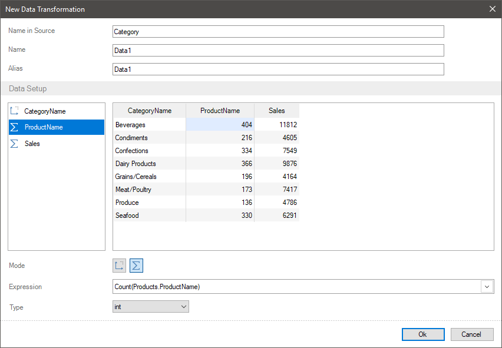

## Grouping Data

Grouping data is their joining by some criterion or condition. The same data can be combined by various conditions. For example, data of product sale can be grouped by sales region or categories. In addition, data can be grouped by several conditions, i.e. into several levels. For example, data about product sales will be grouped firstly by regions and after by categories.
You can group data when transforming data:

* Within one data table;
* Grouping data from one data table by a condition from another data table.

> **Information**
>
> When grouping data from one data table by a condition from another one, you should have relation between these data tables. So, you should create relation between data tables before grouping data.

To group data when creating data transformation, you should switch from the Dimension mode to the Measure for all fields instead of the field which data will be grouped.

Let`s consider the examples of grouping data when transforming data.

Grouping data from one table

For example, there are fields with category number, the set of products and sales of each product in the Products table. You should get data with sales by each category. To do it you should:

Step 1: Drag a data source or a column from this source into the field list of a new data transformation. The Category ID, Product Name, Sales columns will be added in this example.
Step 2: For all fields except the field where the grouping is carried out, you should switch from the Dimension mode to the Measure. In this example, the field mode is changed for the column with the set of products and sales. The mode is not changed for the field with category number so as data will be grouped by the values of this field.

Grouping data from different tables

You should organize relation between these tables before starting data grouping. Imagine, the list of categories is in the Categories table, the list of products in the Products table and data by sales in the Order Details table. Firstly, when transforming data, you should group sales by each product and then by each category. This way, the grouping will be carried out in several levels.

Step 1: Drag a data source or column from this source into the field list of a new data transformation. The Category Name, Product Name, Sales columns will be added in this example. Data will be correlated via relations between tables so as the set of products will correspond to each category. Sale volumes will correspond to each product.

Step 2: For all fields except the field where the grouping is carried out you should switch from the Dimension to the Measure mode. In this case, the mode is changed for the Sales field. The mode is not changed for the fields with names of categories and products, because the grouping is carried out by products.

Step 3: For all fields except the field where the grouping is carried out you should switch from the Dimension to the Measure mode. Since products are already grouped you should change the mode for the field with a list of products.

> **Information**
>
> It`s worth noting, that the number of data grouping levels is not limited when their transforming.
