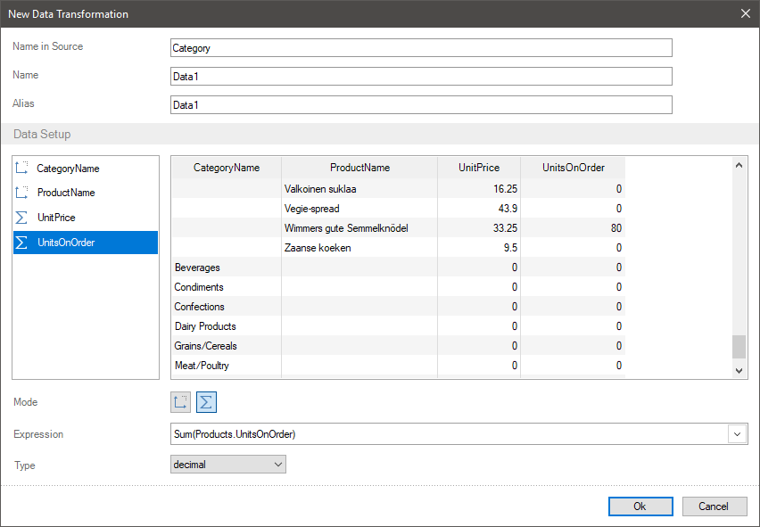
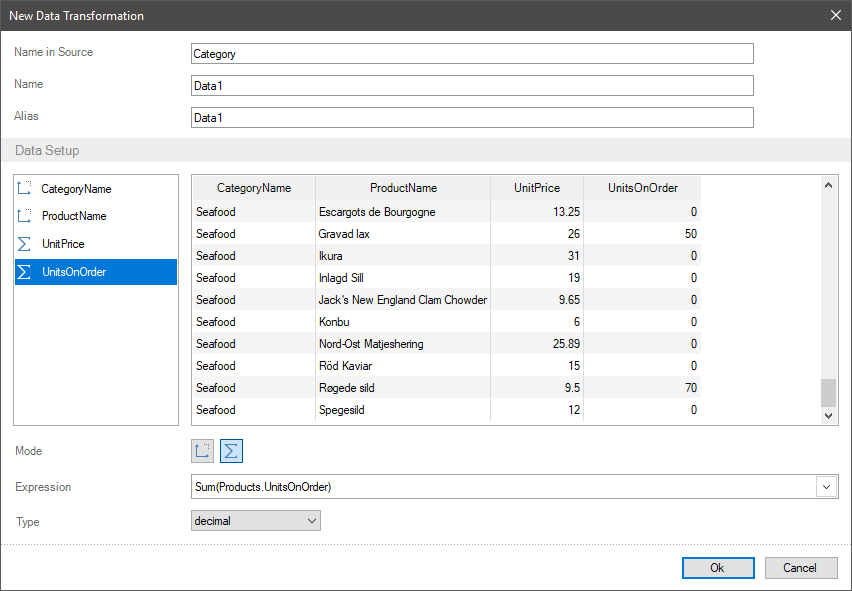

## Join tables

Sometimes you need to join data tables when creating reports. You can do it using various ways. For example, create an SQL query for the data storage or a storage procedure. However, you can do it when creating a new data transformation.
You can join tables with the help of the following methods:
* Using relations between these tables;
* Unrelated data tables.

> **Information**
>
> Get acquainted with the information about [relation between data tables](../Data_Dictionary/Relation/index.md) and about limits of their creation.

Let`s consider an example of joining various data tables for these cases. For example, that the first table contains a list of product categories and the second table – a list of products with prices and sale volume. You can organize relation between these tables by a column with unique keys of the CategoryID.
Joining unrelated data tables
You can organize relation between tables, but it doesn’t exist at the moment. To join unrelated tables you should make the following steps:
Step 1: You should drag data columns from the first table of the data dictionary into the New Data Transformation menu. For example, a data column with category names - Categories.CategoryName;
Step 2: You should drag columns from the second table of the data dictionary into the New Data Transformation menu. For example, data columns with product names, prices and number of orders - Products.ProductName, Products.UnitsPrice, Products.UnitOnOrder.

In this case, data will not be related. Firstly, the data from a table with a large number of data rows will be output. After the data from a table with a little number of rows. In the matched cells of unrelated tables for non-numeric fields will be empty. For numeric fields – 0.

**Joining tables using relation**
In this case, you should create relation between data sources. Besides, if there are such several relations, for example via different columns with unique keys, you should set the Active Relation parameter for the relation, which will be used when joining tables. For the example described above, you should create relation between a table of categories and products via a CategoryID column.
To join tables using relation, you should make the following steps:
Step 1: Create relation between data sources and enable the Active Relation parameter for this relation;
Step 2: You should drag columns from the first table of the data dictionary into the New Data Transformation menu. For example, a data column with category names - Categories.CategoryName;
Step 3: You should drag data columns from the second table of the data dictionary into the New Data Transformation menu. For example, data columns with product names, prices and number of orders - Products.ProductName, Products.UnitsPrice, Products.UnitOnOrder.

In this case, the report generator will define the relation that has the Active Relation parameter enabled and it will match data from various data sources. For the example described above each category will have its own set of products, their prices, and the number of orders.

> **Information**
>
> If more one relation is created from child data source to parent data source and no one of them has the Active Relation parameter enabled, the data will be matched by the first relation in child data source.
