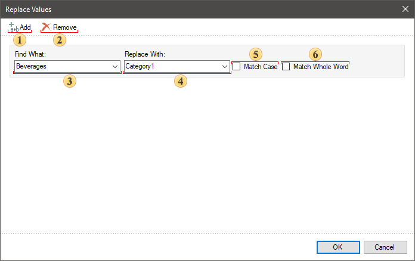
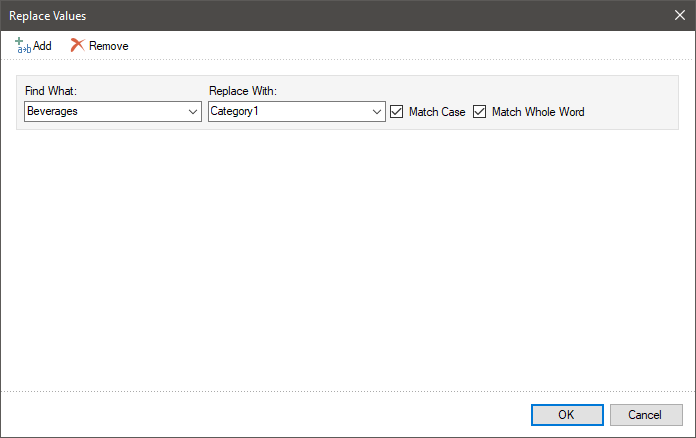
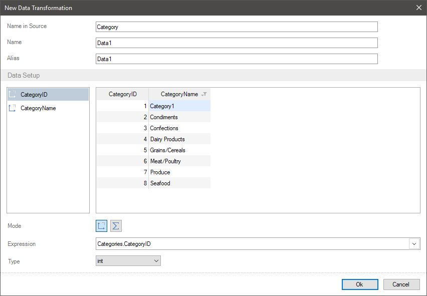
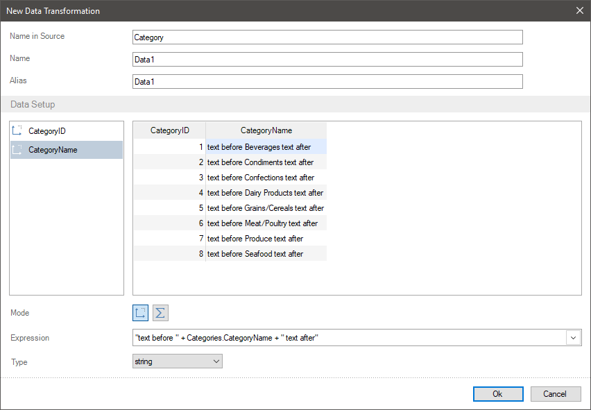
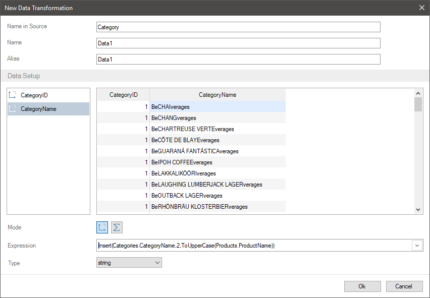

## Replace Values

Frequently, when creating reports in row data you should replace some value with another or add a text to the current value.

You can do it in a report using different tools. However, if you need to transfer data with changed values to a report components, you can do it having created the New Data Transformation.

To change a value, you should make the following actions in a new data transformation:
* Click on a field header in the preview;

* The Actions menu contains the Replace Values command.
* In the opened editor, you should specify the value, which need to be replaced and the value to replace. Also, you can set the replace immediately after several values.

 Button for adding a new panel of value replace.

 Button for deleting a selected panel of value replace.

 The field to type a value, which need to be replaced.

 The field to type a value to be replaced.

 The Match Case parameter enables the mode in which a value will be replaced only if a register of an original value (a value specified in the 3 field) fully corresponds to the value in a data field. If this parameter is disabled, when analyzing values in a data field, the register is not taken into account.

 If the flag is set, then the search will be done considering the whole word.

Apart from direct values replace, you can add a text to all values. To do it you should:
* Specify an addition sign and a text, which need to be added in an element expression before or after this expression.
* Use the Insert(,,) function to insert a text to a value.

Let`s consider the examples of replace values and adding a text to a value in an element. For example, data columns with numbers of categories and their names are added in a new data transformation.

Replace values

For example, you should replace the name of the Beverages category with the Category1 value. To do it you should make the following steps:
Step 1: Click on a field header in the preview, select the Replace Values command in the Actions menu;

Step 2: Specify an original value (Beverages in this case) in the Find What field;

Step 3: Specify the value to replace (the Category1 in this case) in the Replace With field;

Step 4: Check a box next to the Match Case, if you need a full match of an original value with a value in a data field.

Step 5: Click the Ok button.

All values of the Beverages in this data column will be replaced with the Category1 value.

Text adding before and after values

To add some text before or after a value, you should make the following steps:
Step 1: Add fields to a list of data transformation fields. For example, the numbers of categories and their names.
Step 2: Specify an addition sign and a text, which need to be added in a field expression before and after this expression. To add a text before the names of categories and after that, you should change the Categories.CategoryName element expression to the "text before " + Categories.CategoryName + " text after".
The text before and after will be added to all values in this element.

Text insert into a value

You can insert another value into the text value of data fields using the Insert(,,) function. To do it you should make the following steps:
Step 1: Add data fields to a list of data transformation fields. For example, the numbers of categories and their names.

Step 1: Add data fields to a list of data transformation fields. For example, the numbers of categories and their names.

* The first argument of the Insert function is a link to the data field, into the values of which other values need to be inserted.
* The second argument of the Insert function is an ordinal index in the value after which a new value will be inserted into.

* The third argument is the very argument (or a link to another data field), which need to be inserted into.
Let`s insert the names of products into the names of categories, after the second character. In addition to this, drag the names of products for visual selection into the upper case. To do that, you should change the Categories.CategoryName element expression to the Insert(Categories.CategoryName,2,ToUpperCase(Products.ProductName)).
Now the names of products in the upper case will be inserted into the names of categories.

> **Information**
>
> When applying the Replace Values actions to data fields they can be deleted selectively. To do it you should click on a field header in the preview, select the Replace Values from the Actions menu. Select the blocks you need in the opened editor and click the Remove button.
