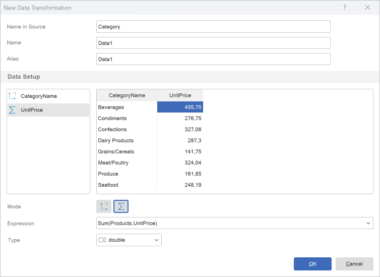
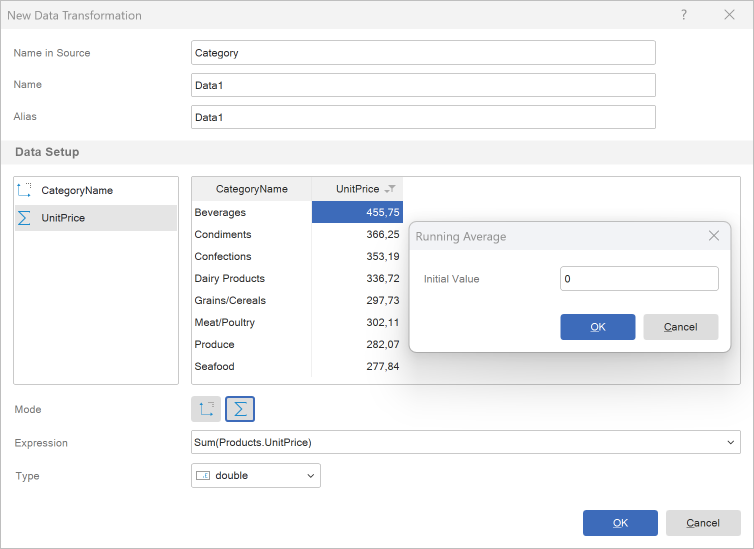
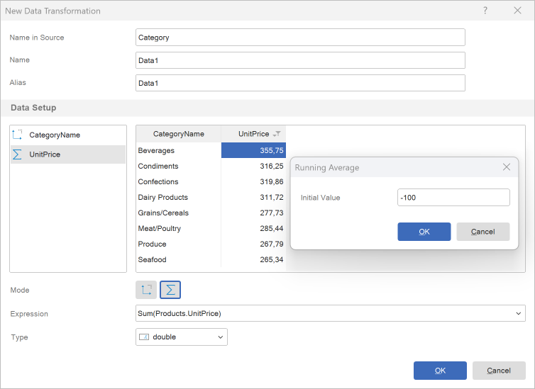

## Running Average

A **running average** is a data transformation in which, for each row, the average of all previous values (including the current one) is calculated for a selected numeric column. In the report designer, this can be performed in several ways. However, if the data needs to be passed to report components with the running average already calculated, this can be done by creating a **New Data Transformation**.
To calculate a running average for data fields, you should:
* Click the column header in the preview panel and select **Running Average** from the **Actions** menu.
* Specify an initial value. By default, the value is set to 0, meaning the running average is calculated only from the data field values. However, if needed, you can provide a different initial value.

> **Information**
>
> It's important to understand that a running average can only be created for data fields containing numeric values.

Let's look at examples of creating a running average. Suppose the new transformation contains a list of categories and their cost.

**Calculating a running average without an initial value**
**Step 1**: Click the field header in the preview pane (in this case, the field containing the cost) and select **Running Average** from the **Actions** menu.
**Step 2**: Enter the value 0 if another value was previously set, and click **OK** in the **Running** **Average** window.
Now the running average will be calculated, the new value is determined by summing the current value with the total of all previous values.

**Calculating a running average with an initial value**
**Step 1**: Click the field header in the preview pane (in this case, the field containing the cost) and select **Running** **Average** from the **Actions** menu.

**Step 2**: Enter an initial value and click **OK** in the **Running** **Average** window. In this example, we will enter -100.

Now the running average will be calculated — the new value is determined by summing the current value with the total of all previous values and adding the initial value.

