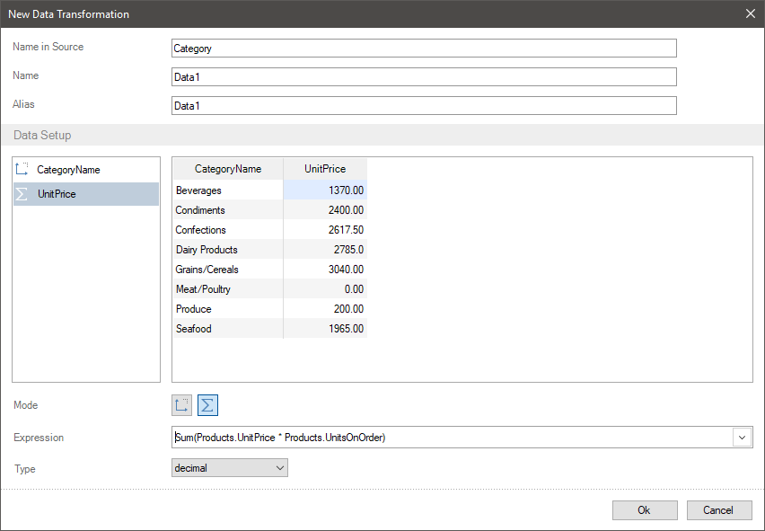
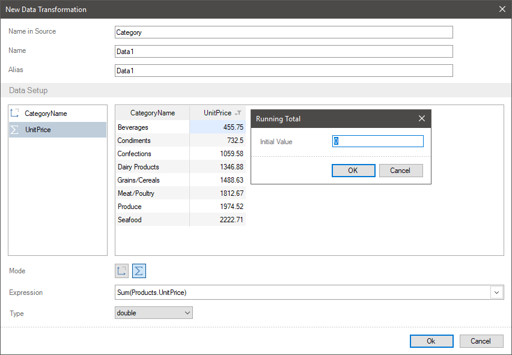

## Running Total

Frequently, when creating a report, you have to calculate running total. Running total is when a new value is calculated in the result of adding the current value of a row with the sum of the previous values. In the report designer, you can do it using various ways. However, if you need to transfer data to a report components with calculated running total, you can do it having created the **New Data Transformation**.
To calculate running total for data fields you should:
* Click on an element header in the preview, select the Running Total command in the Actions menu.
* Set an original value. By default, the 0 value is set, i.e. the running total is calculated only from data fields. However, if needed, you can set an original value.

> **Information**
>
> You should understand, that you can create running total only with data fields, which contain numeric values.

Let`s consider the examples of running total creation. For example, a new transformation contains the set of categories and their price.

**Running total calculation without an original value**
**Step 1**: Click on a field header in the preview, select the **Running Total** command in the **Actions** menu. In this case, you should click on the element with price.
**Step 2**: Type the 0 value, if earlier another value was typed, click Ok in the **Running Total** menu.
Now running total will be calculated, i.e. a new value is calculated with the help of adding the current value to the sum of the previous values.

**Running total calculation with an original value**
**Step 1**: Click on a field header in the preview, select the **Running Total** command in the **Actions** menu.
**Step 2**: Type an original value, click the Ok button in the **Running Total** menu. In this case, let`s type the -100.
Now, running total will be calculated, i.e. a new value is calculated with the help of adding the current value with the sum of the previous values and adding an original value.

> **Information**
>
> To disable running total calculation for a field, you should click on its header in the preview, select the **Running Total** command from the **Actions** menu. You should delete a value in the opened window having left the value input field empty and click Ok. After that, running total for the current field will not be calculated.
