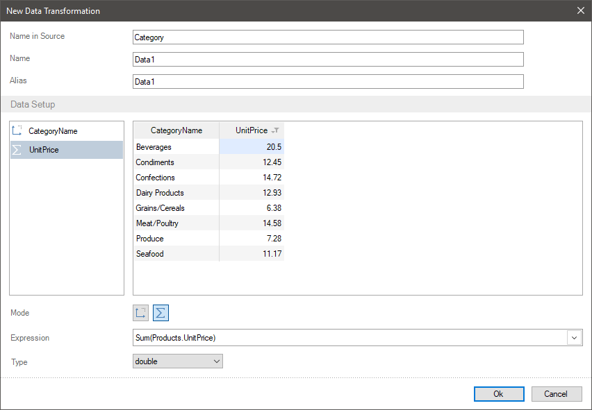

## Show Percentage

Frequently, when creating reports, you can face with such situations when you need to output a specific weight (percent) of the value from a list of data columns. For example, when analyzing sales, to select more profitable region, you should calculate sale percentage in a specific region in relation to sales in all market regions. In the report designer, you can do it using different tools. However, if you need to transfer processed data to a report, you can do it having created the New Data Transformation.
To display the percentage of a value from the sum of all element values (a field or a data column) you should:
* Add the field you need to a new data transformation;
* Click on an element header in the preview, select the Show Percentage command from the Actions menu.

> **Information**
>
> You should understand, that since percentage calculation is performing mathematical operations, this action is available only for fields with numeric values.

Let`s consider the example of percentage calculation of sales volume for each category.
Show percentage
Step 1: Add the fields you need to a new data transformation. For example, add a data field with the set of categories, products included in these categories and sales volume.
Step 2: Group sales volume by categories. To do it you should switch the mode of fields from the Dimension to the Measure, for the fields with sales volume and a list of products.
Step 3: Click on a header in the preview for a field with numeric values and select the Show Percentage command from the Actions menu. For example, it should be done for the field with sales volume.

After that, a relative value will be displayed for each category instead of absolute values, i.e. a specific weight of each category in relation to the sum of all categories sales.

> **Information**
>
> If the Show Percentage action is applied to a field, to enable this action, you should click on a field header in the preview and (if this action is checked a box) select the Show Percentage command from the Actions menu again. After that, original values of data field will be displayed.
