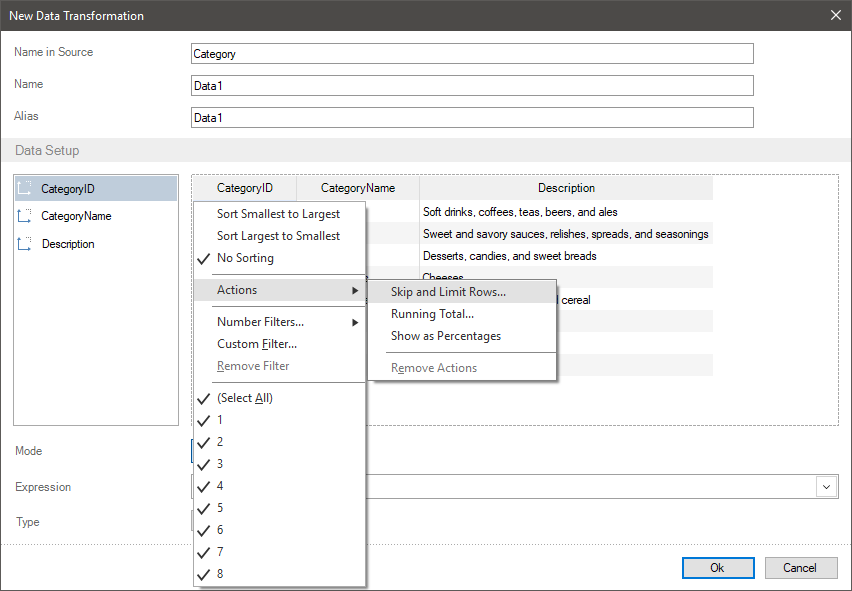
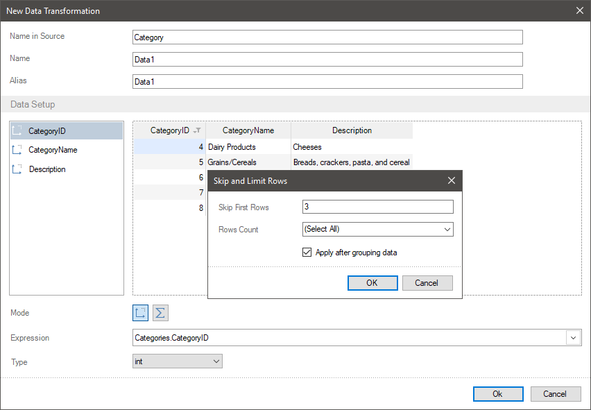
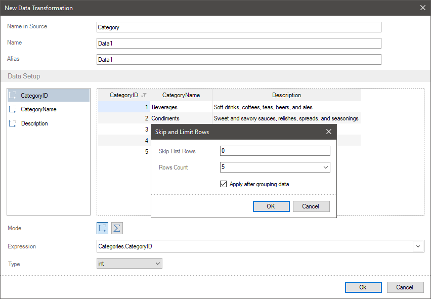
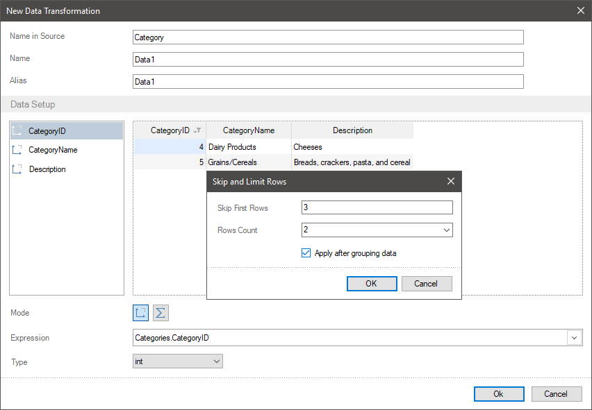
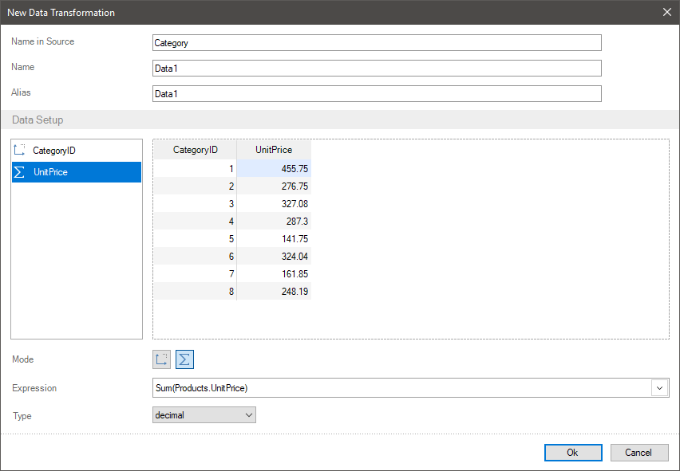
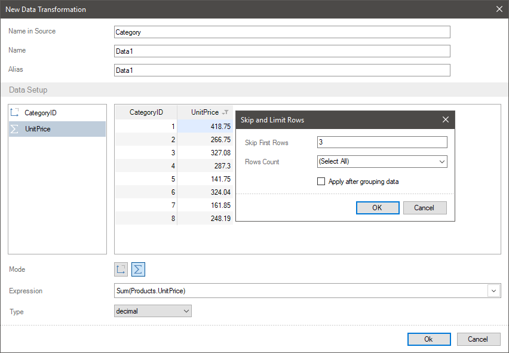
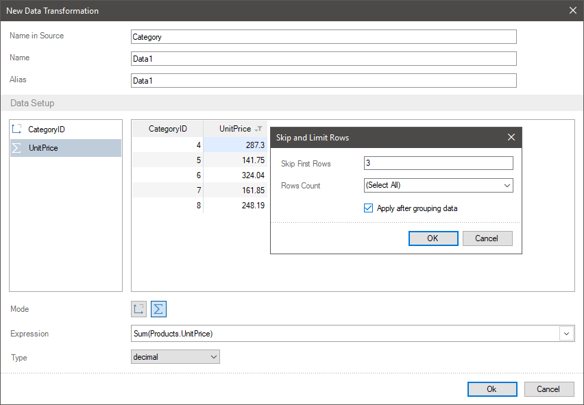

## Skip and Limit Rows

One of the ways to filter data when transforming data is to skip and set row limit in a new data table. This way you can create a range of rows, which will be in a new table. For example, from 5 to 25 row or only first three rows starting with the 10th row.

To skip rows or set their limit you should:
* Click on a field header in the preview;

* Select the **Skip and Limit Rows** command in the **Actions** menu.

* Define the number of rows in the opened window, which need to be skipped. By default, the 0 value is set, i.e. no one row in a table is skipped.
* Select a preset number of rows or type an integer, which will be the number of rows in a new table. By default, all rows are selected.

> **Information**
>
> It`s important to understand, that skip parameters and limits of row number can be set both together and separately. Besides, filters can be applied to data and on the contrary, you can apply skip and limit of rows to the data to which filters are applied.
>
> Also, pay attention to the fact that when applying the **Skip and Limit rows** action you should take into account the **Apply after grouping data** parameter.

Let`s consider the example of skip and limit of the number of rows. Imagine, a new table contains category number, a list of categories, and a description of these categories.

**Skip Rows**

**Step 1**: You should click on a field header in the preview. In this case, you should click on the element with category numbers.
**Step 2**: In the Actions menu you should select the **Skip and Limit rows** command;

**Step 3**: You should define the number of rows, which need to be skipped and click Ok in the opened window. In this case, only 8 values, you should set the 3 value. It means, starting with the 4 row, all other rows will be displayed, if another one is not defined with limit or filters.

**Limit rows**

**Step 1**: You should click on an element header (a data column or a field) in the preview. In this case, you should click on an element with category numbers.
**Step 2**: You should select the **Skip and Limit Rows** command in the **Actions** menu.
**Step 3**: Select a preset number of rows or type an integer, which will be the number of rows in a new table and click Ok. In this case, type the 5 value. It means, that only 5 rows will be displayed in the table. The countdown of these rows starts with the first row or the row, which is defined using the **Skip First Row** parameter or other filters.

**Rows Range**
In this case, you should combine interaction of the **Skip First Rows** and the **Rows Count** parameters.
**Step 1**: You should click on a field header in the preview. In this case, you should click on category numbers.
**Step 2**: You should select the **Skip and Limit Rows** command in the **Actions** menu.
**Step 3**: You should define the number of rows, which need to be skipped in the opened window. In this case, only 8 values, let`s set the 3 value. It means, starting with the 4 row all other will be displayed, if another one is not defined with limit or filters.
**Step 4**: You should select a preset number of rows or type an integer, which will be the number of rows in a new table. In this case, you should type the 2 value. It means only 2 rows will be displayed in the table. The countdown of these rows starts with the first row or with the row, which is defined the first using the **Skip First Rows** parameter or other filters. In this case with the 4 row.
**Step 5**: Click **Ok** in the **Skip and Limit Rows** menu.

This way, a range of two rows starting with the 4 row will be displayed.

**Apply after grouping data parameter**
This parameter allows you to apply the **Skip and Limit Rows** action before data grouping or after that. Accordingly, this parameter is relevant only for data fields, which are grouped by other fields in data transformation. Let`s consider the applying of this parameter when creating data transformation. For example, a data transformation contains a list of categories and a list of product sales, which included in these categories. This way, product sales are grouped by categories.

* If the **Apply after grouping data** parameter is disabled. i.e. a box unchecked, the **Skip and Limit Rows** action will be applied to original data. Let`s consider the algorithm of applying this action to data transformation:
**Step 1**: Firstly, the entire list of products will be grouped by categories;
**Step 2**: Then, the **Skip and Limit Rows** action will be applied to the values within each group. For example, if the number of skip rows is set to 3 value, first three products will not be taken into account within each category;
**Step 3**: After that, the values of product prices will be aggregated for each category, not taking into account skipped rows.

* If the **Apply after grouping data** parameter is enabled, i.e. a box checked, the **Skip and Limit Rows** action will be applied to data after transformation. Let`s consider the algorithm of applying this action to data transformation:

**Step 1**: Firstly, the entire list of products will be grouped by categories;
**Step 2**: After that, the values of product prices will be aggregated for each category;
**Step 3**: Then the **Skip and Limit Rows** action will be applied to the values. For example, if the number of skip rows is set to 3 value, first three rows of grouped data will be skipped.

> **Information**
>
> If the **Skip and Limit Rows** action is applied to a field, to get back to the values by default, you should call the **Skip and Limit Rows** menu and define settings by default, i.e. the **Skip First Rows** parameter is set to **0** value and **Select All** value for the **Rows Count** parameter.
