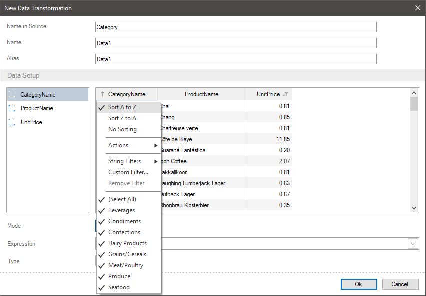
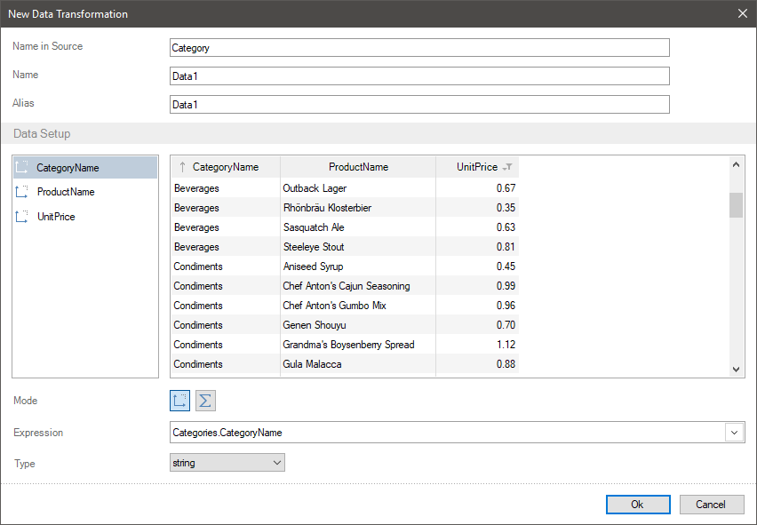
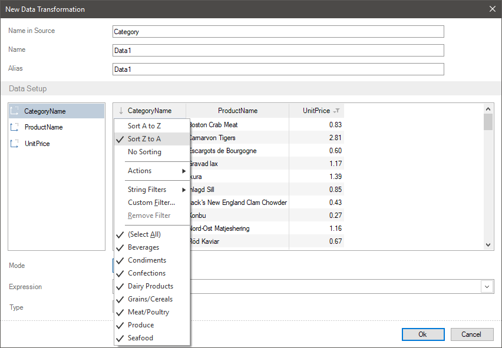
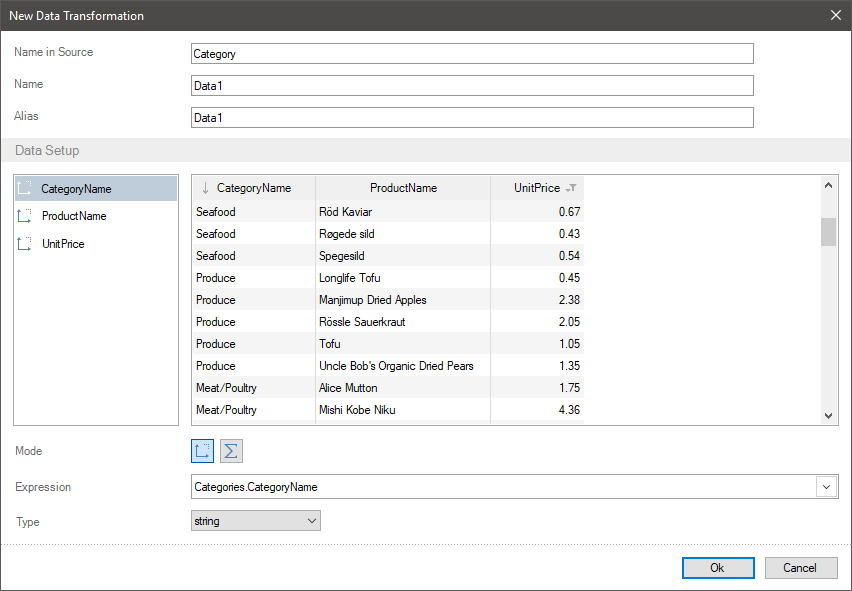
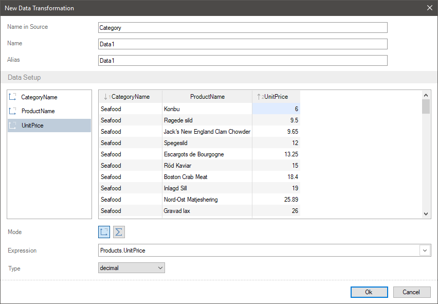

## Sorting Data

Sorting data is ordering values of data fields in a specific direction. You can sort data in a report using various ways, but sometimes you need to transfer sorted data to a report. In this case, you can create the **New Data Transformation** and based on it create a report.

When creating a new data transformation, the values can be:
* Sorted in ascending order. In case with row values, the sorting is carried out **from** **A to Z** and for numeric values from **Smallest to Largest**.
* Sorted in descending order. In case with row values, the sorting is carried out **from Z to A** and for numeric values from **Largest to Smallest**.
* No sorting, i.e. they are transferred to a report in the order where they are contained in data sources.

> **Information**
>
> You should understand, that a data table can contain a nested sorting, i.e. firstly, values are sorted by one field then by another. For example, firstly product categories are sorted then products in each category.

To enable sorting you should:
* Click on a field header in the preview;
* Select the sorting mode in the field mode: **Ascending**, **Descending**, **No sorting**.
Let`s consider the example of sorting data. For example, there are data columns in a new transformation with the names of product categories, a list of products and their prices.
**Sorting by ascending**
**Step 1**: Click on a field header in the preview. In this case, you should click on a data field with category names.
**Step 2**: You should select the sorting values direction in the opened menu. For example, select the **from A to Z**.

Now all categories will be sorted in the direction **from A to Z**.

**Sorting by descending**

**Step 1**: You should click on a field header in the preview. For example, click on the data field with category names.
**Step 2**: You should select the direction of sorting values in the opened menu. For example, select the **from Z to A**.

Now all categories will be sorted in the direction **from Z to A**.

**Sorting data by several fields**
**Step 1**: You should click on a field header in the preview. For example, click on data field with category names.
**Step 2**: You should select the direction of sorting value in the opened menu. For example, select the **from Z to A**.
**Step 3**: You should click on a header of another field in the preview. For example, click on the field with product prices.
**Step 4**: You should select the direction of sorting value in the opened menu. For example, select from the **Smallest to Largest**.

Now, all categories will be sorted in the direction **from Z to A**, and products in these categories in the direction from the **Smallest to Largest**.

> **Information**
>
> To enable sorting values, you should click on an element header in the preview and select the **No Sorting** direction. After that, the values will be displayed in an original order.
