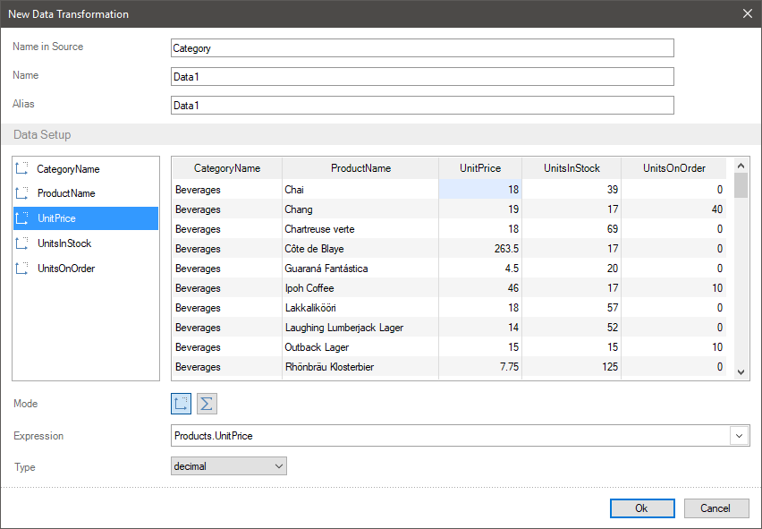
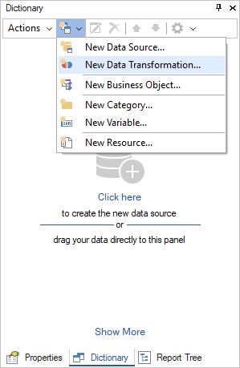

## Data Transformation

The report dictionary contains a description of data in a structured view, for example in tables. Sometimes when creating reports you need to [join data tables](Join.md), [sort](Sorting.md), [group](Groups.md), [filter data](Filtration.md), add some new elements, perform mathematical operations, and calculate the total for joined tables and much more.

You can transform data using different ways:

* Write queries with parameters;

* Change data structure in a storage;

* Create a storage procedure and more.

However, you can use the **Data Transformation** tool in the report designer. Using this tool, you can create a description of data as a table. After that, you will be able to render some reports in the report designer based on this table.

To call the **Data Transformation** you should select the **New Data Transformation** command in the **New Item** menu of the data dictionary.

After you select this command, the **New Data Transformation** window will be called where you can transform data.
