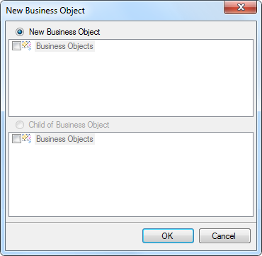
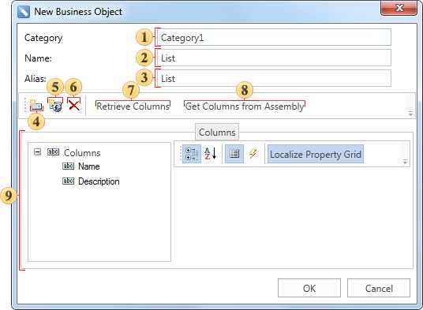

## Business Object

A **Business object** is an object of the data class that can be used to represent data in various structures: tables, lists, arrays, etc. To create a description of the business object in the data dictionary, you need to select **New Business Object...** in the context menu of the data dictionary or in the menu **New Item**. After selecting this command the first dialog box of New Business Object will be opened. The picture below shows the first dialog box New Business Object:

It should be noted that a child business object can be created for each business object. To do this, select the business object and call the command **New Business Object...** Then, the first dialogue box of New Business Object will be called, in which the option Child of Business Object will be checked. After you click OK in that dialog box, the second dialog box will be opened. There you should specify the parameters of the new business object. The picture below shows the second dialog box of **New Business Object**:

 In the field **Category** you can specify the name of the category. If this field is filled, then the category of business objects in the report dictionary will be created. If the field is left blank, the category will not be created. When you create a child business object this field is not editable.

 The field **Name** is used to specify the business object. This field must be filled and, in this case, the name List is used.

 The field **Alias** specifies the alias of the business object. If it will not be changed by the user, then, by default, the alias is the same as the name of the business object. In our case, it is List.

 The button **New Column**. When you click it, a new data column will be created in the business object. It should be noted that the data column created this way is the virtual one, and does not contain actual data.

 When you click the button **New Calculated Column**, a new calculated column will be inserted into the business object.

 When you click the button **Delete**, the selected data column will be deleted. If the tab Columns is selected, it will remove all the columns, which are located in the tab.

 The button **Retrieve Columns** is used to get a data column from the business object.

 The button **Get Columns from Assembly** will open the dialog Open Assembly, in which you select an assembly file. After selecting the file, press the button Open and data columns (if they are present there) will be extracted from that file.

 The panel **Columns** has three fields. These fields show a list of columns, their properties and description

> **Information**
>
> The Business object created this way does not contain actual data. Therefore, when rendering a report using this business object the error will occur. The Business object with the real data is generated and passed from the code.
