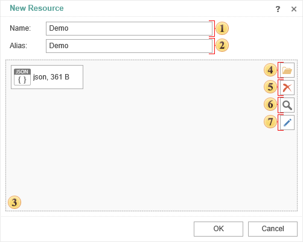
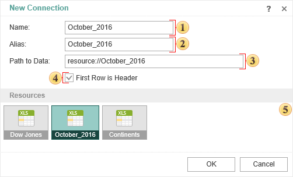
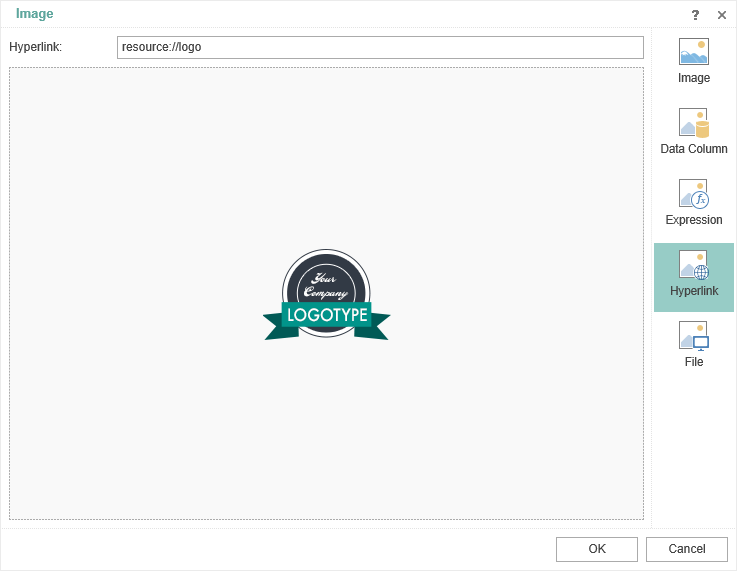
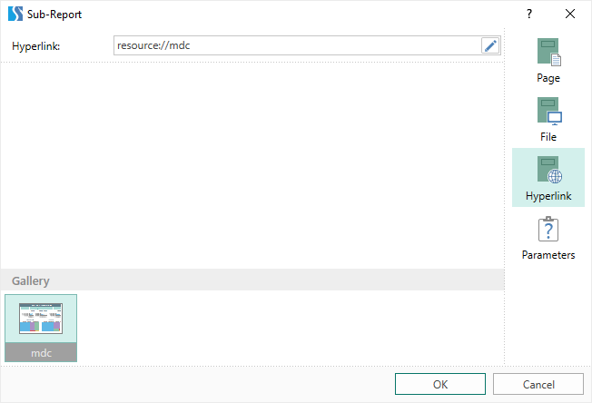
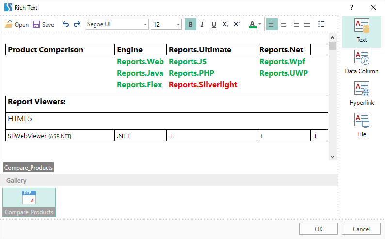

## Resources

> **YouTube**
>
> Please watch video tutorials for [working with resources](https://www.youtube.com/watch?v=TwMpBguli9k).

Resources are files that can be embedded in a report template. The following can be added as resources:

* Data files - CSV, Excel, JSON, XML, DBF;

* Image files - SVG, JPEG, JPG, PNG, BMP, GIF and other image files.

* Report templates (*.mrt, *.mrz) and built reports (*.mdc, *.mdz).

* RTF files.

You should do the following to embed a file into a report:

Select the **New Resource...** command in the **New Item** menu or in the context menu of the report **Dictionary**.

Drag the file from the explorer to the data dictionary. When dragging a data file, you should select the **New Resource** item.

After selecting this command, the menu for creating a new resource will be displayed:

 This field specifies the **Name** of the resource;

 This field specifies the **Alias** of the resource;

 This field displays the selected file which will be loaded as a resource;

 The button is used to call the explorer to select the file you want to upload to the report;

 The button is used to delete the selected file;

 The button is used to view the selected file;

 The button is used to call the text editor to change the selected file. However, the command is available only for files that can be edited with the text editor. For example, if you select an Excel file, this command will not be available.

> **Information**
>
> When you embed a big file into a report with data or images, and when you add multiple resources, the size of the *.mrt file can be significantly increased.

**Saving a resource from a report**

To save a resource from the report designer, you should select the resource in the Data Dictionary and click **Save** in the context menu. In this case, a dialog will be called in which it is necessary to specify the location for saving the file. Then, click the **Save** button and the resource will be saved in the format of the source file. In addition, if a *.mrt file was added to the resource, then the *.mrt file will also be saved when this resource is saved.

**Resource based data source**

When designing reports, data files (CSV, Excel, JSON, XML, Dbase) are often used. Based on these files, you can create data sources in the data dictionary that will be used to create report templates. In this case, the data sources will not contain real data but only a description of the methods, parameters and methods to access to real data. The transfer of data from the file to the data sources, and accordingly the filling of the actual data of the report, occurs when rendering of this report.

In this case, you should always consider the specified path in the data source to CSV, Excel, JSON, XML, Dbase files, and, if necessary, edit them. Also, if you want to transfer the report template to another user, you should provide a data file to correctly render this report.

In such cases, when you create reports, you may add data files (CSV, Excel, JSON, XML, DBF) to the report resources.

After the data file is added to the report as a resource and based on it, you can create a data source:

Select the **New Data Source...** in the **New Item** menu or in the **Data Dictionary** context menu, define the appropriate source type by specifying the path to the resource or simply by selecting it from the resource gallery.

Select the resource in the data dictionary and select **New Data Source [Resource Name]** from the context menu.

Below is the menu for creating an Excel data source:

 This field specifies the **name** of the data source.

 This field specifies the data source **alias**.

 This field specifies the path to the Excel file that contains the data. In this case, a link to the resource in the report is specified. The link can be specified manually using the template **resource://file name** or the link will be generated automatically when the resource is selected from the resource list.

 The parameter of using the first line in the Excel file as a header for the data. If it is enabled, the first line will be the header for the data.

 A resource gallery, on the base of which you can create a data source of a certain type.

After clicking **OK**, the generated data source can be used to create reports.

**Images from resources**

Images in reports can be obtained from various resources - uploaded directly, from a file, from a data source, by a hyperlink, etc. When you send a report to another person or move the report (or images) to another medium, you will have to send (along with the report) images, editing the path to these images. Except the cases when the image is uploaded directly to the **Image** component. However, each time you load an image into the Image component, the size of the report file is increased by the size of the image file.

Therefore, if the same image is used in several **Image** components or in a watermark for various report pages, it is better upload this image into a resource. Then, in the Image or Watermark component, you need to specify a link to this resource. Also the added image in the resources will be displayed in the image gallery of the Image or Watermark component. If the image is uploaded to the resource, the size of the report file will grow only by the size of the image file, and when sending to another person (or when the report is moved to another media), no additional editing of the Image components is required.

After adding an image to the **Resource**, it can be used as a watermark of the report or in the **Image** component.

**Sub-reports from Resources**

The Sub-report component is used to display another report on the same report page within this component. This other report is the report which is nested one can be located on another page in this report template or in another report template file. Using the Sub-report component, you can also display the rendered report.

If the report you want to display in the Sub-report component is another file (*.mrt, *.mrz, *.mdc, *.mdz), you can add it to the report resources. After adding to the resources, you can:

Drag the resource to the report page. In this case, the Sub-report component with a link to this resource will be created.

Add the Sub-report component to the report template. When editing this component, you should specify a link to the resource.

Also, you can pass a parameter in the Sub-report component editor. For example, to filter data in a nested report. However, this is only relevant for the not rendered report (*.mrt, *.mrz).

**Rich text from resources**

Sometimes you need to use Rich text in your reports. There is a special component to display this text in the report designer – Rich Text. You can add the Rich text to the report with next ways:

Enter text in the Rich Text editor. In this case, you will have to edit the text formatting.

Specify a file or hyperlink from where the text will be obtained. In this case, when you move a report or file, you may have to edit the path to the source text.

Therefore, one of the options is to add a Rich text file to the report resources. To output the Rich text from resources:

You need to drag the resource to the report template;

In the Rich Text editor, you need to specify a link to the resource or simply select a resource from the gallery.

Also, if necessary, the text obtained from the resources can be edited in the Rich Text editor.
