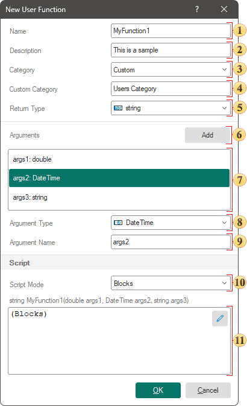

## User Functions

When designing reports and dashboards, you may create user functions in the report designer. The function script can be written using the visual programming tool Blockly or one of the programming languages set as the report scripting language: JS, C#, or VB.NET. These functions are created in the report data dictionary.

To create a new function, you should:

* Select **New Function...** from the **New** menu;

* Select the **New Function...** command from the data dictionary context menu.

The user function can be edited. To do this you should:

* Select the user function in the data dictionary, and click the **Edit** control;

* Select the user function in the data dictionary, and click the **Edit** command in the data dictionary context menu.

**User Function Editor**

The function is created in a special editor:

 The **Name** field is used to change the name of the function. This is a required field because the function is accessed by its name.

 The **Description** field is used to specify additional information for the function. If this field is not empty, additional information will be displayed in the description panel in the data dictionary.

 The **Category** parameter is used to define the data dictionary category into which the new function will be added. It contains a list of preset categories, and a **Custom** mode. If **Custom** is selected, the **Custom Category** field will be displayed. Categories are used to catalog functions and do not provide any functionality themselves.

 The **Custom Category** field appears only if the **Category** option is set to **Custom**. In this field you can specify the name of the custom category that will be created when creating the function. If the **Custom Category** field is blank, the function will be added to the root of the **Functions** category.

 The **Return Type** parameter is used to set the data type that the function will return.

 The **Add** button allows you to add function arguments. A maximum of 10 arguments can be passed to a function.

 List of function arguments. If at least one argument is added, parameters will be displayed with which you can specify the data type of the argument and its name.

 The **Argument Type** parameter is used to set the data type of the argument.

 The **Argument Name** field is used to set the name of the argument by which it can be accessed in the function script.

 The **Script Mode** option is used to select between **Blocks** or **Code** script creation mode. The script created using Blockly is universal for all platforms. The function script will work in all Stimulsoft reporting tools. However, the script can also be implemented using the report scripting language - JS, C#, VB.NET.

 Function script field displays the function code or the inscription **Blocks**, which in turn means the script is implemented using Blockly.

**The specifics of the function's script using code**
When implementing a function script using code, there are several limitations and features you should keep in mind:
* The script should be implemented in the programming language that is set as the report scripting language. Change it using the report template property of the same name, **Script Language**.

* When building a report using the .NET and .NET Framework report engine, the function script written using code will be executed only if the [report calculation mode](../../Reports_Designer/Template/Calculation_Mode.md) is set to **Compilation**.

* When running function script code in a reporting tool for .NET and the .NET Framework, you should be aware of the **Compilation Access** option, which can be found in the **Main** tab of the [Options menu in the report designer](../../Reports_Designer/File_Menu/Options.md). If **Compilation Access** is set to **Deny** or **Force Interpretation**, the script code will not be executed. In reporting tools for JS, PHP and Python, you should consider the value of the **Events Access** parameter, which can be found in the **Main** tab in the **Options** menu of the report designer. If **Event Access** is set to **Deny**, the script code will not be executed.
