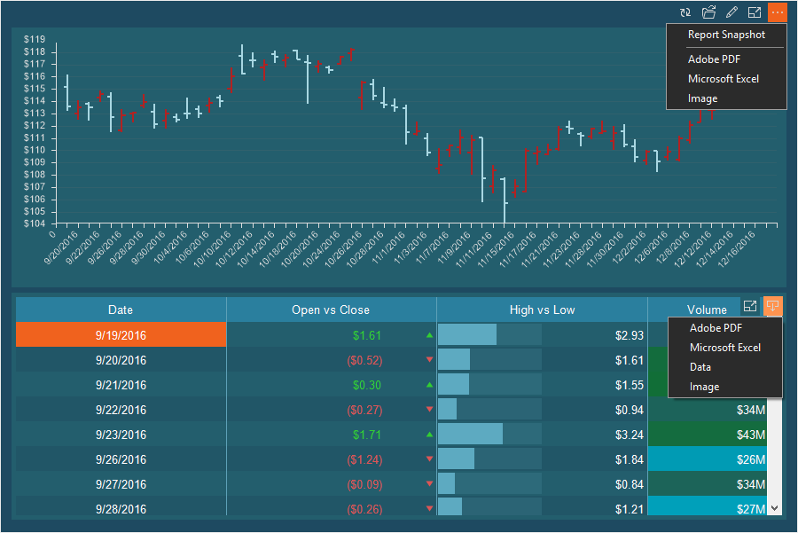
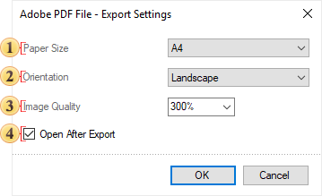
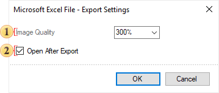
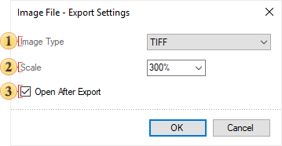
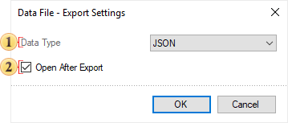

## Export Dashboard

When viewing the dashboard in the report viewer, you can convert its elements to [PDF](#pdfexportsettings), [Excel files](#excelexportsettings), as well as [image](#imageexportsettings) files such as BMP, GIF, PNG, TIFF, JPEG, PCX, EMF, SVG, and SVGZ. In addition, you can save the dashboard as a [report snapshot](#reportsnapshot).

To export the dashboard, click the [More Options](../Viewer/Dashboards.md#moreoptions) button and select the appropriate command. If you want to convert only a specific element, click the [Save](../Viewer/Dashboards.md#save) button on that element and select the file type.

> **Information**
>
> For the [Table](../Dashboards/Table.md) element, export formats to [CSV, DBF, XML, JSON, DIF, and SYLK](#exportsettingsofdata) are also available. To do this, select the **Data** command in the **Save** menu. Then, in the export settings, select the file type into which you want to convert the current element.

After selecting the export format, the export options dialog will be called. The parameters may vary depending on the type. Let's consider export settings in more detail.

**Report snapshot**

The **Report Snapshot** command is used to save the dashboard with the current data to the **.mrt** file. In this case, the created data sources will be embedded into the report as resources. You can open this report both in the report designer and in the report viewer.

**PDF Export Settings**

Export settings for the dashboard or its elements when converting to a PDF file.

 The **Paper Size** option allows you to select the page size in the PDF document.

 The **Orientation** parameter is used to select the page orientation in the PDF file - Portrait or Landscape.

 The **Image Quality** option is used to change the quality of images.

 The **Open After Export** parameter allows you to open the exported document after the export process is completed.

**Excel Export Settings**

Export settings for the dashboard or its elements when converting to an Excel file.

 The **Image Quality** option allows you to change the quality of images.

 The **Open After Export** parameter allows you to open the output document after the export process is completed.

> **Information**
>
> When exporting the [Table](../Dashboards/Table.md) element to Excel, the **Export Data Only** parameter will also be available in the export settings. This option is used to convert only the values of these elements, without headers and totals.

**Image Export Settings**

Export settings for the dashboard panel or its elements when converting to an image file.

 The **Image Type** parameter is used to determine the type of image into which the report will be converted - BMP, GIF, PNG, TIFF, JPEG, PCX, EMF, SVG, SVGZ.

 The **Scale** parameter is used to change the number of pixels per inch.

 The **Open After Export** parameter allows you to open the exported document after the export process is completed.

**Export Settings of Data**

Export settings for the [Table](../Dashboards/Table.md) element when converting it to a data file.

 The **Data Type** parameter is used to specify the type of data file into which the report will be converted - CSV, DBF, XML, JSON, DIF, SYLK.

 The **Open After Export** parameter allows you to the exported document after the export process is completed.

> **Information**
>
> You should know that this type of export is available only for the [Table](../Dashboards/Table.md) element. However, if you need to convert the values of all the fields of an element into a data file, you may [change the type of this element](../Dashboards/index.md#ItemType) to the **Table** element, and then, export the **Table** element to the data file.
