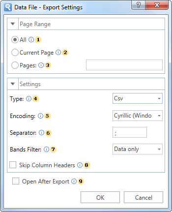

## Data

This is a group of file formats which are used to store table data.

*Export options in* *Data*

 The checkbox **All** enables processing of all report pages.

 The checkbox **Current Page** enables processing only the current (selected) report page.

 The checkbox **Pages** has the field. This field specifies the number of pages to be processed. You can specify a single page, several pages (using a comma as the separator) and also specify a range by defining the start page and end page range separated with "-". For example, 1,3,5-12.

 The parameter **Type** provides the ability to determine a type of the file the report will be converted into.

* **Notice:** Depending on the file type, parameters, and their number may vary. For example, when you select a format DIF or Sylk, the following options will be available:

  * The option **Only Data Only** enables/disables the mode of exporting data only. If this option is enabled, information will be exported from the Data bands (the component table, Hierarchical band). Only these bands are processed, the rest are ignored. If this option is disabled, the entire report will be exported;

  * The option **Use Default System Encoding** allows you to use the system encoding by default. Different encoding can be applied depending on the installed system. If this option is disabled, you must set the encoding by the standard.

 The parameter **Encoding** is used to define file encoding.

 The parameter **Separator** specifies delimiter between the data in the CSV file.

 The parameter **Bands Filter** is used to apply a filtering condition in the export. The following options are available:

  * **Data Only** - in this case only Data bands will be processed (the Table component, Hierarchical band);

  * **Data and Headers/Footers** - Data bands will be processed (the Table component, Hierarchical band), and their headers/footers, if any;

  * **All Bands** - all bands of the report will be processed.

 The checkbox **Skip** **Column Headers** enables/disables the column headers. If the option is enabled, then column headers will not be displayed. If this option is disabled, then column headers (if present in the report) will be displayed.

 The flag **Open After Export** enables/disables the automatic opening of the created document (after completion of exports), the default program for these file types.
