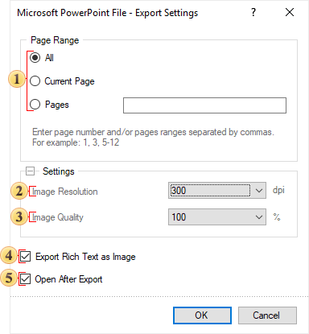

## Microsoft Power Point

Notice

For desktop versions, there are no specific size restrictions; the size of the opened file is limited by the free memory of the computer. For web versions, there are limitations: the timeout for download/save operations is set to 1 minute, and usually, files larger than 1 gigabyte cannot be saved.

**Microsoft PowerPoint** is a presentation program developed by Microsoft. It is a part of the Microsoft Office suite. PowerPoint presentations consist of a number of individual pages or "slides". Slides may contain text, graphics, movies, and other objects, which may be arranged on the slide. The presentation can be printed, displayed on a PC, or navigated through at the command of the presenter. In Stimulsoft Reports each report page corresponds to one slide.

Export Settings

 The parameter for setting the range of report pages to be rendered and exported.

 The Image Resolution is used to change DPI (image property PPI (Pixels Per Inch)). The greater the number of pixels per inch is, the greater is the quality of the image. It should be noted that the value of this parameter affects the size of the finished file. The higher the value is, the greater is the size of the finished file.

 The Image Quality allows changing the image quality. Keep in mind that if you change this option the size of the finished file will increase. The higher the quality is, the larger is the size of the finished file.

 The flag Export Rich Text as Image enables/disables the conversion of the RTF text into the image. If the option is disabled, the Rich Text is decomposed into simpler primitives supported by the PDF format. The Rich Text with complex formatting (embedded images, tables) cannot always be converted correctly. In this case it is recommended to enable this option.

 The flag Open After Export enables/disables the automatic opening of the created document (after completion of exports), the default program for these file types.

> **Information**
>
> When you enable Export Rich Text as Image option, the file size may increase significantly.
