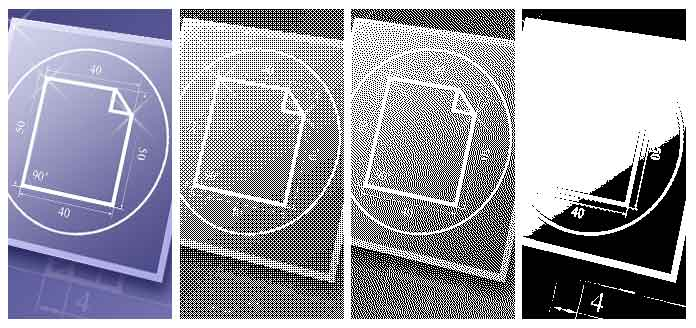

## Dither

**Dither** is an intentionally applied form of noise, when processing digit signals. It is used in most often surfaces in the fields of digital audio and video. The following image shows (from left to right) original image and the result of export to monochrome image. There are three modes of **DitheringType**: **Ordered**, **FloydSteinberg**, **None**.

* **Notice:** On the current moment the export of monochrome image is supported only to the PCX format. So the DitheringType property works only for this export.  Different images may look differently in these modes. The **FloydSteinberg** is the best mode to output an image but the file size is too big.
