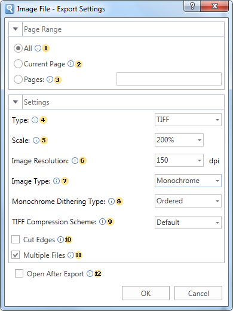

## Images

Export groups to graphic formats. All graphic formats can be divided in to types: bitmapped images and vector formats. Notice. On the current moment the export of monochrome image is supported only to BMP, GIF, PCX, PNG, TIFF format. So the DitheringType property works only for these exports.

*Export options in* *Image*

 The checkbox **All** enables processing of all report pages.

 The checkbox **Current Page** enables processing only the current (selected) report page.

 The checkbox **Pages** has the field. This field specifies the number of pages to be processed. You can specify a single page, several pages (using a comma as the separator) and also specify a range by defining the start page and end page range separated with "-". For example, 1,3,5-12.

 The option **Type** provides the ability to determine a type of the file the report will be converted into.

 The option **Scale** allows you to increase/decrease the size of the report after export. It should also be taken into consideration that the smaller the scale is selected, the greater is the number of pixels per inch, and vice versa.

 The Image **Resolution** is used to change DPI (image property PPI (Pixels Per Inch)). The greater the number of pixels per inch is, the greater is the quality of the image. It should be noted that the value of this parameter affects the size of the finished file. The higher the value is, the greater is the size of the finished file.

 The option **Image Type** provides the ability to define the color scheme of the image.

* **Color** - an image after export will fully comply with the image in the report;

* **Gray** - an image after export will be gray.

* **Monochrome** - images will be strictly black and white. At the same time, it should be taken into consideration that monochrome images have three modes None, Ordered and FloydSt.

 The option **Monochrome Dithering Type** allows you to determine the type monochrome color mixing: None - no dithering, Ordered, FloydSt. - with dithering.

 The option **TIFF Compression Scheme** provides the ability to define a compression scheme for TIFF files.

 The checkbox **Cut Edges** provides the ability to display a report without page edges. If this is enabled, then when you export the report the page edges will be cut off. If this option is disabled, the report page will be displayed with the specified edges.

 The checkbox **Multiple Files** is available when exporting to TIFF. By default, each report page is a separate image. When exporting to TIFF you can put multiple images in a single file by disabling the option. You need a special viewer to view the TIFF file that contains multiple images.

 The flag **Open After Export** enables/disables the automatic opening of the created document (after completion of exports), the default program for these file types.
