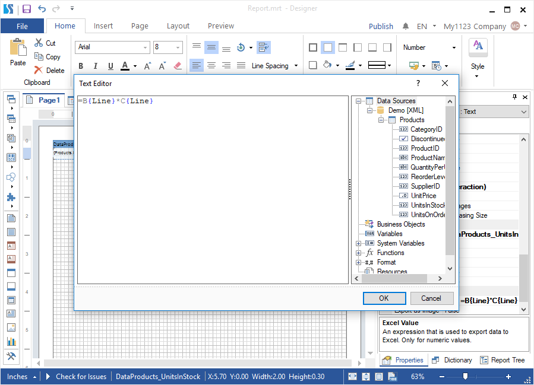
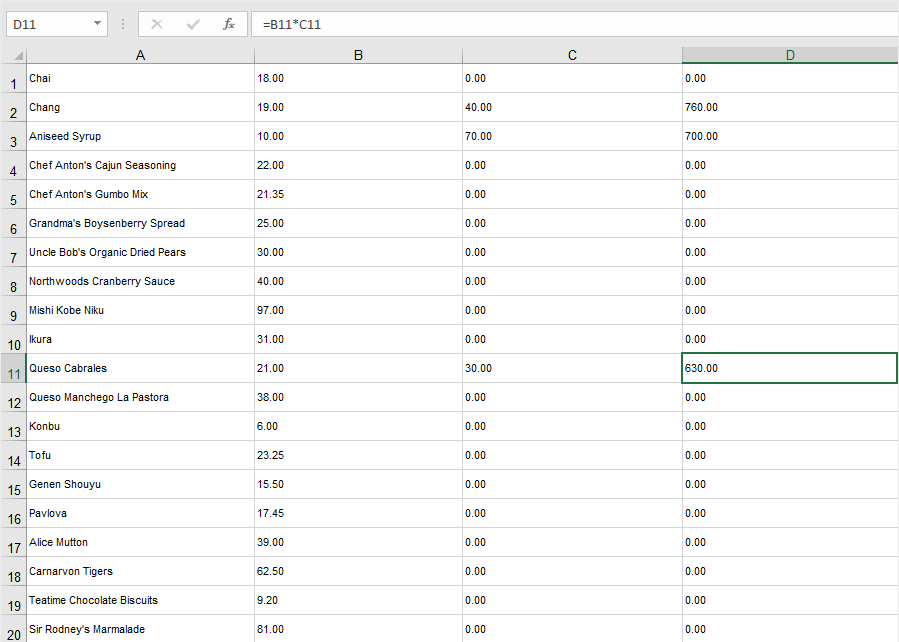
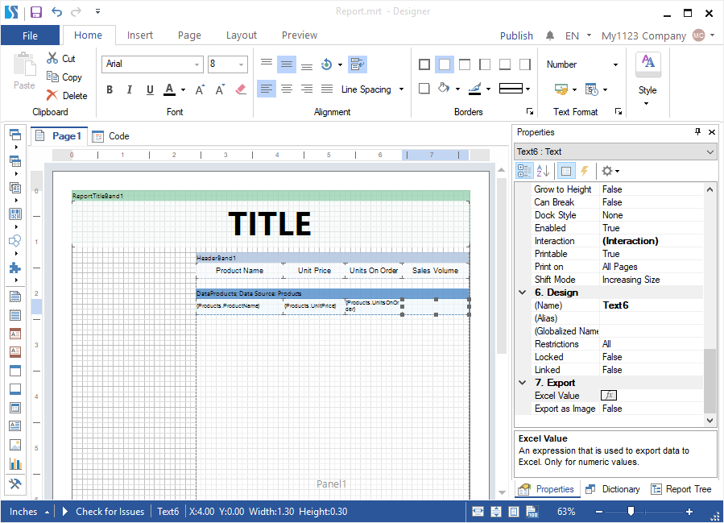
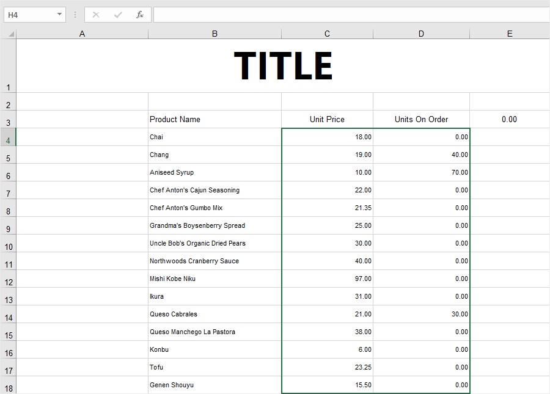
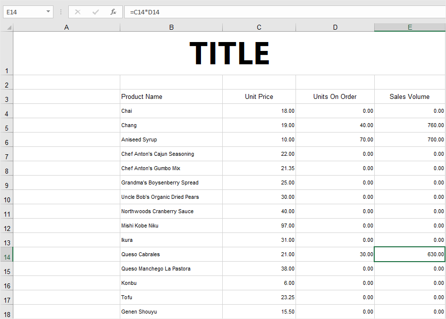

## Excel value

When exporting a report to spreadsheets, each value of data will be located in a specific cell in the Excel spreadsheet. For example, if there are four columns of data and ten rows in a rendered report, when exporting to the Excel spreadsheet 40 cells will be filled up.

However, sometimes we need to apply Excel formulas to these cells. It can be done in a finished document, when opening it for editing or defining a formula in the Excel value for a text component in the report designer when designing a report.
To set a formula for the Excel text component you should:
* Highlight this text component in a report template;
* Click on the Browse on the Properties panel for the Excel value property;
* Set an Excel formula in an opened editor.

> **Information**
>
> When designing a report it`s important to know the range of cells to which a formula will be applied, so as the range of cells, that the data occupies may shift when adding other components to a report. To avoid the calculating of incorrect formulas you should:
> * Create a report template with all components;
> * Export this report to Excel;
> * Memorize the range of cells to which a formula will be applied;
> * Back to the report template and edit it, specifying an Excel formula with this range of cells.

Let`s look at several examples of using Excel formulas in a report template. For example, there is a report with the list of products, their prices, the number of orders and products in the warehouse.
Sample 1
Apart from data this report doesn`t have other components. All 4 columns and each of them has 77 values. It means that when exporting to Excel the cells will be filled up:
* The names of the products will be in the cells A1 through A77;
* Prices of the products will be in the cells B1 through B77;

* The number of the products orders will be in the cells C1 through C77.

* The number of the products in the warehouse will be in the cells D1 through D77.

For example, you need in the column D shows not the number of products in the warehouse, but the volume of products sales (price multiplied by the number of orders). In this case, you should:

**Step 1**: Highlight the text component, where the result of the Excel formula calculating must be shown;
**Step 2**: On the Properties panel, click on the Browse for the Excel value property;
**Step 3**: Set an Excel formula in an opened editor. In this case the **=B{Line}*C{Line}** formula.

**Step 4**: Click on **OK** in the editor;

**Step 5**: Go to the **Preview** tab or open this report in the Viewer.

**Step 6**: Click on the Save and select the Microsoft Excel File command in the drop-down menu.

**Step 7**: Define the export settings, click on **OK**.

**Step 8**: Select a place to save your Excel document, change name, and click on the **Save**.

After that, open this Excel document, a formula for each cell will be calculated in the D column, due to this the value in the cell will display. In this case, the volume of sales for each product will be calculated.

**Sample 2**

In addition to data, the report contains other components, or if the Data band is located on another component. In this case, it is not possible to predict the cells, into which the data will be inserted. This is why, to set the range of cells in the Excel correctly formula you should:

**Step 1**: Create final version of the report template with all components and their correct location. In this case, you should add the header of the report and the header of the data. In addition, you should place the list of the data on another component – the **Panel**.

**Step 2**: Go to the Preview tab or open this report in the Viewer;

**Step 3**: Click on the **Save** and select the Microsoft Excel File command in the drop-down menu;

Step 4: Define the export settings, click on **OK**;

**Step 5**: Select a place to save the Excel document, change the name, and click on the **Save**;

**Step 6**: Open this saved document and memorize the range of cells with data.

Step 7: Go back to the report designer with this template;

**Step 8**: Highlight the text component, where the result of the calculated Excel formula must be shown;

**Step 9**: Click on the Browse on the Properties panel for the Excel value property;

**Step 10**: Enter the Excel formula with the range of cells you need in an opened editor. In this case the =C{Line+3}*D{Line+3} formula. In this case, number three is the number of rows in the Excel file, which must be skipped;

**Step 11**: Click on **OK** in the editor;

**Step 12**: Go to the Preview tab or open this report in the Viewer;

**Step 13**: Click on the Save and select the Microsoft Excel File command in the drop-down menu;

**Step 14**: Define the export settings, click on **OK**;

Step 15: Select a place to save the Excel document, change name, and click on the Save;

After that, open this Excel document, a formula will be calculated for each cell in the E column, and due to this, the value will display in the cell. In this case, the volume of sales for each product will be calculated.

> **Information**
>
> When making changes in a report template you should check the range of cells for your data to avoid incorrect calculations.
