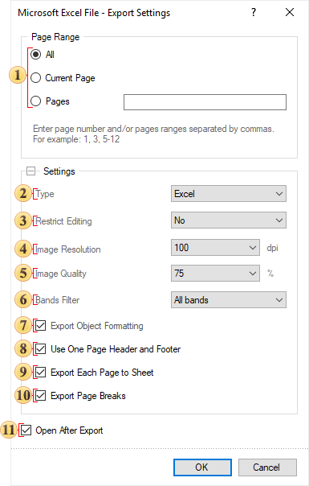

## Spreadsheets

| **Notice** |
| --- |
| For desktop versions, there are no specific size restrictions; the size of the opened file is limited by the free memory of the computer. But for web versions there are restrictions depending on the version of the product and the service used (10mb - 50mb - 250mb). |

This group of exports create spreadsheets. They are exports to both different formats of Microsoft Excel and to OpenOffice Calc.

**Export Settings**

 The parameter for setting the range of report pages to be rendered and exported.

 The option **Type** provides the ability to determine a type of the file the report will be converted into.

 The **Restrict Editing** parameter provides the ability to restrict editing of an Excel document. The following values are available:

* **No** - sets unrestricted mode, meaning the document will be fully available for editing;

* **Yes** - sets restricted editing mode for the entire document, meaning the document cannot be modified;

* **Except Editable Fields** - sets restricted editing mode for the Excel document except for editable fields in the report. This means that if components have the **Editable** property enabled, these components will be available for modification after export.

> **Information**
>
> It should be noted that the restrictions on editing an Excel document do not use robust encryption algorithms resistant to tampering. Therefore, we recommend exporting to PDF format if you need a document with editing restrictions and a high level of protection.

 The **Image Resolution** is used to change DPI (image property PPI (Pixels Per Inch)). The greater the number of pixels per inch is, the greater is the quality of the image. It should be noted that the value of this parameter affects the size of the finished file. The higher the value is, the greater is the size of the finished file.

 The **Image Quality** allows changing the image quality. Keep in mind that if you change this option the size of the finished file will increase. The higher the quality is, the larger is the size of the finished file.

 The **Bands Filter** parameter provides the ability to specify which report bands will be exported. The following values are available:

* **All Bands** - when exporting the report, all bands present in the rendered report will be exported;

* **Data Only** - when exporting the report, only the Data band (or the Table/Tree component) will be exported;

* **Data and Headers** - when exporting the report, the Data band (or the Table/Tree component) and the related Header bands will be exported;

* **Data and Headers/Footers** - when exporting the report, the Data band (or the Table/Tree component), as well as the related Header and Footer bands, will be exported.

 The checkbox **Export Object Formatting** is available only when you export the data. It provides the opportunity to apply formatting to them. If this option is enabled, the data will be exported with formatting applied in the report. If this option is disabled, the data formatting will be lost.

 The checkbox **Use One Page Header and Footer** is used to get rid of repeats of headers and footers on the report pages. By default the page header and footer in the report are located on each page. The report in export to Excel is printed on a sizeless page. The page is able to grow in height as long as there are data. In this case, when you view the document in Excel, page headers and footers are output on the top and bottom of each report page. For example, if the report consists of 15 pages (in the Excel document it will all be placed on a single sheet), the page header and footer page will be output 15 times (each time on the top and bottom of the report page). To avoid this, you should enable this option, and then the page header will be displayed only on the top of the Excel sheet, and the page footer - in the end.

 The checkbox **Export Each Page to Sheet** is used to export each report page on a separate Excel sheet. If this option is enabled, then each report page will be located on a separate sheet in Excel. If this option is disabled, the entire report will be printed on a single sheet of Excel.

 The checkbox **Export Page Breaks** is used to display the borders of the report pages on the Excel sheet. In other words, if the report contains 10 pages, all of them are placed on one sheet after export. Enable this option to define the borders of pages. If this option is disabled, all report pages will be printed, and, if no other delimiters present, will be output in one sizeless page.

 The flag **Open After Export** enables/disables the automatic opening of the created document (after completion of exports), the default program for these file types.

> **Information**
>
> Enabling **Use One Page Header and Footer** option may have residual effects. For example, if the page header or footer has borders, then, when this option is enabled, these borders may be shown. It is recommended, before rendering the report, to enable the parameter of the report page, Unlimited Height. In this case, the report will be rendered on a sizeless single page. The page header and footer will be printed only once on the Excel sheet.
