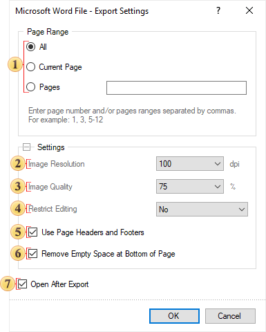

## Word

| Notice |
| --- |
| Word can open max. size of the files: - Plain text: 32 MB; - Document with images: 512 MB. |

**Microsoft Word** is a text processing software produces by Microsoft. It is a component of the Microsoft Office system. The first version was released for  IBM PC's running DOS in 1983. Later there was a release for Apple Macintosh (1984), SCO UNIX, and Microsoft Windows (1989). Microsoft Word is the most popular text processors. Starting with first versions MS Word could write files in binary code with the «.doc» extension. The Word specification was secret and only in 2008 was published. The latest version of Word 2007/2010 "uses by default" the XML based format: Microsoft Office Open XML. For a new format the «.docx» file extension is used. This format is a zip-archive that contains a text as XML, graphics, and other data. When exporting, a report is converted into one table. Such a document is easy to edit.

Export Settings

 The parameter for setting the range of report pages to be rendered and exported.

 The Image Resolution is used to change DPI (image property PPI (Pixels Per Inch)). The greater the number of pixels per inch is, the greater is the quality of the image. It should be noted that the value of this parameter affects the size of the finished file. The higher the value is, the greater is the size of the finished file.

 The Image Quality allows changing the image quality. Remember that if you change this option the size of the finished file will increase. The higher the quality is, the larger is the size of the finished file.

 The parameter Restrict Editing provides the ability to restrict editing the Word document. The available modes are: No – without editing; Yes- editing is not allowed; Except Editable Fields - editing is allowed only for editable fields in the report. In this case, the Editable property of components must be set to true.

 The checkbox Use Page Headers and Footers is used to define the Page Header and Footer as the header and footer of the Word document. If this option is not set, then, after exporting, page header and footer will be a table cell or an individual frame. In case of editing a report they may change its location. If this option is enabled, the data bands will be output as objects a header and footer in the Word document.

 The checkbox Remove Empty Space at Bottom of the Page is used to display data one after the other while minimizing empty space at the bottom of the page. If this option is enabled, then, if empty space is available, the part of data from the next page will be moved to the empty space. If this option is disabled, the empty space is ignored and the report will be displayed in the viewer or in the tab Preview.

 The flag Open After Export enables/disables the automatic opening of the created document (after completion of exports), the default program for these file types.

> **Information**
>
> If the checkbox Use Page Headers and Footers is on, it should be taken into consideration that, in this case, the height of the lines will be minimum allowable.
