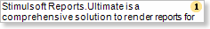
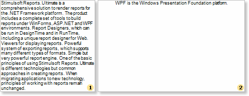
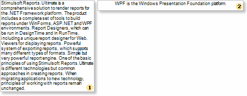

## Exporting Text Components

When exporting reports to the HTML format, it is necessary to take the following features of this format into consideration:

* if a text does not fit a table cell horizontally, then a browser automatically carries a text to the next page;

* if a text does not fit a table cell vertically, then a browser automatically increases height of a table cell.

Such a behavior of a text can be obtained in the Net and WPF viewers (Win-viewers) by setting WordWrap and CanGrow properties of a text component to true. In the HTML format (and in the Web viewer correspondingly), no matter what is the value of these two properties, the text component will be shown the same way. For example, put 2 text components on a report template. Insert long text to the first component and a short one to the second. Set WordWrap and CanGrow properties to false. The picture below shows a report template:

After rendering a report in the Win-viewer, a report will look like on a picture below:

As seen on the picture, a text in the first text component did not fit and was cut, in the second text component the text fits a text component and shown without changes. Now set the WordWrap property to true for both components. After rendering, a report will look in the Win viewer like on the picture below:

As seen on the picture, a text in the first text component is wrapped to the second row. But the component is not grown by height, so the text does not fit this component and was cut. In the second component the text fit this component and shown without changes. In both ways the text in the HTML format in the Web will look the following way:

If to set the Can Grow properties of these texts components to true, then the report will look the same in the Win viewer and Web viewer:

