## Anchors in Report

| **Important** |
| --- |
| Scripts can be a security risk, so they are disabled in the [Interpretation mode](../Reports_Designer/Template/Calculation_Mode.md). However, if you are confident in the safety of your scripts, you can use them in the [Compilation mode](../Reports_Designer/Template/Calculation_Mode.md). |

A report with anchors is a report in what there is a page of contents and links (called anchors) to other pages in the report. Follow the steps below to design a report with the anchors.

**Creating a page of contents**

1. Run the designer;

2. Connect the data:

2.1. Create a **New Connection**;

2.2. Create a **New Data Source**;

3. Create **Relation** between data sources. If the relation will not be created and/or the **Relation** property of the **Detail** data source will not be filled, then, for **Master** entry, all **Detail** entries will be output;

4. Change the number of columns on a page. For example, set the **Columns** property to **2**, and the **ColumnGaps** property to **1**;

5. Put two **DataBands** on a page of the report template

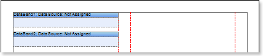

6. Edit **DataBand1** and **DataBand2**:

6.1. Align them by height;

6.2. Change values of required properties. For example, if to set the **PrintIfDetailEmpty** property of the **DataBand1** that is the **Master** component in the **Master-Detail** report to **true**, if it is necessary all **Master** entries be printed in any case, even if **Detail** entries not present. And set the **CanShrink** property of the **DataBand2** that is the **Detail** component in the **Master-Detail** report to **true**, if it is necessary to shrink this band;

6.3. Change the background color of the **DataBands**;

6.4. Enable **Borders** of the band, if required;

7. Specify the data sources for **DataBands**, as well as assign the **Master** component. In this case, the **Master** component is the upper **DataBand1**, and hence in the  **DataSetup** window the lower **DataBand2** on the **Wizard** tab in the **Master Component** should indicate **DataBand1** as a **Master** component. Indicate the data sources for **DataBands** using the **Data Source** property:

8. Fill the **DataRelation** property of the **DataBand2**, which is the **Detail** component:

9. Put text components with expressions on **DataBands**. For example: on the **DataBand1**, which is the **Master** component, we put the text component with the following expression: **{Categories.CategoryName}**, and on the **DataBand2**, which is the **Detail** component we put two text components with expressions: **{Products.ProductName}** and **{GetAnchorPageNumber (sender.TagValue)}**;

10. Edit texts and text components of **DataBands**:

10.1. Drag and drop a text component in the **DataBand**;

10.2.  Set the font settings: size, style, color;

10.3. Align the text component by height and width;

10.4. Set the background color of the text component;

10.5. Align the text in the component;

10.6. Change the values of the required properties. For example set **WordWrap** property to **true**, if you want the text be wrapped;

10.7. If necessary, set **Borders** for the text component;

10.8. Set the border color.

10.9. Change the value of the **Hyperlink** property for the text component with the **{Products.ProductName}** expression. In this case, set the **Hyperlink** property to the **#{Products.ProductName}** value;

10.10 Change the value of the **Hyperlink** and **Tag** properties for the text component with the **{GetAnchorPageNumber(sender.TagValue)}**. The **Hyperlink** property should be set to **#{Products.ProductName}**, and the **Tag** property to **{Products.ProductName}**.

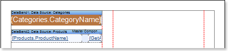

**Creating a master list**

11. Create a second page in the report template;

12. Put two **DataBands** on the page of the report template.

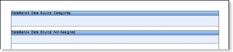

13. Edit **DataBand3** and **DataBand4**:

13.1. Align the **DataBand** by height;

13.2. Change the values of the required properties. For example set the **Print if Detail Empty** property of the **DataBand3**, which is the **Master** component in the Master-Detail report to **true**, if you want the Master records be printed in any case, even if the **Detail** entries are not present. Set the **CanShrink** property of the **DataBand4**, which is the **Detail** component in the Master-Detail report to **true**, if it is necessary for this band be shrunk;

13.3. Set background color of the **DataBand**;

13.4. If it is necessary, set **Borders** for the **DataBand**;

14. Specify the data sources for DataBands, as well as assign the **Master** component. In this case, the **Master** component is the upper **DataBand3**, and hence in the  **DataSetup** window the lower **DataBand4** on the **Wizard** tab in the **Master Component** should indicate **DataBand3** as a **Master** component. Indicate the data sources for **DataBands** using the **Data Source** property:

15. Fill the **DataRelation** property of the **DataBand4**, which is the **Detail** component:

16. Put text components with expressions on **DataBands**. For example: on the **DataBand3**, which is the **Master** component, we put the text component with the following expression: **{Categories.CategoryName}**, and on the **DataBand4**, which is the **Detail** component we put two text components with expressions: **{Products.ProductName}, {Products.QuantityPerUnit}**, and **{Products.UnitPrice}**;

17. Edit texts and text components of **DataBands**:

17.1. Drag and drop a text component in the **DataBand**;

17.2.  Set the font settings: size, style, color;

17.3. Align the text component by height and width;

17.4. Set the background color of the text component;

17.5. Align the text in the component;

17.6. Change the values of the required properties. For example set **WordWrap** property to **true**, if you want the text be wrapped;

17.7. If necessary, set **Borders** for the text component;

17.8. Set the border color.

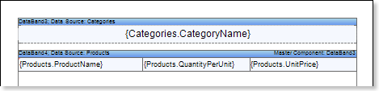

18. Select the **DataBand**, which is the **Master** data source. In our case, this is the **DataBand3**:

18.1. Set the **Interaction.Bookmark** property of the **DataBand3** to **{Categories.CategoryName}**;

19. Select the **DataBand**, which is the Detail data source. In our case, this is the **DataBand4**:

19.1. Set the **Interaction.Bookmark** property to **{Products.ProductName}**;

19.2. Subscribe to the event. Set the **RenderingEvent** to **{AddAnchor (Products.ProductName);}**;

**Report rendering**

20. Click the **Preview** button or invoke the **Viewer**, clicking the **Preview** menu item. After rendering a report all references to data fields will be changed on data from specified fields.

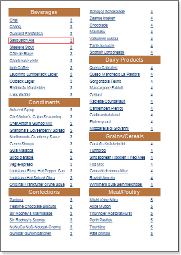

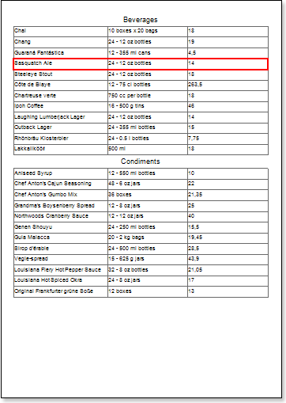

In the rendered report, when clicking an entry in the table of contents the transition to this entry in the report will be done.

21. Go back to the report template;

22. If needed, add other bands to the report template, for example, **HeaderBand**;

23.  Edit this band:

23.1. Align it by height;

23.2. Change values of properties, if required;

23.3. Change the background of the band;

23.4. Set **Borders**, if required;

23.5. Set the border color.

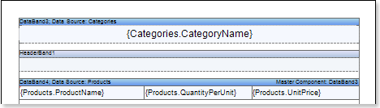

24. Put text components with expressions in this band. The expression in the text component is a header in the **HeaderBand**.

25.  Edit text and text components:

25.1. Drag and drop the text component in the band;

25.2. Change font options: size, type, color;

25.3. Align text component by height and width;

25.4. Change the background of the text component;

25.5. Align text in the text component;

25.6. Change values of text component properties, if required;

25.7. Enable **Borders** of the text component, if required;

25.8. Set the border color.

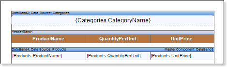

26. Click the **Preview** button or invoke the **Viewer**, clicking the **Preview** menu item. After rendering all references to data fields will be changed on data form specified fields. Data will be output in consecutive order from the database that was defined for this report. The amount of copies of the **DataBand** in the rendered report will be the same as the amount of data rows in the database.

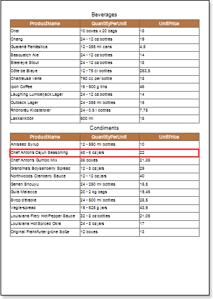

**Adding Styles**

1. Go back to the report template;

2. Select the **DataBand**. In our case, select the **DataBand4**;

3. Change values of **Even style** and **Odd style** properties. If values of these properties are not set, then select the **Edit Styles** in the list of values of these properties and, using **Style Designer**, create a new style. The picture below shows the **Style Designer**:

Click the **Add Style** button to start creating a style. Select **Component** from the drop down list. Set the **Brush.Color** property to change the background color of a row. The picture below shows a sample of the **Style Designer** with the list of values of the **Brush.Color** property:

Click **Close**. Then a new value in the list of **Even style** and **Odd style** properties (a style of a list of odd and even rows) will appear.

4. To render the report, click the **Preview** button or invoke the **Viewer**, clicking the **Preview** menu item.

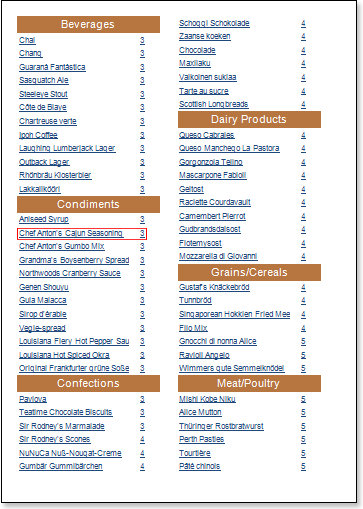

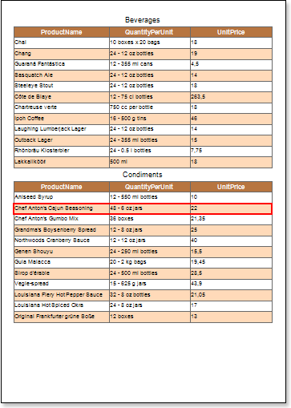
