## Data connection

Data connection is carried out in the report data dictionary and includes the following steps: creating a connection and creating data sources. Depending on the type of a data source, the creation process may vary.

This chapter will cover the following:

* [Creating SQL data sources](#creatingsqldatasource);

* [Creating OData data sources](#creatinganodatadatasource);

* [Retrieving data from files](#creatingafiledatasource);

* [Move the data file to the report resources when creating the data source](#movetoresource);

* [Embed a data file and create a data source based on it](#draganddropdatafile).

> **Information**
>
> When you design a report, you can embed all created data sources in a report file. Each type of connection will be converted to a separate XML file and embedded into the report file as a resource. In this case, the connection of data sources will be redefined on this resource. However, in this case, you should know that:
>
> The size of the report file can increase significantly;
>
> This is an irreversible action. Therefore, before performing this step, you should back up the report file or use Stimulsoft Cloud to store reports.
>
>
> To embed all data in a report file, select the Embed all data to resources command from the Actions menu of the data dictionary.

Creating SQL Data Sources

Step 1: [Run the report designer](Install_and_First_Run.md#rundesigner);

Step 2: [Go to the data dictionary](Install_and_First_Run.md#reportdesigneroverview);

Step 3: Click the New Item button and select the New Data Source command;

Step 4: Select the type of a data source. In the current example, we have selected MySQL;

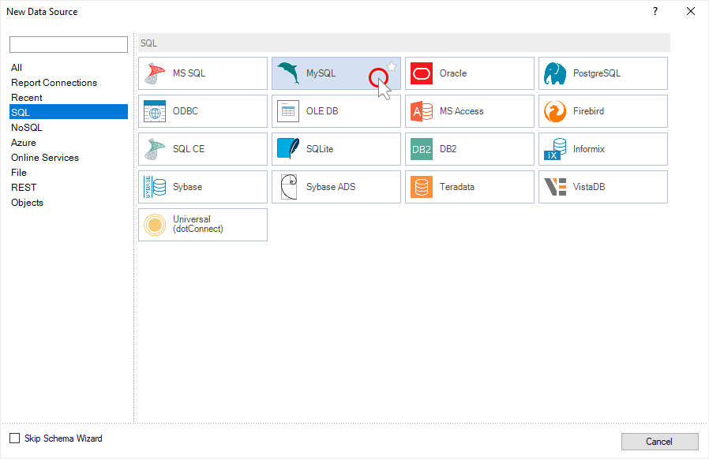

Step 5: The report engine will check for installed adapters in the following path: c:\Users\% username%\AppData\Local\Stimulsoft\DataAdapters\. If there is no current adapter, it will be offered to download it.

Step 6: Click the Download button, the report generator will download and install the necessary adapter;

Step 7: After successful installation of the data adapter, a window for creating a connection to the data storage will open.

Step 8: Click the Test button to test the connection. At the end of the test process, a message will be displayed. If the connection is successful, click OK in the New connection window.

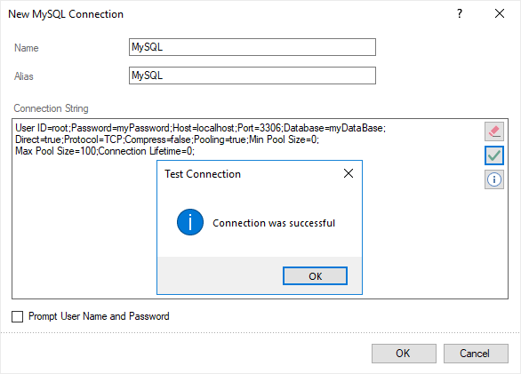

Step 9: After that, the Select Data dialog will be displayed. In this window, you should select the data tables that will be the data sources in the report dictionary.

Step 10: Click OK in the Select Data window.

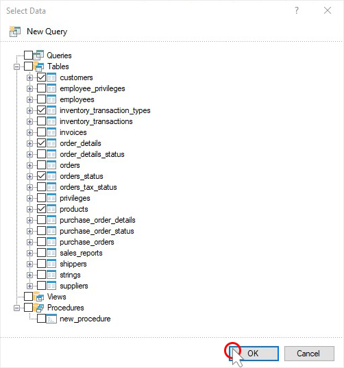

Now, based on these data sources, you can design reports or dashboards. Also, you can edit created sources. For example, you may change the request.

Step 1: Select the data source in the report dictionary;

Step 2: Click the Edit button on the toolbar of the data dictionary;
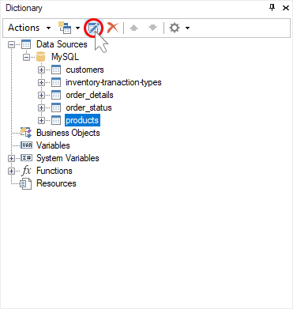

Step 3: Specify a request for data selection in the Edit Data Source dialog. For example, select * from products;

Step 4: Run the request by clicking the Run button;

Step 5: Click the Retrieve Columns button to retrieve all columns from the storage as requested;

Step 6: Click OK in the data source editing window.

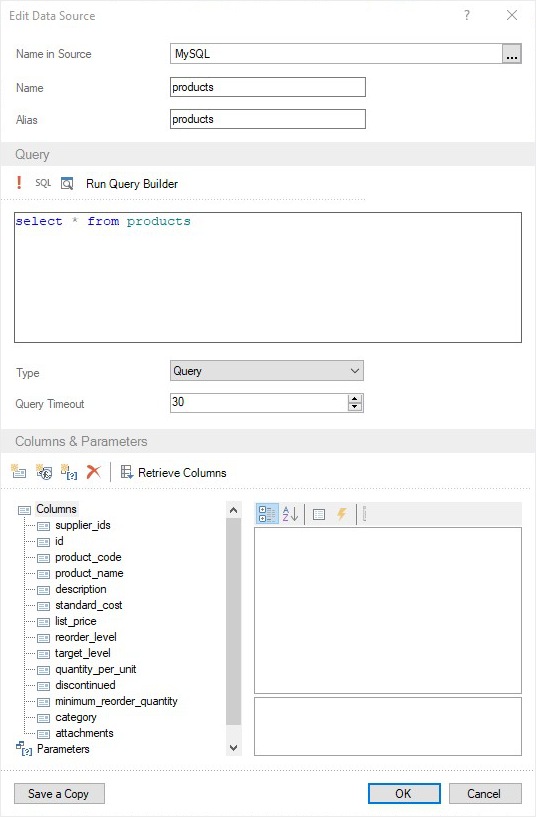

Creating an OData Data Source

Step 1: [Run the report designer](Install_and_First_Run.md#RunDesigner);

Step 2: [Go to the data dictionary](Install_and_First_Run.md#reportdesigneroverview);

Step 3: Click the New Item button and select the New Data Source command;

Step 4: Select the type of data source. In the current example, OData;

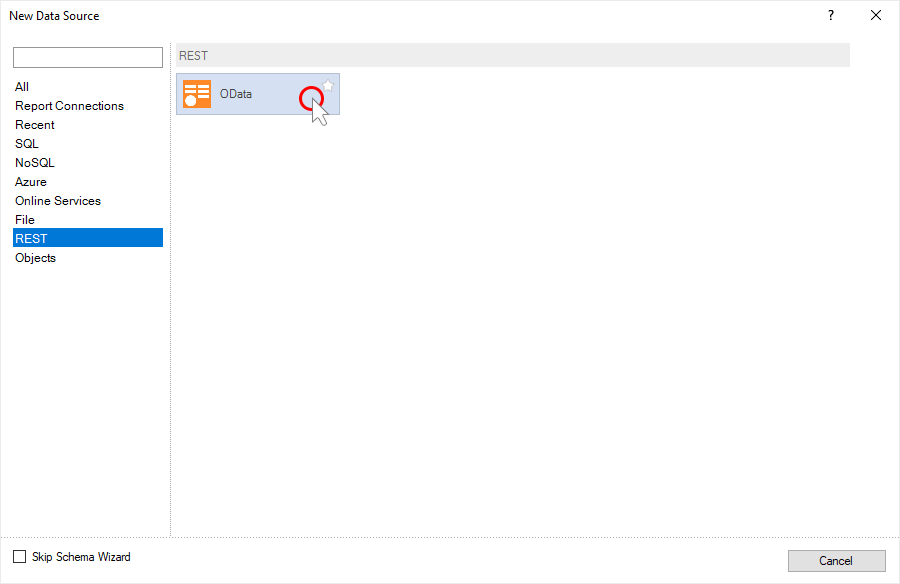

Step 5: The report engine will check for the presence of installed adapters in the following path: c:\Users\%username%\AppData\Local\Stimulsoft\DataAdapters\. If there is no current adapter, it will be offered to download it.

Step 6: Click the Download button, the report engine will download and install the necessary adapter;

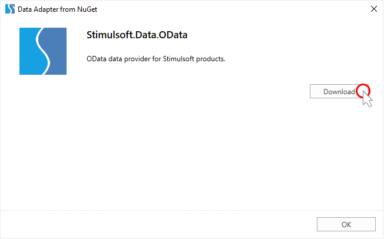

Step 7: After successful installation of the data adapter, a window for creating a connection to the data storage will open. In the case of the OData data storage, the data path should be specified.

Step 8: Click the Test button to test the connection. At the end of the test connection process, a message will be displayed. If the connection is successful, click OK in the New Connection window.

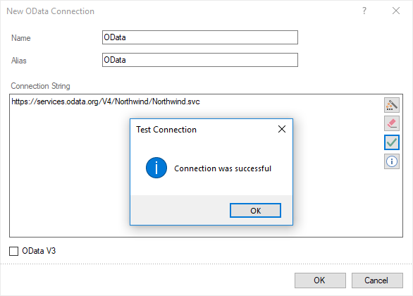

Step 9: After that, the Select Data window will be displayed. In this window, you should select the data tables that will be the data sources in the report dictionary.

Step 10: After selecting the data tables, click the OK button in the Select Data window.

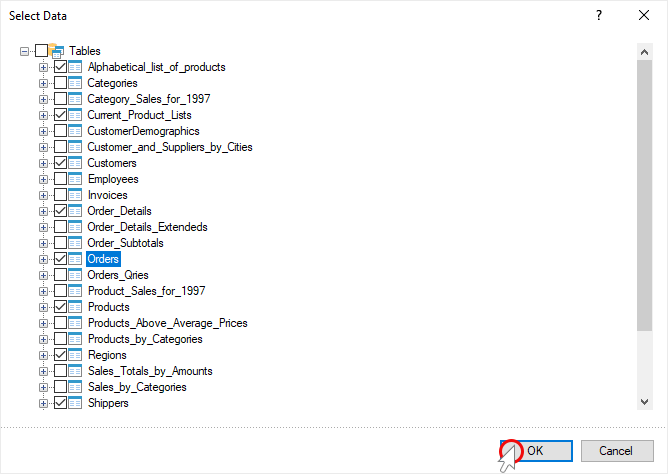

Now, based on these tables, you can create reports and dashboards. Also, you can edit the created data sources. For example, you may create a request for data sampling. To do this:

Step 1: Select the data source in the report dictionary;

Step 2: Click the Edit button on the toolbar of the data dictionary;
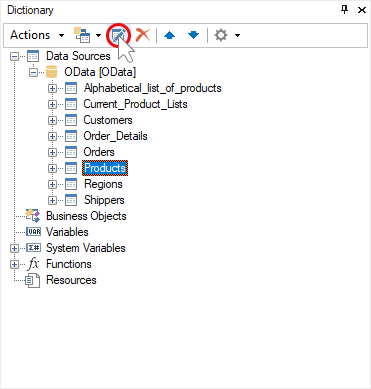

Step 3: Specify the data filtering request in the Edit Data Source window. For example, Products?$filter=ProductID le 10 and click OK in the current window.

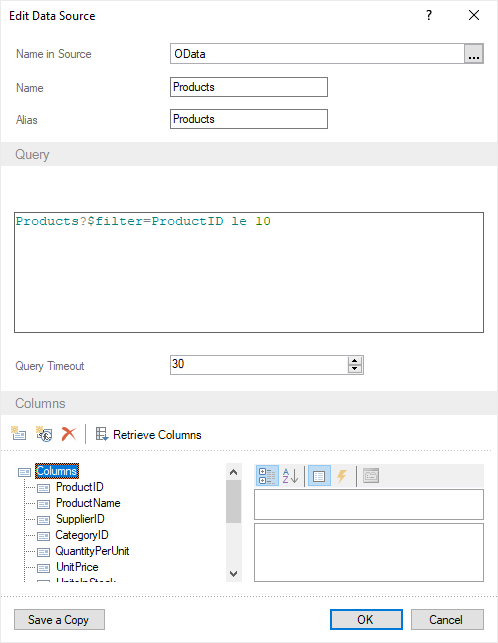

Now, when rendering a report using the current data source, only filtered data will be obtained from the storage.

Creating a file data source

When you design reports, you can get data from CSV, Excel, JSON, XML, and DBF files. The main advantage of data files is that you can embed them in a report template. However, the size of the report file will be increased by the size of the data file.

> **Information**
>
> The report designer supports dragging data files. When dragging a data file into a dictionary, you have two options for adding this file:
>
> New Data Source, a connection will be created to this file and data tables will be obtained from it, but this file will not be embedded in the report.
>
> New Resource, the data file will be [embedded in the report as a resource](#draganddropdatafile). Based on this resource, you can create a data source.
>
>
> When you drag the data file to any other area of ​​the report designer, it will be added as a resource, embedded in the report.

Consider connecting to an external data file, which is not embedded in the report template.

Step 1: [Run the report designer](Install_and_First_Run.md#RunDesigner);

Step 2: [Go to the data dictionary](Install_and_First_Run.md#reportdesigneroverview);

Step 3: Click the New Item button and select the New Data Source command;

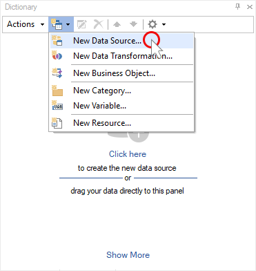

Step 4: Select the type of data source. For example, JSON;

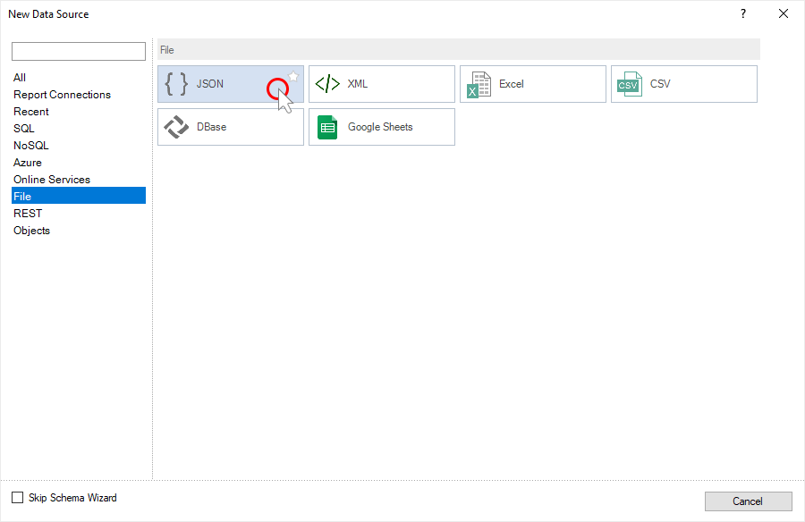

Step 5: In the New JSON Data window, select the local JSON data file using the Browse button. Also, you can specify the URL path to the JSON file.

Step 6: Click OK in the New JSON Data window;

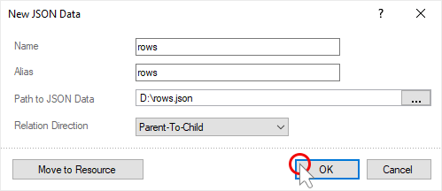

Step 7: The Select Data window will pop up. You should select data tables there. Each data table will represent a separate data source in the report data dictionary.

Step 8: Click OK in the Select Data window.
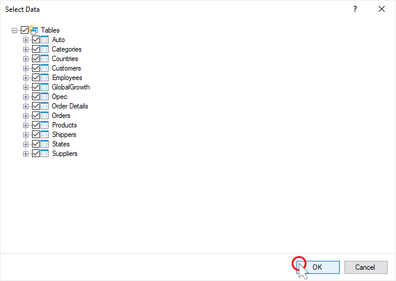

Now, based on these data sources, you can create reports or dashboards.

Move to Resource

Consider an example of dragging a data file to report resources.
Step 1: [Run the report designer](Install_and_First_Run.md#RunDesigner);

Step 2: [Go to the data dictionary](Install_and_First_Run.md#reportdesigneroverview);

Step 3: Click the New Item button and select the New Data Source command;

Step 4: Select the type of data source, for example, XML;

Step 5: In the New XML Data window, select XML and XSD files using the Browse button.

Step 6: Click the Move to Resource button.

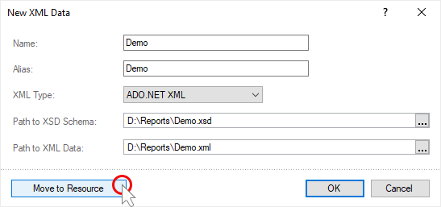

Step 7: The New XML Data window will be closed, and the Select Data window will pop up. You should select the data tables there. Each data table will represent a separate data source in the report data dictionary.

Step 8: Click OK in the Select Data window.

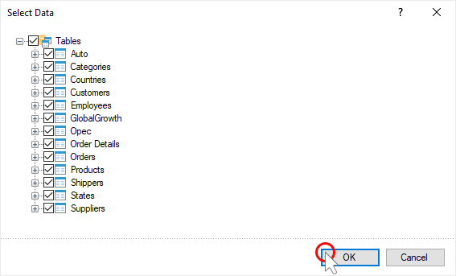

Now, based on these data sources, you can create reports or dashboards.

Also, you can first add the data file as a resource to the report, and then create a data source based on this resource.
Step 1: Drag the data file to the bottom of the report data dictionary.

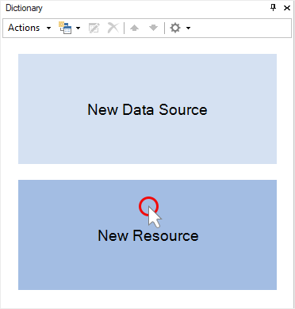

Or, click the New Item button in the data dictionary and select the New Resource command.

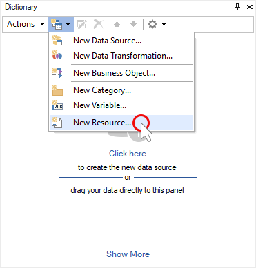

In the New Resource window that pops up, click the Open button to select a data file. Then, click OK in the New Resource window.

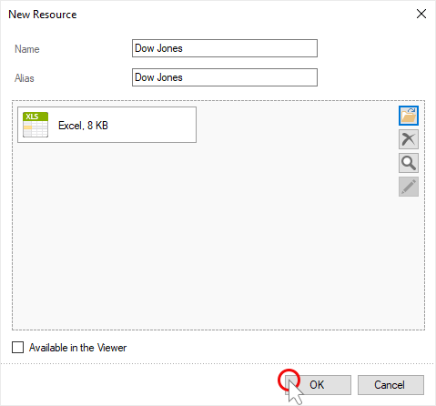

Step 2: Select the resource in the data dictionary;

Step 3: Click the New item button in the data dictionary and select the New Data Source [resource name] command;

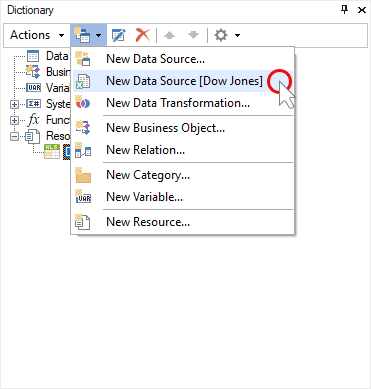

Step 4: Click OK in the New Excel Connection window;

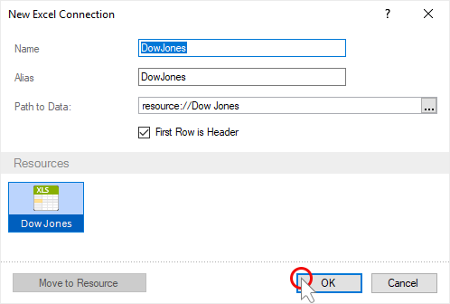

Step 5: Select the data tables in the Select Data window. Each data table will represent a separate data source in the report data dictionary.

Step 6: Click OK in the Select Data window.

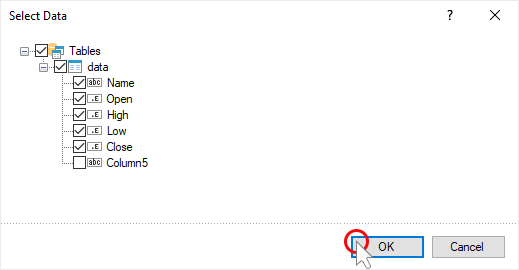

Now, based on these data sources, you can design reports or dashboards.
