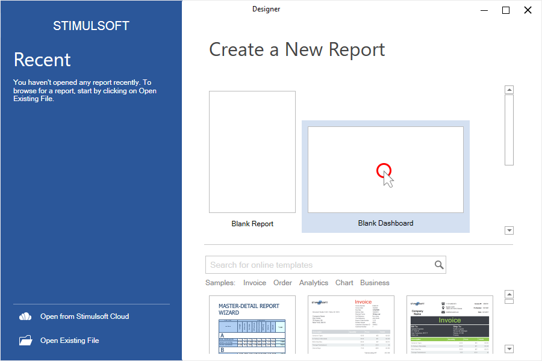
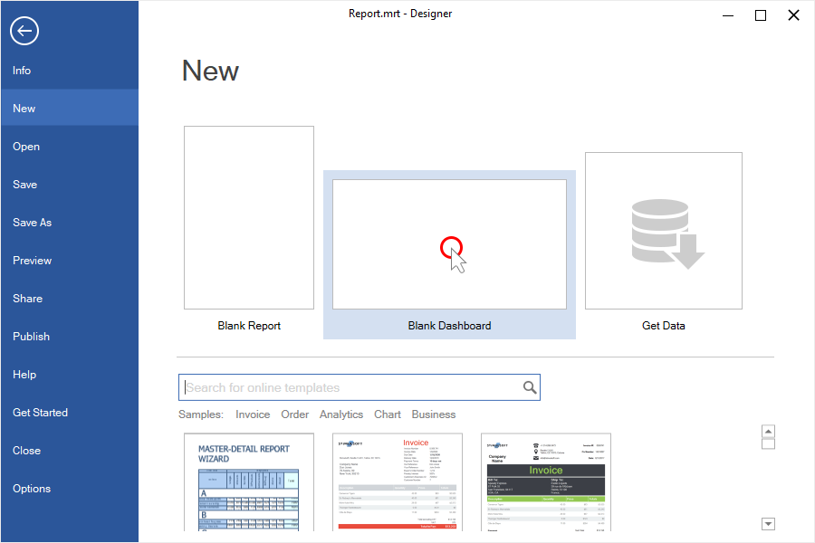
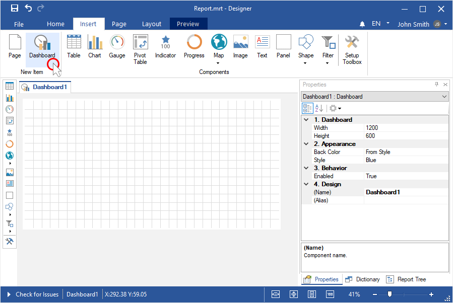
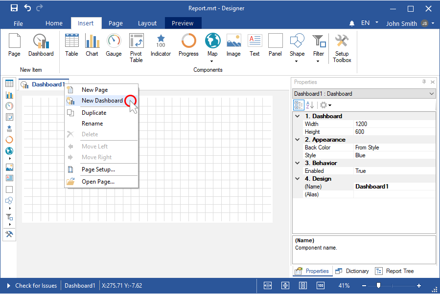

## Creating a dashboard

The [Dashboard](../Dashboards/index.md) is a dimensionless area where you can place data analysis elements.

This chapter will cover issues such as:

* [Creating a dashboard on the first run](#creatingadashboardonfirstrun);

* [Creating a new dashboard from the File menu](#fromthefilemenu);

* [Adding a dashboard to the current report](#addingadashboardtothecurrentreport).

**Creating a dashboard on first run**

To create a dashboard panel at the first start of the report designer, you should:

**Step 1**: [Run the report designer](Install_and_First_Run.md#rundesigner);

**Step 2**: Select **Blank Dashboard** on the welcome screen.

After that, the grid of the dashboard panel will be displayed in the report designer. You may place the analysis elements on it.

**From the File menu**

Also, you can create a new analytical panel from the report report designer.

**Step 1**: Click the **File** tab on the Ribbon panel of the report designer;

**Step 2**: Select the **Blank dashboard** item from the **New item** in the **File** menu.

**Adding a dashboard to the current report**

The above examples demonstrate how to create a new dashboard. At the same time, the current report in the report designer will be closed. To add a dashboard panel to the current report, you should:

**Step 1**: Go to the **Insert** tab in the report designer;

**Step 2**: Click the **Dashboard** button.

You can also add a dashboard to the current report from the context menu of the page header or dashboard:

**Step 1**: Hover over the page title or dashboard;

**Step 2**: Select the **New Dashboard** command.

