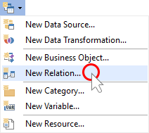
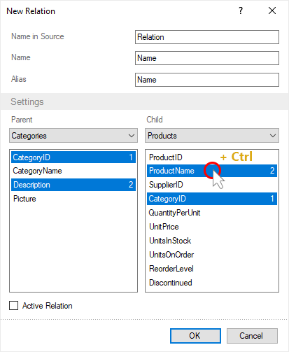
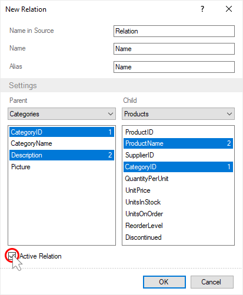
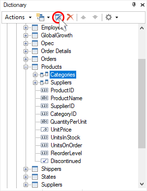

## Creating Relation

Connection between data sources is arranged for the correct comparison of values from various data sources. You should follow these steps to create a relation:

Step 1: [Run the report designer](Install_and_First_Run.md#rundesigner);

Step 2: [Go to the data dictionary](Install_and_First_Run.md#reportdesigneroverview);

Step 3: [Connect data](Connecting_Data.md);

Step 4: Click the New Item button and select the New Relation command;

Step 5: Using the drop-down lists, identify the master and detail data sources;

> **Information**
>
> The selected data sources (master and detail) must be of the same type, connection types must be the same. If the connection types are different, then you can use the CashAllData property.

Step 6: Select the data columns using which the relation between the sources will be arranged. Hold down the Ctrl button to select multiple columns.

> **Information**
>
> When creating a connection, you should know that the key columns must comply with all the rules for creating a connection in ADO.NET:
>
> * Their number should be the same;
>
> * Their types must match, if the master key column is the string type, then the detail key column must be the string type;
>
> * Keys must be specified, keyless relation is impossible.

Step 7: Select the Active Relation. If the data source has several relations with other sources, then an active relation will be used to map the data.

Step 8: Click OK in the link editor.

A link will now appear in the detail data source. Also, you can edit any relation:

Step 1: Select the relation in the data dictionary;

Step 2: Click the Edit button on the toolbar of the data dictionary;

Step 3: Change the relation settings;

Step 4: Click OK in the relation editor.
