## Cross-Tab Report in Data Band

If the Cross-Tab component is placed in the DataBand, then when designing a report, this component will be constructed as part of the DataBand. Because the Cross-Tab component placed in the DataBand is designed as an element of the DataBand, then, when designing a report, this component will be printed as many times as the DataBand. Consider an example of building a report with the Cross-Tab in the DataBand. In this example, Cross-Tab will display the detailed entries in the Master-Detail report. Do the following steps to build a report with the Cross-Tab in the DataBand:

1. Run the designer;
2. Connect data:

2.1. Create New Connection;

2.2. Create New Data Source;

3. Create the Relation between data sources. If the Relation is not created and/or the Relation property will be not filled for the Detail data source, then, for each Master entries, all Detail entries will not be output;

4. Put two DataBands on a page of a report template;

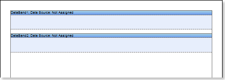

5. Edit DataBand1 and DataBand2:

5.1 Align the DataBands vertically;

5.2 Change the value of the required properties. For example, for the DataBand1, which is a Master component in the Master-Detail report, set the Print If Detail Empty property to true, if you want the Master entries be printed in any case, even if the Detail entries are not available. And for the DataBand2, which is a Detail component in the Master-Detail report, set the CanShrink property to true, if it is necessary for this band to be shrunk;

5.3 Change the background color of the DataBand;

5.4 If necessary, set Borders of the DataBand;

6. Specify data sources for DataBands, as well as assign the Master component. In our example, the Master component is the upper DataBand1, and hence indicate the DataBand1 in the Master Component tab of the Data Setup dialog box of the lower DataBand2 as the Master component;

7. Fill in the Data Relation property of the DataBand, which is the Detail component, in our case, this is the DataBand2:

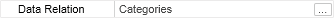

8. Put the text component with an expression. Where the expression is a reference to the data field. For example: the DataBand1, that is the Master component, put the text component with the {Categories.CategoryName} expression;

9. Edit text and text components located in the DataBand:

9.1. Drag the text component to the required place in the DataBand;

9.2. Align the text in a text component;

9.3. Change the value of the required properties. For example to set the Word Wrap property to true, if you want the text be wrapped;

9.4. Set Borders of a text component, if required.

9.5. Change the border color.

10. Put the Cross-Tab component in the DataBand. In this case, the Cross-Tab component will be located on the DataBand2, that is the Detail component of the report.

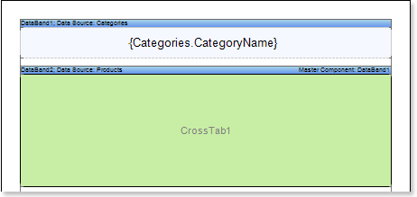

11. Edit the Cross-Tab component:

11.1 Change values of the Cross-Tab properties. For example, set the Can Shrink property to true, if you want the Cross-Tab component be shrunk;

12. Specify the data source for the band of the Cross-Tab component, for example, using the Data Source:

13. Call the Cross-Tab Designer, for example, by selecting Edit .. (Design..) of the context menu of the cross-table component.

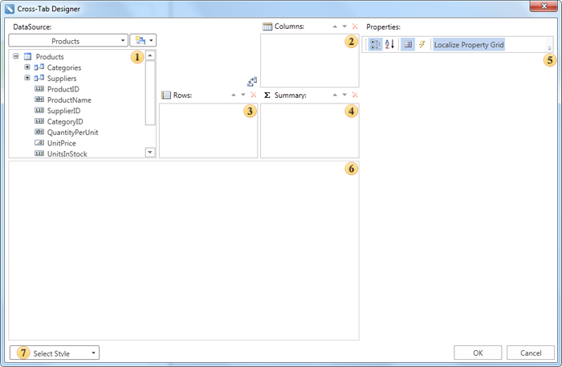

 The DataSource field. This field displays data columns of the selected data source;

 The Columns field. This field displays a list of columns of the data source for the entries by which columns in the cross-table will be formed;

 The Rows field. This field displays a list of columns of the data source for the entries by which lines in the cross-table will be formed;

 The Summary field. This field displays a list of columns of the data source for the entries by which summaries in the cross-table will be formed;

 The Properties field. This field displays the properties of the selected element of cross-table;

 The Cross-Tab Cells field. This field displays cells of the cross-table;

 The Description field. This field displays a short description of the selected properties of the cross-table item;

 The Select Style button. When you click, the drop-down list of styles appears for the cross-table.

14. Do the following in the Cross-Tab Designer editor:

14.1. Add a data column from the 

 DataSource field to the 

 Columns field of the cross-table. Add a data column from the DataSource field to the Columns field of the cross-table. For example, add the CategoryID data column of data to the Columns field of the cross-table, and then one entry from this data column will correspond to one column in the rendered cross-table;

14.2. Add a data column of the data source from the 

 DataSource field to the  Rows field of the cross-table. For example, add the ProductName data column to the Rows field of the cross-table, and then one entry from this data column will correspond to one row in the rendered cross-table, the number of entries in this data column will be equal to the number of rows in the cross-table;

14.3. Add a data column from the 

 DataSource field to the  Summary field of the cross-table. For example, add the UnitInStock data column to the Summary field of the cross-table, entries in this data column will be summary entries in the cross-table;

15. Press the OK button to save your changes and go back to the report template with the cross-table.

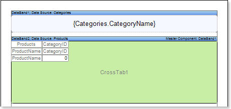

16. Render a  report. Click the Preview button or call the Viewer by selecting the Preview of the menu item. The picture below shows an example of the cross-table report:

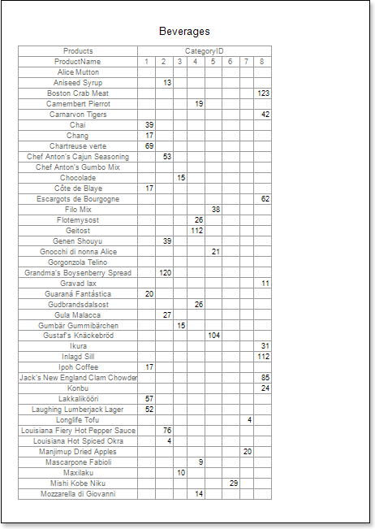

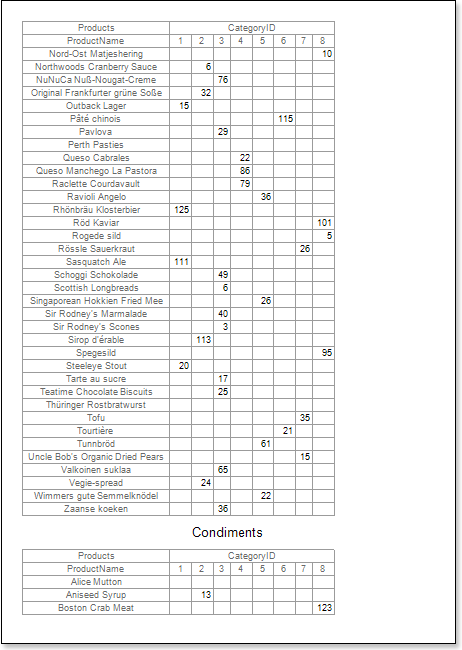

17. Go back to the report template;

18. If necessary, edit the text component in the DataBand:

18.1. Change the background color of the text component;

18.2. Change the style, color, and text type.

19. Edit cells in the report template:

19.1. Change the font settings: type, style, size;

19.2. Change the background color of a cell;

19.3. Set the Word Wrap property to true, if you want the text to be wrapped;

19.4. Set Borders if necessary;

19.5. Change the border color.

19.6. Change the background color of cells, etc.

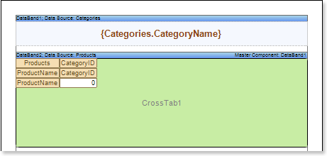

20. Render a  report. Click the Preview button or call the Viewer by clicking the Preview menu item. The picture below shows an example of the cross-table report after editing cells of the report template:

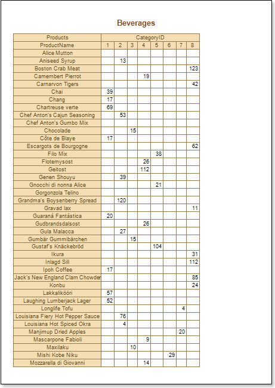

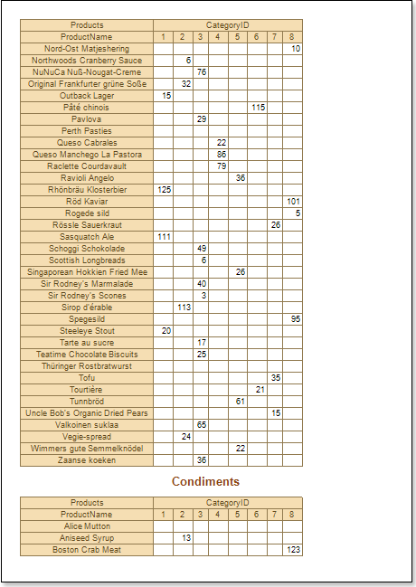

**Adding styles**

1. Go back to the report template;

2. Invoke the Style Designer;

Click the Add Style button to start creating a style. Select Cross-Tab from the drop down list. Call the new style as Style for Cross-Tab. To create a custom style it is necessary to change the Color property, where the value of this property and is a color scheme.

After the style is created, press the Close button. In the list of values of the Select Style button in the editor of the cross-table, a custom style will be displayed. In our case, this is the Style for Cross-Tab. Select this value;

3. Render a  report. Click the Preview button or call the Viewer by selecting the Preview menu item. Now you can see the result of the rendered report:

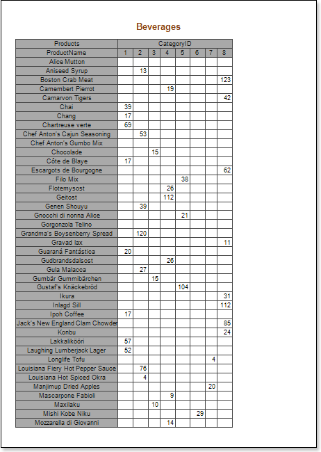

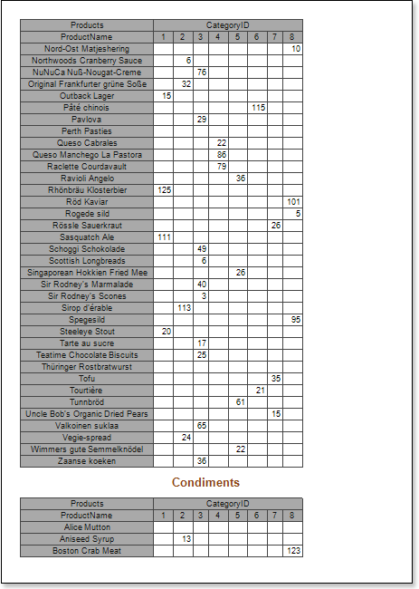
