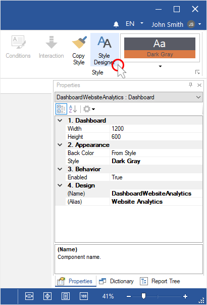
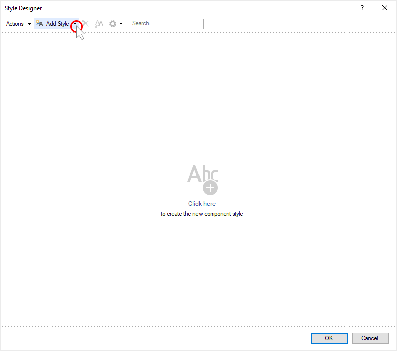
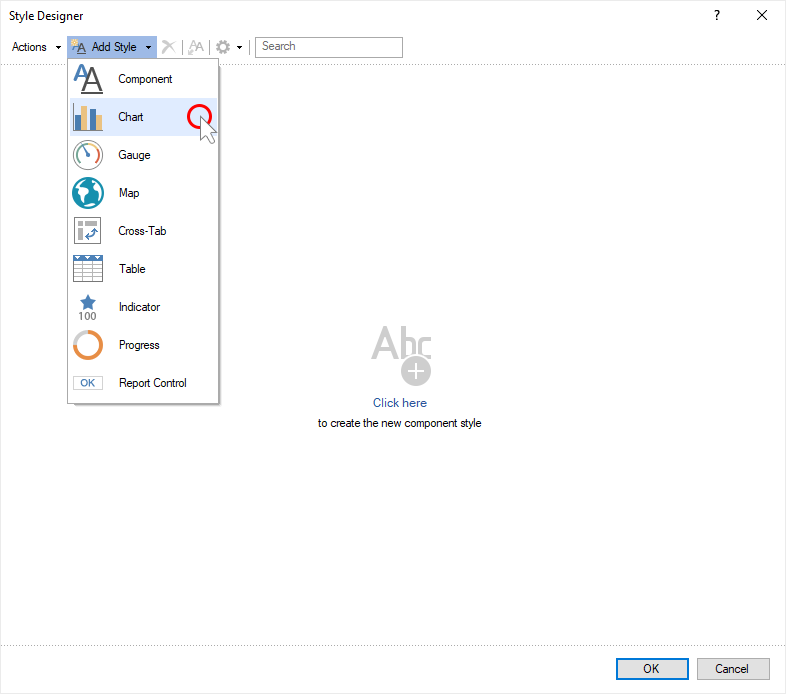
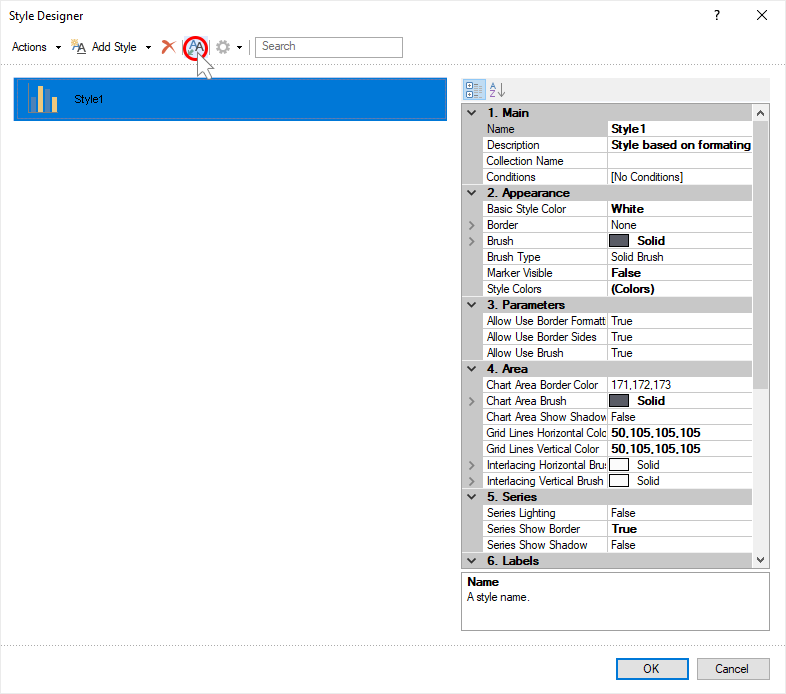
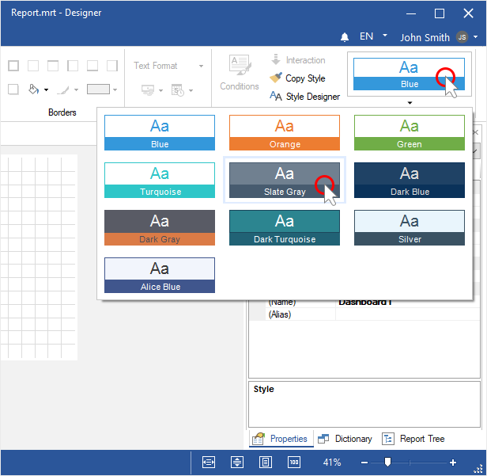
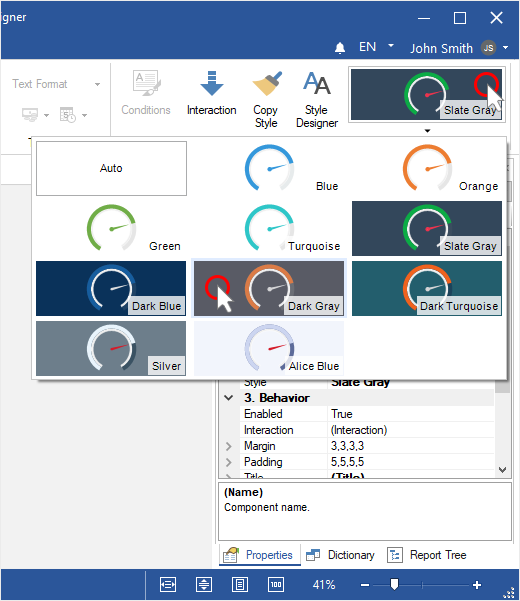
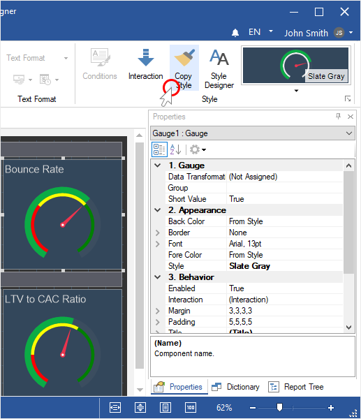

## Dashboard Design

The following questions will be considered in this chapter:

* [Element style creation](#CreateStyle);

* [Style creation based on the used style](#GetStyleFromSelectedComponents);

* [Dashboard appearance](#AssignDashboardStyle);

* [Elements appearance](#AssignItemStyle);

* [Element style copying](#CopyStyle).

**Element style creation**

**Step 1**: [Launch the report designer](Install_and_First_Run.md);

**Step 2**: Click the **Style Designer** on the **Home** tab in the report designer;

**Step 3**: Click the **Add Style** button;

**Step 4**: Select the style you want to create;

**Step 5**: You can set this style with the help of the properties and controls;

**Step 6**: Click **Ok** in the style editor;

**Step 7**: Assign a style for a dashboard.

**Style creation based on the used style**

**Step 1**: Add a dashboard;

**Step 2**: Select the element the style that needs to be changed;

**Step 3**: Click **Style Designer** button on the **Home** tab;
**Step 4**: **Click** **Get Style from Selected Components** **button** **in the Style editor**;

**Step 5**: You can set a given style with the help of the properties and controls;

**Step 6**: Click **Ok** button in the style designer;

**Step 7**: Assign a style for a dashboard elements.

**Dashboard design**
**Step 1**: Select a dashboard;
**Step 2**: Click the select style on the **Home** tab in the report designer;
**Step 3**: Select a style for your dashboard.

**Dashboard elements design**
**Step 1**: Select a dashboard element;
**Step 2**: Click the select style on the **Home** tab in the report designer;
**Step 3**: Choose a style for the dashboard element.

**Copy Style for dashboard elements**

**Step 1**: Highlight the dashboard element from which you want to copy a style;

**Step 2**: Click the **Copy** on the **Home** tab;

**Step 3**: Hover the cursor for the element, into which you want to copy a style;

**Step 4**: Click on the element once;

**Step 5**: Click the Copy on the Home tab to disable the copy mode.
