## Dashboard with Table

This chapter will cover the following:

* [Adding a Table element](#addingatableitem);

* [Disabling data fields in the Table](#disablingthedatafieldinthetable);

* [Hyperlinks in the Table element](#hyperlinksinthetableelement);

* [Stretching columns along the width of the Table element](#stretchingtablecolumnsbythewidth);

* [Data Bars, Color scale, Indicator, Sparklines in the Table;](#databars)

* [Calculation of totals in the Table element.](#calculationoftotalsinthetable)

**Adding a Table Item**

To create a dashboard panel with the Table element, you should do the following steps:

**Step 1**: [Run the report designer](Install_and_First_Run.md#rundesigner);

**Step 2**: [Create a dashboard](Creating_Dashboard.md) or [add it to a current report](Creating_Dashboard.md#addingadashboardtothecurrentreport);

**Step 3**: [Connect data](Connecting_Data.md);

**Step 4**: Select the **Table** element on the tools of the report designer or on the **Insert** tab;

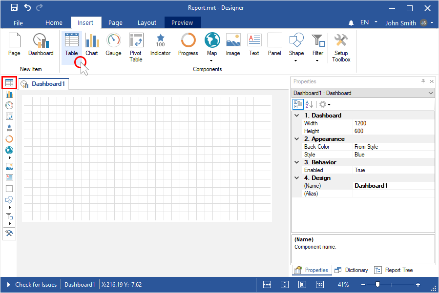

**Step 5**: Place the item on the dashboard panel;

**Step 6**: If the item editor did not open, double-click on the table;

**Step 7**: Drag the required data columns from the data dictionary;

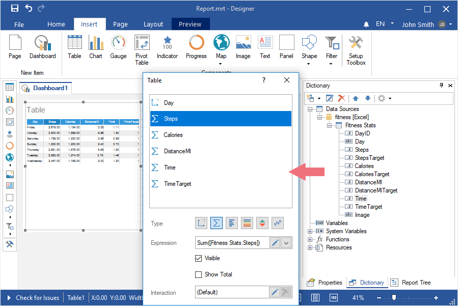

> **Information**
>
> You can drag data columns directly into the **Table** element. You can also drag the entire data source.

**Step 8**: Select the data field;

**Step 9**: Click the **Browse** button in the **Expression** field and select the function of aggregating values, if necessary. By default, the **Sum()** function is used, which sums the values from the specified data column.

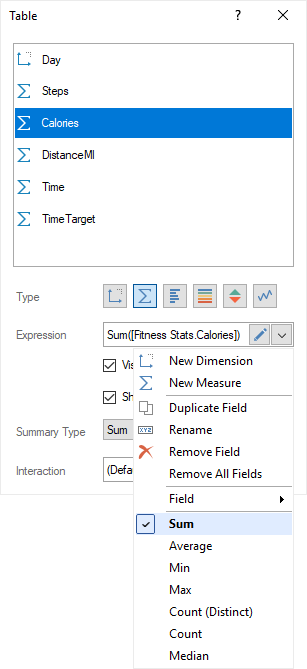

> **Information**
>
> The aggregation functions are not applied for data fields of the **Dimension** type. To apply a function to a specific field, you should set its type as **Measure**.

**Step 10**: Close the editor of the **Table** element;

**Step 11**: Go to the preview tab.

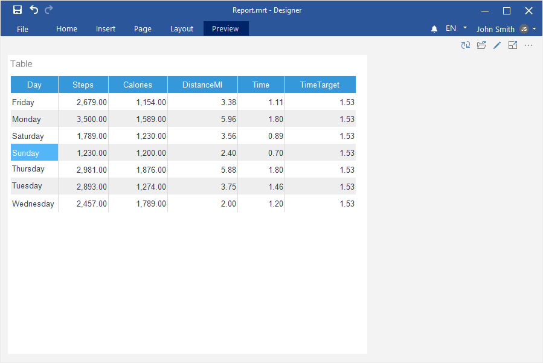

**Disabling the data field in the Table**
**Step 1**: Double-click on the **Table** element to call the editor of this element;

**Step 2**: Select the data field;

**Step 3**: Uncheck the **Visible** option.

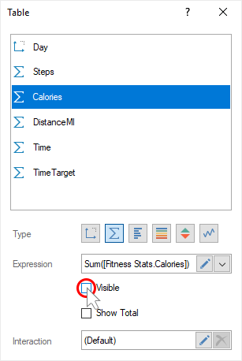

The data field will be present in the list of element fields, but will not be displayed.

**Hyperlinks in the Table Element**

**Step 1**: Double-click on the **Table** element to call the editor of this element;

**Step 2**: Select the data field of the **Dimension** type;

**Step 3**: Check the box next to **Hyperlink**;

**Step 4**: Specify the link in the **Pattern** field.

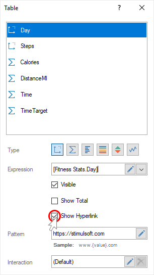

Now, when you click on the value of the current data field, a transition will be carried out on a given hyperlink.

**Stretching table columns by the width**

By default, the column width is set automatically, depending on the content. However, you may stretch all columns by the width of the element. For this, you should do the following:

**Step 1**: Select the **Table** element in the dashboard;

**Step 2**: Set the **Fit** value for the **Size Mode** property.

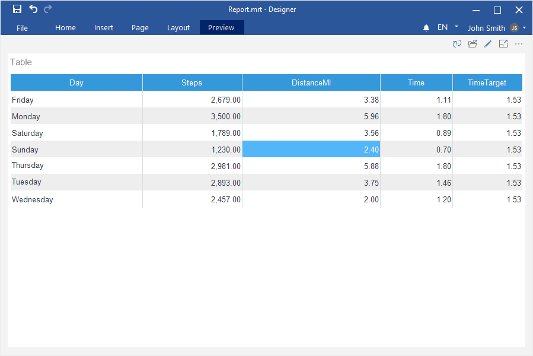

**Data Bars, Indicator, Color scale, Sparklines in the Table**

**Step 1**: Double-click on the **Table** element to call the editor of this element;

**Step 2**: Select the data field;

**Step 3**: Using the controls, specify the type for the current data field;

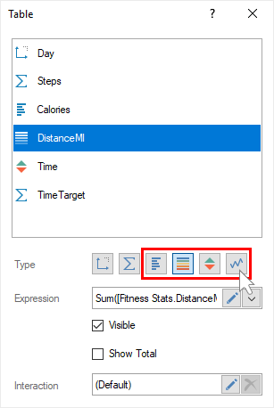

**Step 4**: For **Sparklines**, specify the parameters of the sparklines and its type.

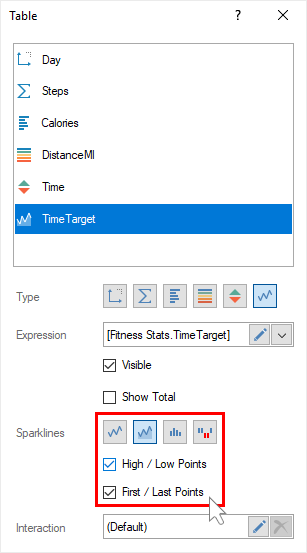

**Calculation of totals in the Table**

**Step 1**: Double-click on the **Table** element to call the editor of this element;

**Step 2**: Select the data field for which you want to calculate the total;

**Step 3**: Select the **Show Totals** check box;

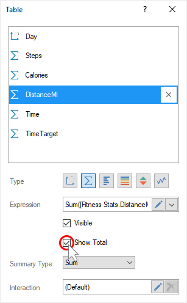

**Step 4**: Specify a function for calculating the total.

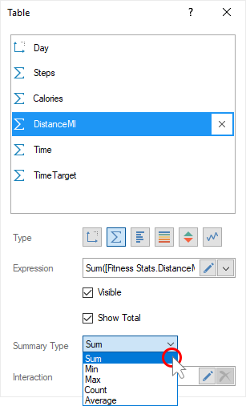
