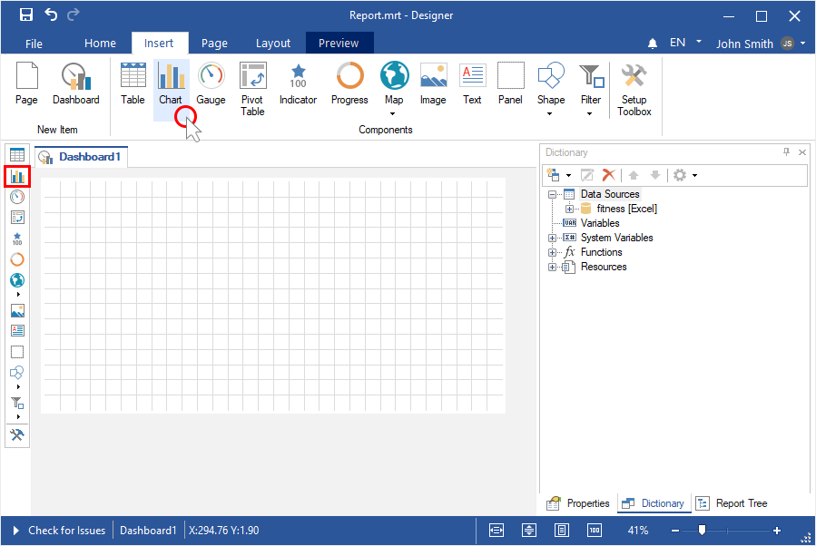
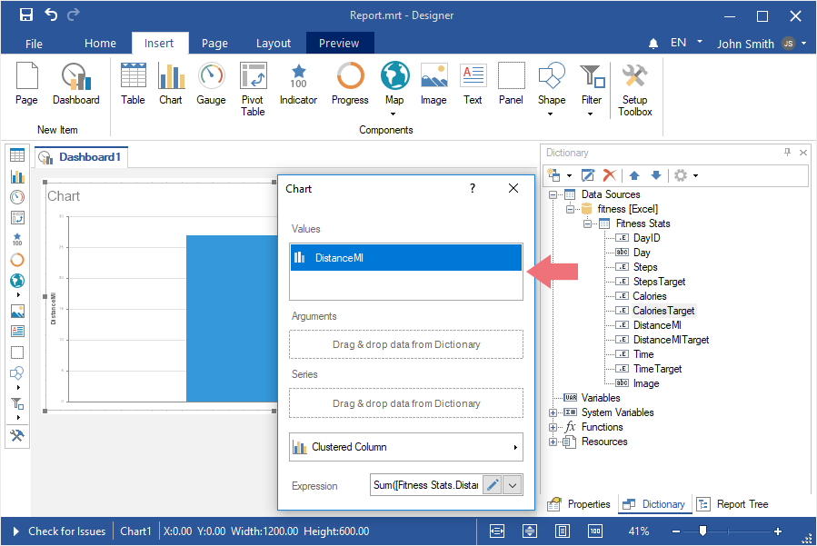
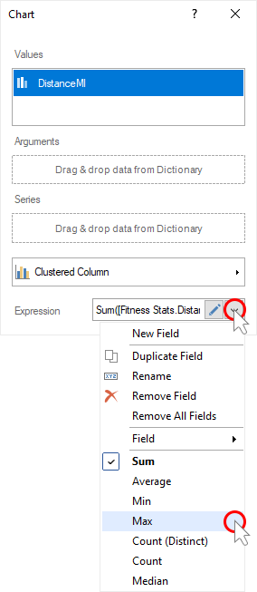
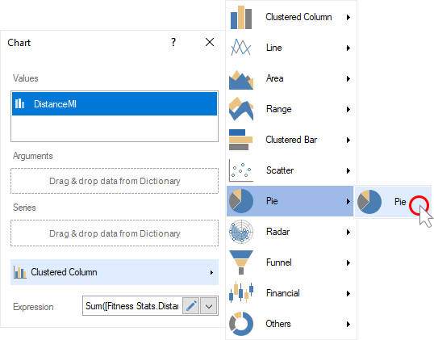
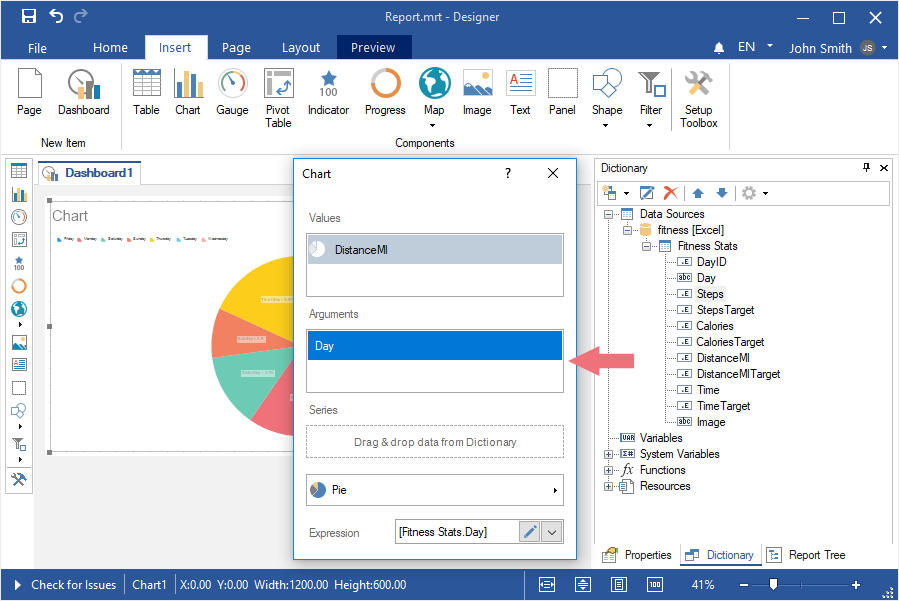
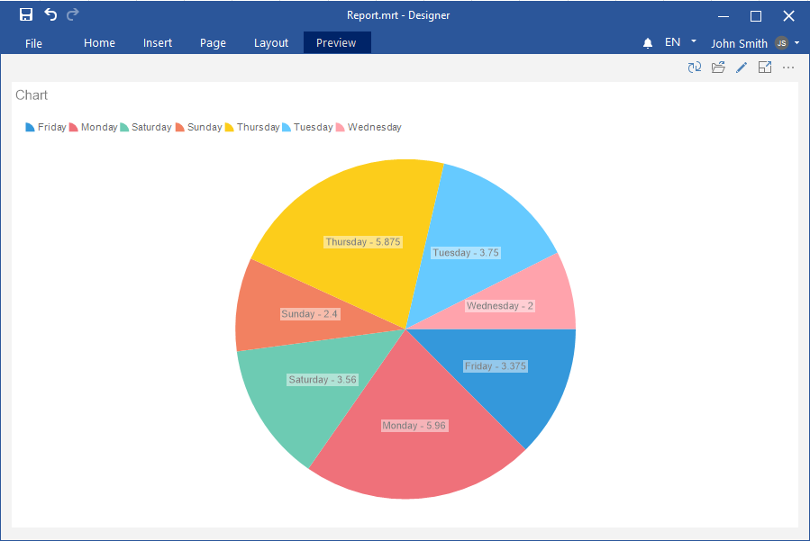

## Dashboard with Chart

To create a dashboard with a [Chart](../Dashboards/Chart.md) element, you should do the following steps:

**Step 1**: [Run the report designer](Install_and_First_Run.md#rundesigner);

**Step 2**: [Create a dashboard](Creating_Dashboard.md) or [add it to a current report](Creating_Dashboard.md#addingadashboardtothecurrentreport);

**Step 3**: [Connect data](Connecting_Data.md);

**Step 4**: Select the **Chart** element in the toolbox of the report designer or on the **Insert** tab;

**Step 5**: Put the item on the dashboard panel;

**Step 6**: If the item editor did not open, double-click on the chart;

**Step 7**: Drag the required data columns from the data dictionary;

**Step 8**: By default, columns will be added to the **Values** field of the chart;

**Step 9**: Select the field of values;

**Step 10**: Click the **Browse** button in the Expression field and select the function of aggregating values, if necessary. By default, the **Sum()** function is used, which sums the values from the specified data column.

**Step 11**: Change the type of a chart, if necessary;

**Step 12**: Drag the data columns into the **Arguments** and **Series** fields, if necessary;

> **Information**
>
> For some types of charts, you should specify columns of values in several fields. For example, for financial charts, you should add data columns to the fields Open Values, Close Values, Maximum Values, and Minimum Values.

**Step 13**: Close the editor of the **Chart** element;

**Step 14**: Go to the preview tab.

