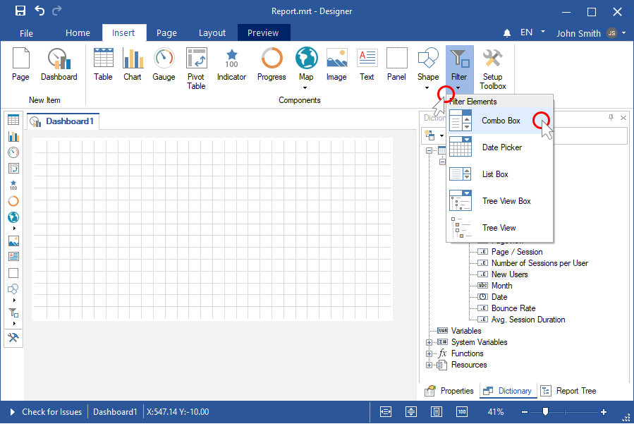
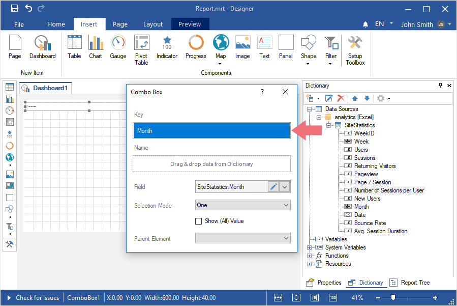
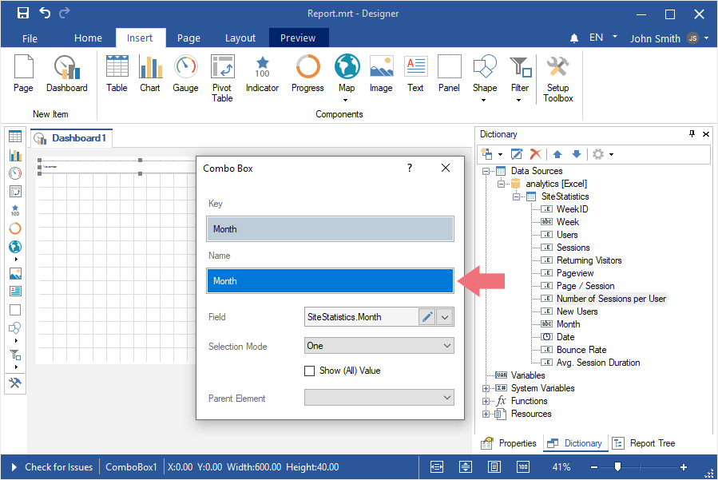
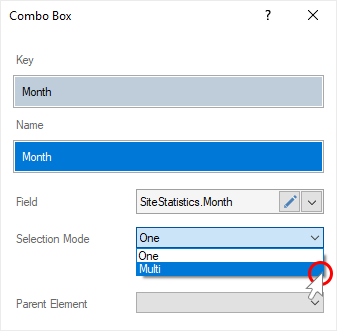
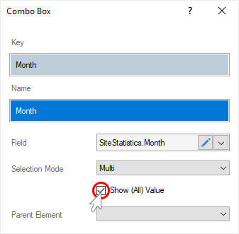
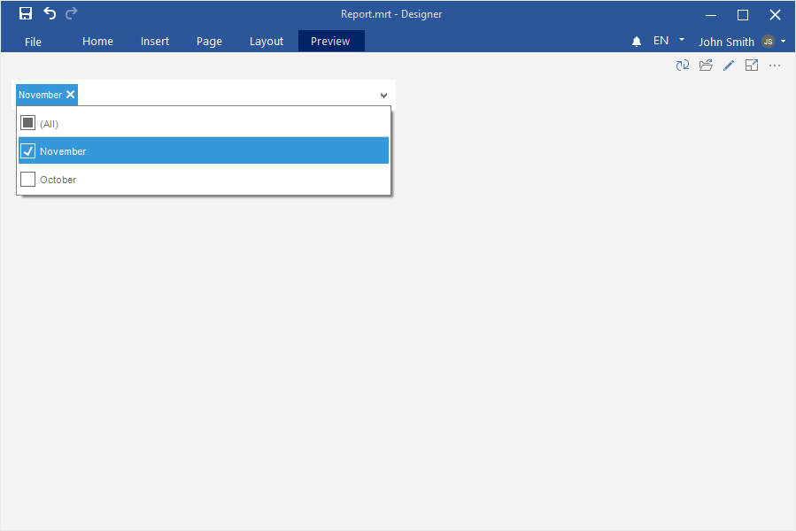

## Dashboards with Combo Box

To create a dashboard with the [Combo Box element](../Dashboards/Data_Filtering/Combo_Box.md), you should make the following actions:

Step 1: [Launch the report designer](Install_and_First_Run.md);

Step 2: [Create a dashboard or open it](Creating_Dashboard.md);

Step 3: [Connect data](Connecting_Data.md);

Step 4: Click on the Filters category in the Toolbox of the report designer or on the Insert tab;

Step 5: Select the Combo **Box** element;

Step 6: Place the element on the dashboard;
Step 7: If the element editor is not displayed, you should double click on the element;
Step 8: Drag a data column from data dictionary. By default, the data column will be added to the Key field;

Step 9: Drag the data column into the Name field;

Step 10: If you need to permit to select only one value of the current element, you should set the One value for the Selection Mode parameter. Set the Multi value for the Selection Mode parameter, if you need to permit to select several values of the current element.

Step 11: If you need the list of values contain the **All** value, you should set a checkbox next to the **Show (All) Value** parameter.

Step 12: If you need the list of values to be depended on the selected value of the Parent Element parameter, you should select another item of filtration as the value of the **Parent Element** parameter.

Step 13: Close the element editor.
Step 14: Go to the Preview tab.

