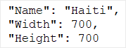
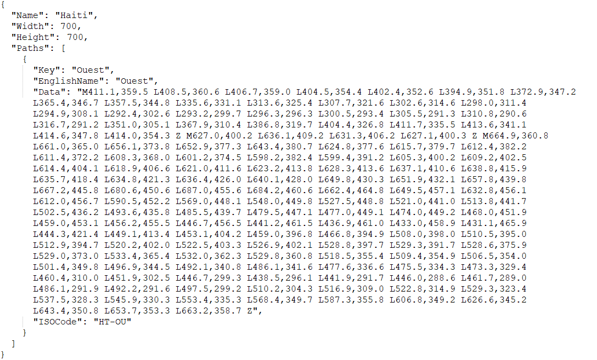
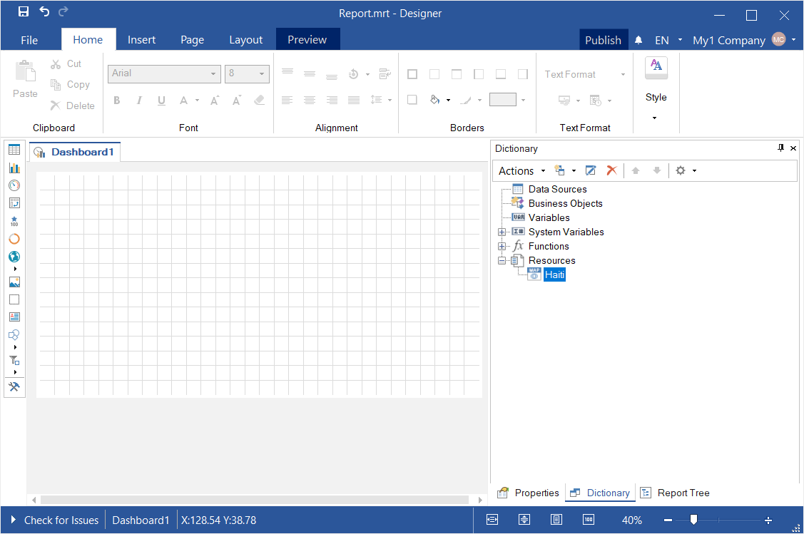
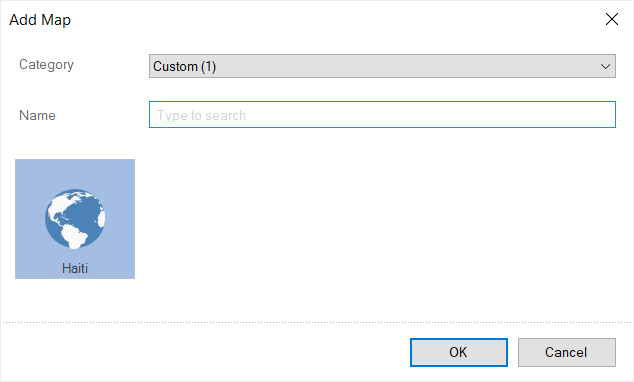
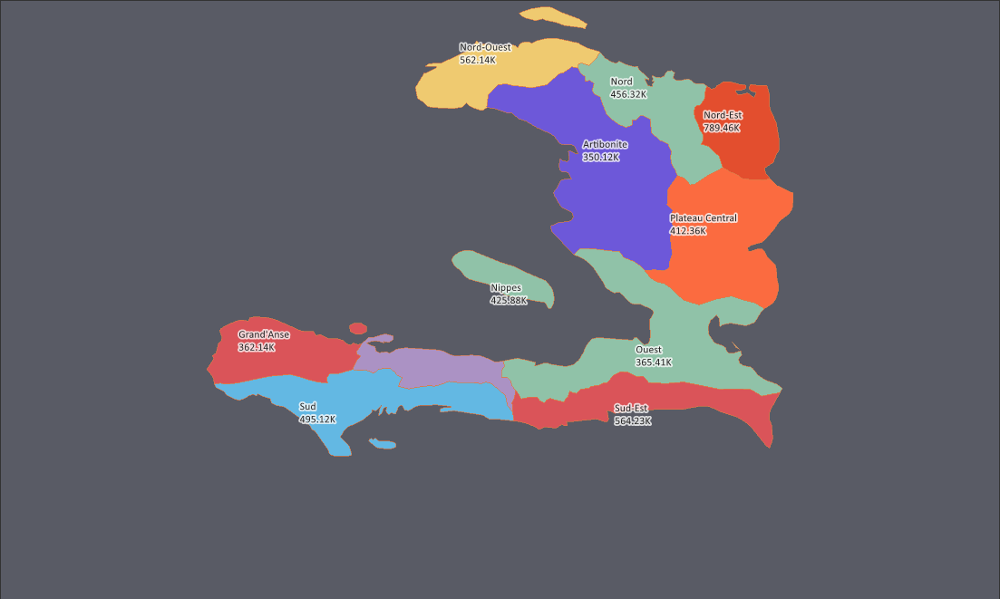
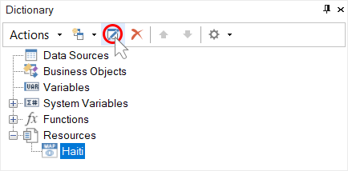
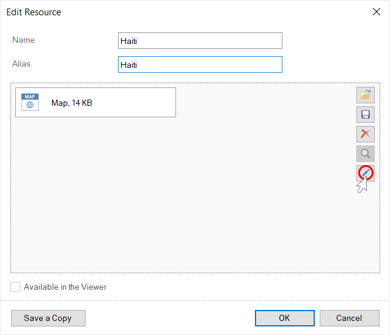
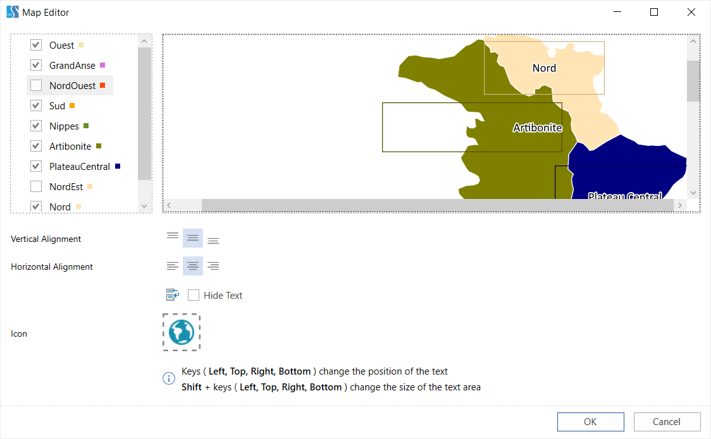
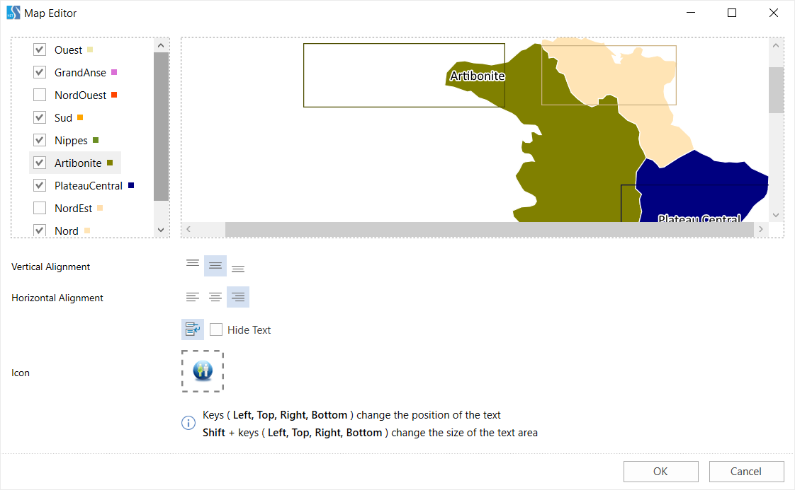

## Dashboard with Custom Region Map

In this chapter, you will find the following:

* [Adding a custom map](#addingacustommap);

* [Custom map customization](#custommapsetup).

**Adding a custom map**

When you create a dashboard, you can use [custom maps in the Region Map](../Dashboards/Maps/Region_Map.md#AddingCustomMap) element. Consider the example of adding a Haiti map to the list of regional maps. To achieve this, you should do the next steps:

**Step 1**: You should find the source of the map, which you need to integrate into the list of maps. For example, **Haiti.svg**.

**Step 2**: Open this file using the editor. In our case, using VSCode.

**Step 3**: Create a text file named **Haiti.txt** and open it in VSCode;

> **Information**
>
> Since the map file is created in the [JSON format](https://en.wikipedia.org/wiki/JSON), you should check the rules of its formatting.

**Step 4**: In the **Haiti.txt file**, add the **Name**, **Width**, and **Height** fields with the values. In the current example, the values are "Name": "Haiti", "Width": 700, "Height": 700.

**Step 5**: In the **Haiti.txt** file, add the Paths array and go to the creation of geographic map objects. To create a geographic object, you should specify the **Key**, **EnglishName**, **Data**, **ISOCode** fields with values. Values for these fields can be taken from the source file **Haiti.svg**.

**Step 6**: Create the **Key** field in the **Haiti.txt** file and copy the value from the source file there. In the current source file Haiti.svg, you need to copy the value from the title field.

> **Information**
>
> Please note that the **Key** field cannot contain spaces, dashes, special characters, etc. The **Key** field can contain only Latin letters. So, if the source file contains invalid characters, then when copying the values, they must be deleted.
>
>
> All values in the **Key** field must be unique. It is not allowed to use the same values in several geographic objects. Each geographic object must have its own value in the **Key** field.

**Step 7**: Create the **EnglishName** field in the **Haiti.txt** file and copy the value from the source file there. This is the name of the geographic objects that will be displayed. Unlike the **Key** field, the value of this field can contain various characters.

**Step 8**: Create the **Data** field in the **Haiti.txt** file and copy the value from the source file there. Copy the value from the id field in the current **Haiti.svg** source file.

**Step 9**: Create the **ISOCode** field in the **Haiti.txt** file and copy the value from the source file there. Copy the value from the id field in the current **Haiti.svg** source file.

**Step 10**: Add the required number of geographic objects of the map;

**Step 11**: After adding all the geographic objects, you should save the changes to the **Haiti.txt** file;

**Step 12**: Rename **Haiti.txt** to **Haiti.map**;

**Step 13**: Run the report designer and drag the **Haiti.map** file into the data dictionary;

**Step 14**: [Add the Region map element to the dashboard panel](Dashboard_with_Region_Map.md#creatingaregionmap);

**Step 15**: Click the **Custom** category in the map editor, select **Haiti** and click **OK**;

**Step 16**: Set the values of geographic objects and [set the parameters of the Region Map element](Dashboard_with_Region_Map.md);

**Step 17**: Close the **Region Map** editor.

Now, you can create dashboards using this map.

**Custom map setup**

Also, you can customize the map you added. Follow the steps below to achieve this:

**Step 1**: Select the **Haiti** resource in the data dictionary and click the **Edit** button in the data dictionary;

**Step 2**: Click the **Edit** button in the **Edit resource** dialog;

**Step 3**: The Map editor will be called;

**Step 4**: Uncheck the check boxes of geographic objects if you want to disable displaying them when working in the current editor;

**Step 5**: Select a geographic object in the list and change the location of the title area using the cursor keys (left, right, top, bottom);

**Step 6**: Hold down the **Shift** key and use the keys (left, right, top, bottom) to resize the title area;

**Step 7**: Using the alignment commands (horizontal, vertical), set the location of the title text in its area;
**Step 8**: Enable text wrapping if you need to wrap the title text to the next line;

**Step 9**: Select the **Hide Text** checkbox if you do not want to display the title text;

**Step 10**: Click on the **Icon** parameter, if you want to load a custom icon for the current map;

**Step 11**: Click the **OK** button in the **Map** editor;

**Step 12**: Click the **OK** button in the **Resource** editor.

Changes will be applied to the map of this type.
