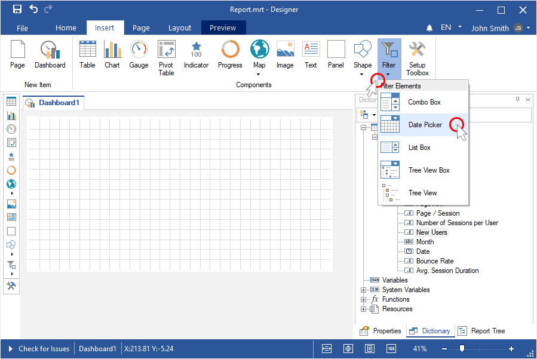
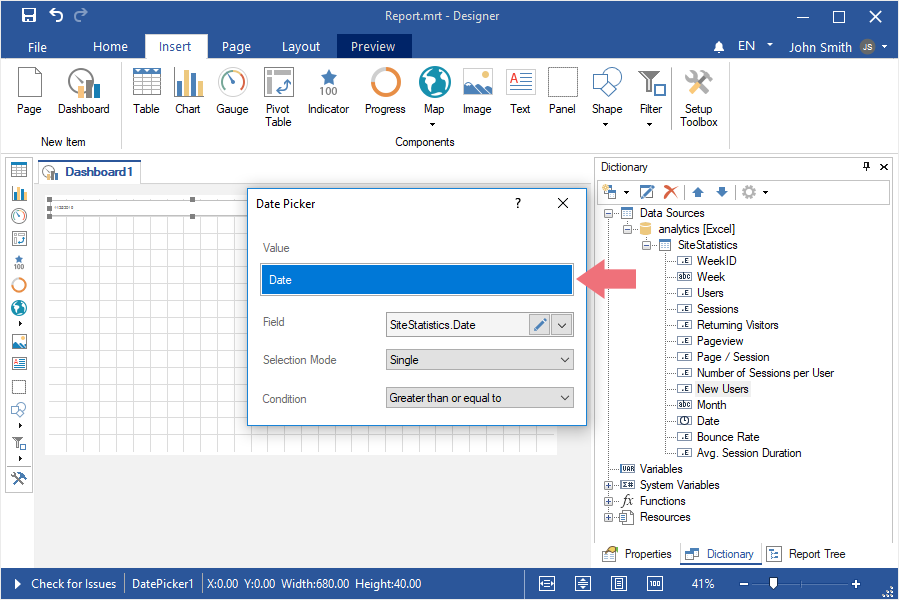
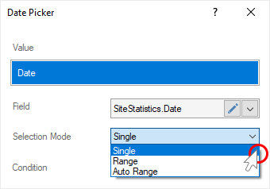
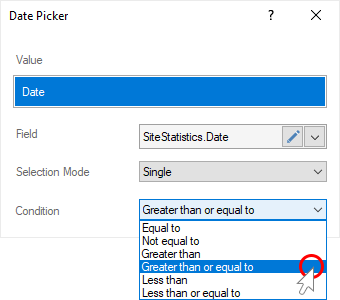
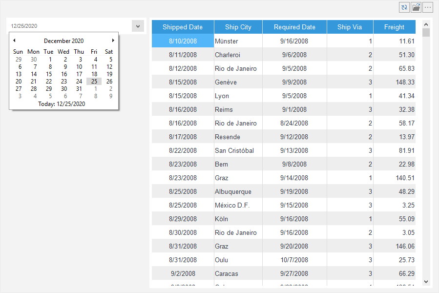
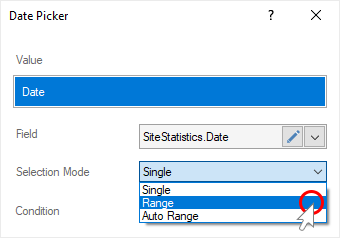
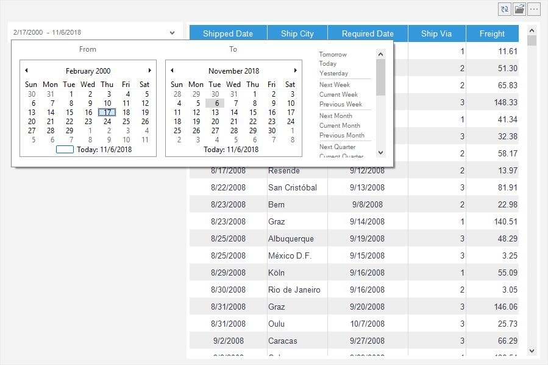
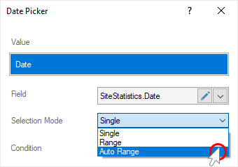
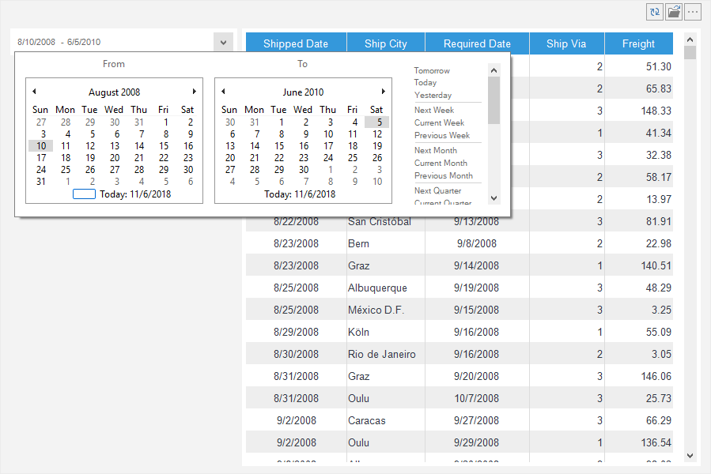

## Dashboards with Date Picker

In this chapter, the following questions will be considered:

* [Additing the Date Picker](#CreateDatePicker);

* [Single mode](#SingleMode);

* [Range mode](#RangeMode);

* [Autorange mode](#AutoRangeMode).

**Additing the Date Picker**

To create a dashboard with the [Date Picker element](../Dashboards/Data_Filtering/Date_Picker.md), you should make the following actions:

**Step 1**: [Launch the report designer](Install_and_First_Run.md);

**Step 2**: [Create a dashboard or open it](Creating_Dashboard.md);

**Step 3**: [Connect data](Connecting_Data.md);

**Step 4**: Click on the **Filters** category in the **Toolbox** of the report designer or on the **Insert** tab;

**Step 5**: Select the **Date Picker** element;

**Step 6**: Place the element on the dashboard;
**Step 7**: If the element editor is not displayed, you should double click on the element;
**Step 8**: Drag data columns from data dictionary into the **Value** field.

**Step 9****:** Define the type of work of the **Date Picker** element by setting the [Single mode](#SingleMode) value, [Range](#RangeMode), [Auto Range](#AutoRangeMode) for the **Selection Mode** parameter.

**Single Mode**
Single mode gives the ability to display the time range from the selected date. The original date is the current operating system date, by default. Next, the time range is calculated depending on the logical operation of the condition.
**Step 1**: If the element editor is not displayed, you should double click on the element;
**Step 2**: Set the selection mode parameter in the **Single** value;

**Step 3**: Select the logical operation of the time range calculation and set it as the value of the **Condition** parameter.

**Step 4**: Close the element editor;

**Step 5**: Go to the **Preview** tab.

When viewing a dashboard, you can change date in the **Date Picker** element, by shifting the time range of data filtration. The calculation logical operation will remain unchanged.

**Range Mode**
Range mode gives the ability to define the time range from one date to another. The range is equal to the current date of the operating system, i.e the beginning and the end of the range is similar to the current date of operating system.
**Step 1**: If the element editor is not displayed, you should double click on the element;

**Step 2**: Set the selection mode parameter in the **Range** value;

**Step 3**: Close the element editor;

**Step 4**: Go to the Preview tab.
If there are no data for the current date, dashboard elements will be empty. Therefore, you can manually define the beginning and the end of the range.

**Auto Range mode**
The **Auto Range** mode gives the ability to set the time range of the **Date Picker** element based on the values of the column data you specify.

**Step 1**: If the element editor is not displayed, you should double click on the element;
**Step 2**: Set the selection mode parameter in the **Auto Range** value;

**Step 3**: Close the element editor;

**Step 4**: Go to the **Preview** tab.

Change the beginning and the end of the time range in the viewer or on the **Preview** tab in the **Date Picker** element.

